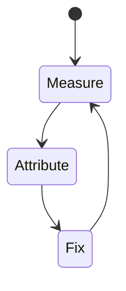
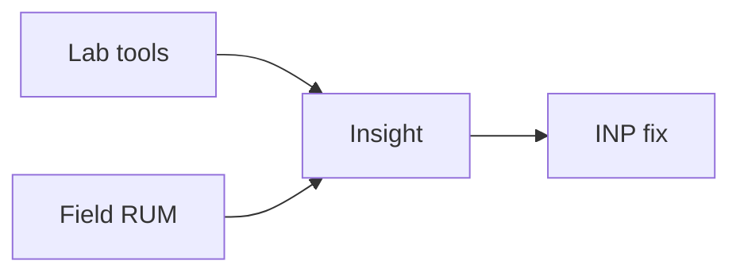

# INP

<TopicMeta />

<Prerequisites />

::: tip Published
This page meets the handbook **published** bar: deep explanation, ≥10 common mistakes, and official references. Further engine-level errata welcome via PR.
:::

## Introduction

**INP** measures how quickly the page responds to user interactions (tap/click/key) by looking at latency from input to next paint. It replaced FID as a Core Web Vital.

## Why does it exist?

A page can paint fast (good LCP) yet feel janky when clicking. INP captures that interactivity quality.

## Historical Background

FID only looked at first interaction; INP observes throughout and better reflects real UX.

## Mental Model

Input delay + processing + presentation delay. Break up long tasks; reduce hydration; yield to the browser.

## Internal Workflow

1. Define what INP measures and the “good” threshold.
2. Collect lab (Lighthouse/Perf panel) and field (CrUX/RUM) data.
3. Attribute the slow stage in a trace.
4. Change one cause; remeasure.
5. Guard with budgets in CI/RUM alerts.

## Lifecycle



## Browser Perspective

INP is observed in Chromium Performance/Lighthouse and via web-vitals JS APIs in the field.

## JavaScript Engine Perspective

JS long tasks, layout, and paint feed into how INP feels to users.

## React Perspective

Unnecessary renders/hydration inflate interaction and paint costs that show up in INP.

## Next.js Perspective

Server TTFB, streaming, and client bundle size all influence INP depending on the metric.

## Server Perspective

Not applicable.

## Network Perspective

RTT, bytes, and CDN behavior often dominate before JS micro-optimizations.

## Memory Perspective

GC pauses and large DOM/images can indirectly worsen INP.

## Performance

Good INP ≤ 200ms at p75. Split long handlers, defer non-critical work, shrink JS, use `startTransition` for non-urgent updates.

## Production Example

A team tracks INP in RUM by route template, sets a regression alert at p75, and ties fixes to specific owners (images, JS, server).

## Code Examples

```ts
import { onINP } from 'web-vitals'
onINP(console.log)

button.addEventListener('click', () => {
  // keep handler short; schedule heavy work
  queueMicrotask(() => computeHeavy())
})
```

## Diagrams



## Common Mistakes

1. Huge click handlers doing sync JSON parse/render
2. Third-party scripts monopolizing the main thread
3. Hydrating massive client trees
4. Optimizing only FID lore after INP replaced it
5. Ignoring presentation delay from large style/layout
6. Running analytics in the critical click path synchronously
7. Missing a production edge case for 13-performance.inp (#1)
8. Missing a production edge case for 13-performance.inp (#2)
9. Missing a production edge case for 13-performance.inp (#3)
10. Missing a production edge case for 13-performance.inp (#4)


## Best Practices

- Optimize INP with field data, not vanity lab scores alone
- Fix the attributed cause, not a random best practice list
- Keep a performance budget for the owning surface
- Re-check after framework upgrades

## Anti-patterns

- Chasing Lighthouse while ignoring RUM
- Micro-optimizing JS before cutting bytes/RTT
- Declaring victory from one local run on fiber

## Comparison

| Signal | Use |
| --- | --- |
| Lab | Debug & regressions |
| Field | Real users / SEO signals |

## Interview Questions

### Easy

**Q:** What did INP replace?

**A:** FID (First Input Delay) as the interactivity Core Web Vital.

### Medium

**Q:** What are the three INP phases?

**A:** Input delay, processing duration, and presentation delay before next paint.

### Hard

**Q:** How can React concurrent features help INP?

**A:** `startTransition`/`useDeferredValue` mark updates non-urgent so React can keep the UI responsive; still must split true long tasks.

## Summary

- INP: Interaction to Next Paint: responsiveness across page interactions.
- Measure lab + field
- Attribute before optimizing
- Budget and alert on p75

## References

- [web.dev — Core Web Vitals](https://web.dev/explore/learn-core-web-vitals)
- [Chrome — Web Vitals](https://developer.chrome.com/docs/performance/insights/web-vitals)

<RelatedTopics />


Prev: [`13-performance.cls`](/13-performance/cls/) · Next: [`13-performance.ttfb`](/13-performance/ttfb/)
