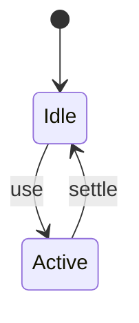

# Lazy Loading

<TopicMeta />

<Prerequisites />

::: tip Published
This page meets the handbook **published** bar: deep explanation, ≥10 common mistakes, and official references. Further engine-level errata welcome via PR.
:::

## Introduction

**Lazy loading** delays downloading/initializing resources until they are near-needed—viewport, route, or interaction. Applies to JS chunks and media.

## Why does it exist?

Eager loading everything competes with LCP resources.

## Historical Background

loading="lazy" for images/iframes; JS lazy via dynamic import; frameworks formalized patterns.

## Mental Model

Critical now vs later. Never lazy the LCP image.

## Internal Workflow

1. Rank resources by criticality.
2. Lazy non-critical JS/media.
3. Prefetch when intent is likely.
4. Measure LCP/INP side effects.

## Lifecycle



## Browser Perspective

Not applicable.

## JavaScript Engine Perspective

Not applicable.

## React Perspective

Not applicable.

## Next.js Perspective

Not applicable.

## Server Perspective

Not applicable.

## Network Perspective

Not applicable.

## Memory Perspective

Not applicable.

## Performance

Measure before/after with lab + field tools. Optimize the attributed bottleneck for Deferring load of resources (JS, images, iframes) until needed., not folklore.

## Production Example

Teams adopt Deferring load of resources (JS, images, iframes) until needed. on critical routes, add monitoring, and guard regressions with budgets or reviews.

## Code Examples

```html

```

## Diagrams

```mermaid
flowchart TD
  A[Understand] --> B[Apply Deferring load of resources (JS, images, iframes) until needed.]
  B --> C[Measure]
```

## Common Mistakes

1. lazy on LCP hero image
2. Lazy JS for primary CTA without prefetch
3. Infinite scroll without virtualization
4. SEO content hidden behind client lazy gates incorrectly
5. No placeholders → CLS
6. Lazy loading everything including fonts of brand title
7. Missing a production edge case for 13-performance.lazy-loading (#1)
8. Missing a production edge case for 13-performance.lazy-loading (#2)
9. Missing a production edge case for 13-performance.lazy-loading (#3)
10. Missing a production edge case for 13-performance.lazy-loading (#4)


## Best Practices

- Prefer platform/framework primitives
- Measure impact on real user metrics
- Keep the change reviewable and reversible
- Document the invariant you are protecting

## Anti-patterns

- Copy-paste without understanding failure modes
- Premature abstraction around a single use
- Optimizing without a baseline

## Comparison

| Approach | When |
| --- | --- |
| Use as designed | Default |
| Simpler alternative | If constraints differ |

## Interview Questions

### Easy

**Q:** When should you not lazy-load an image?

**A:** When it is the LCP/hero above-the-fold image.

### Medium

**Q:** Lazy loading JS vs images—difference?

**A:** JS lazy uses dynamic import/chunks; images use loading=lazy / IntersectionObserver; both defer bytes.

### Hard

**Q:** How combine lazy JS with good INP?

**A:** Prefetch on hover/idle for likely next actions so first interaction does not wait on chunk download.

## Summary

- Deferring load of resources (JS, images, iframes) until needed.
- Know why it exists and when not to use it
- Measure production impact
- Link related handbook topics instead of duplicating

## References

- [web.dev — Lazy loading](https://web.dev/articles/lazy-loading-overview)
- [MDN — loading attribute](https://developer.mozilla.org/en-US/docs/Web/HTML/Reference/Elements/img#loading)

<RelatedTopics />


Prev: [`13-performance.dynamic-import`](/13-performance/dynamic-import/) · Next: [`13-performance.debounce`](/13-performance/debounce/)
