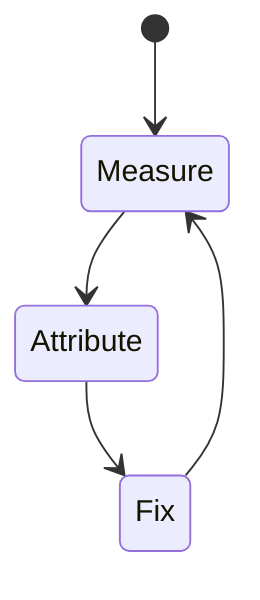
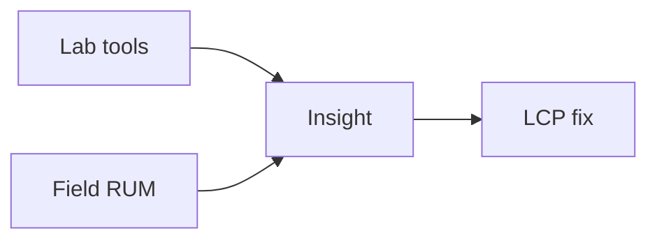

# LCP

<TopicMeta />

<Prerequisites />

::: tip Published
This page meets the handbook **published** bar: deep explanation, ≥10 common mistakes, and official references. Further engine-level errata welcome via PR.
:::

## Introduction

**LCP** marks when the largest text block or image in the viewport is painted. It is a Core Web Vital for loading performance.

## Why does it exist?

Users judge speed by when the main content appears—not when `DOMContentLoaded` fires. LCP operationalizes that judgment.

## Historical Background

Introduced as CWV replaced older focus on metrics like load event / FCP alone.

## Mental Model

Find the LCP element (image/text/video poster) → ensure it is discoverable early, sized, compressed, and not blocked by late CSS/JS.

## Internal Workflow

1. Define what LCP measures and the “good” threshold.
2. Collect lab (Lighthouse/Perf panel) and field (CrUX/RUM) data.
3. Attribute the slow stage in a trace.
4. Change one cause; remeasure.
5. Guard with budgets in CI/RUM alerts.

## Lifecycle



## Browser Perspective

LCP is observed in Chromium Performance/Lighthouse and via web-vitals JS APIs in the field.

## JavaScript Engine Perspective

JS long tasks, layout, and paint feed into how LCP feels to users.

## React Perspective

Unnecessary renders/hydration inflate interaction and paint costs that show up in LCP.

## Next.js Perspective

Server TTFB, streaming, and client bundle size all influence LCP depending on the metric.

## Server Perspective

Not applicable.

## Network Perspective

RTT, bytes, and CDN behavior often dominate before JS micro-optimizations.

## Memory Perspective

GC pauses and large DOM/images can indirectly worsen LCP.

## Performance

Good LCP ≤ 2.5s at p75. Common wins: optimize hero image, preconnect, avoid late-discovered LCP, reduce TTFB, limit render-blocking resources.

## Production Example

A team tracks LCP in RUM by route template, sets a regression alert at p75, and ties fixes to specific owners (images, JS, server).

## Code Examples

```html

```

```ts
import { onLCP } from 'web-vitals'
onLCP(console.log)
```

## Diagrams



## Common Mistakes

1. Lazy-loading the LCP image
2. Hero background-image in CSS discovered late
3. Huge unoptimized hero PNG/JPEG
4. Waiting on client fetch to render the LCP text
5. Ignoring TTFB as part of LCP
6. Optimizing a non-LCP element that looks important in DevTools thumbnail only
7. Overlooking an edge case #1 specific to 13-performance.lcp in production traffic
8. Overlooking an edge case #2 specific to 13-performance.lcp in production traffic
9. Overlooking an edge case #3 specific to 13-performance.lcp in production traffic
10. Overlooking an edge case #4 specific to 13-performance.lcp in production traffic


## Best Practices

- Optimize LCP with field data, not vanity lab scores alone
- Fix the attributed cause, not a random best practice list
- Keep a performance budget for the owning surface
- Re-check after framework upgrades

## Anti-patterns

- Chasing Lighthouse while ignoring RUM
- Micro-optimizing JS before cutting bytes/RTT
- Declaring victory from one local run on fiber

## Comparison

| Signal | Use |
| --- | --- |
| Lab | Debug & regressions |
| Field | Real users / SEO signals |

## Interview Questions

### Easy

**Q:** What does LCP measure?

**A:** When the largest above-the-fold content element is painted.

### Medium

**Q:** Name three common LCP fixes.

**A:** Compress/prioritize hero image, improve TTFB, eliminate render-blocking resources delaying paint.

### Hard

**Q:** How can SSR still have poor LCP?

**A:** If HTML is fast but the LCP image is late-discovered, huge, or deprioritized—or client JS must run before the LCP node appears.

## Summary

- LCP: Largest Contentful Paint: when the largest above-the-fold content element becomes visible.
- Measure lab + field
- Attribute before optimizing
- Budget and alert on p75

## References

- [web.dev — Core Web Vitals](https://web.dev/explore/learn-core-web-vitals)
- [Chrome — Web Vitals](https://developer.chrome.com/docs/performance/insights/web-vitals)

<RelatedTopics />


Prev: [`13-performance.core-web-vitals`](/13-performance/core-web-vitals/) · Next: [`13-performance.cls`](/13-performance/cls/)
