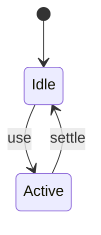
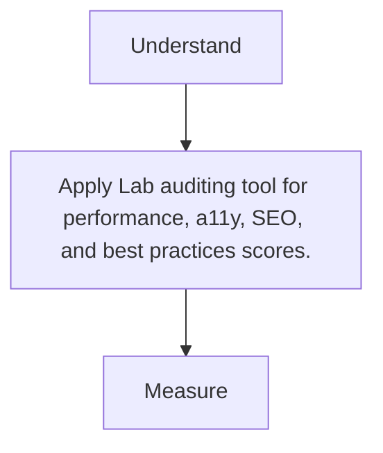

# Lighthouse

<TopicMeta />

<Prerequisites />

::: tip Published
This page meets the handbook **published** bar: deep explanation, ≥10 common mistakes, and official references. Further engine-level errata welcome via PR.
:::

## Introduction

**Lighthouse** runs automated lab audits in Chrome/CI. Scores are simulated—not field CWV—but excellent for debugging and regression gates.

## Why does it exist?

Teams need a repeatable lab checklist. Lighthouse packages traces + opportunities.

## Historical Background

Chrome tooling → CI integrations (LHCI) widely adopted.

## Mental Model

Lab ≠ users. Use Lighthouse to find issues; confirm with CrUX/RUM.

## Internal Workflow

1. Run on production-like builds.
2. Throttle appropriately.
3. Triage opportunities.
4. Track scores/budgets in CI.
5. Validate with field data.

## Lifecycle



## Browser Perspective

Not applicable.

## JavaScript Engine Perspective

Not applicable.

## React Perspective

Not applicable.

## Next.js Perspective

Not applicable.

## Server Perspective

Not applicable.

## Network Perspective

Not applicable.

## Memory Perspective

Not applicable.

## Performance

Measure before/after with lab + field tools. Optimize the attributed bottleneck for Lab auditing tool for performance, a11y, SEO, and best practices scores., not folklore.

## Production Example

Teams adopt Lab auditing tool for performance, a11y, SEO, and best practices scores. on critical routes, add monitoring, and guard regressions with budgets or reviews.

## Code Examples

```bash
npx lighthouse https://example.com --only-categories=performance --view
```

## Diagrams



## Common Mistakes

1. Tuning only for Lighthouse while RUM worsens
2. Testing with cache disabled inconsistently
3. Dev mode builds
4. Ignoring variance between runs
5. Treating score 100 as a product goal over UX
6. Not authenticating for gated pages correctly
7. Missing a production edge case for 13-performance.lighthouse (#1)
8. Missing a production edge case for 13-performance.lighthouse (#2)
9. Missing a production edge case for 13-performance.lighthouse (#3)
10. Missing a production edge case for 13-performance.lighthouse (#4)


## Best Practices

- Prefer platform/framework primitives
- Measure impact on real user metrics
- Keep the change reviewable and reversible
- Document the invariant you are protecting

## Anti-patterns

- Copy-paste without understanding failure modes
- Premature abstraction around a single use
- Optimizing without a baseline

## Comparison

| Approach | When |
| --- | --- |
| Use as designed | Default |
| Simpler alternative | If constraints differ |

## Interview Questions

### Easy

**Q:** Is Lighthouse field data?

**A:** No—it is a lab tool with simulated conditions.

### Medium

**Q:** How use Lighthouse in CI?

**A:** LHCI or similar against preview URLs with budgets; fail PRs on regressions.

### Hard

**Q:** Why can Lighthouse and CrUX disagree?

**A:** Lab device/network/CPU differs from real users; extensions, caching, geo, and personalization also diverge.

## Summary

- Lab auditing tool for performance, a11y, SEO, and best practices scores.
- Know why it exists and when not to use it
- Measure production impact
- Link related handbook topics instead of duplicating

## References

- [Chrome — Lighthouse](https://developer.chrome.com/docs/lighthouse/overview/)
- [web.dev — Lighthouse CI](https://web.dev/articles/lighthouse-ci)

<RelatedTopics />


Prev: [`13-performance.font-performance`](/13-performance/font-performance/) · Next: [`13-performance.core-web-vitals`](/13-performance/core-web-vitals/)
