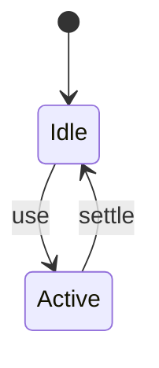
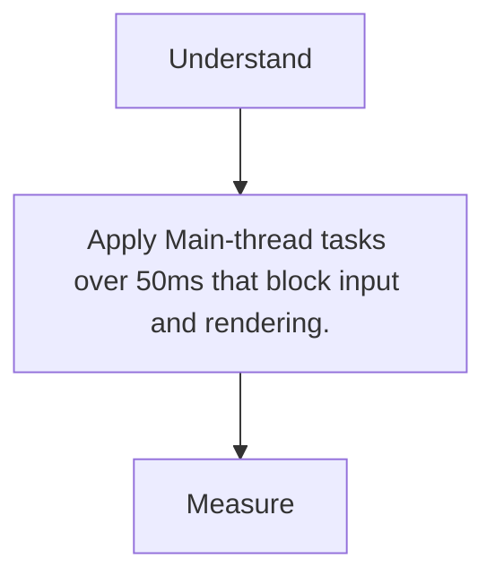

# Long Tasks

<TopicMeta />

<Prerequisites />

::: tip Published
This page meets the handbook **published** bar: deep explanation, ≥10 common mistakes, and official references. Further engine-level errata welcome via PR.
:::

## Introduction

**Long tasks** are main-thread tasks exceeding ~50ms. They delay input handling and paints, driving bad INP/TBT.

## Why does it exist?

The browser cannot paint or handle events mid-task. Breaking work up restores responsiveness.

## Historical Background

Long Tasks API standardized observation; central to modern INP debugging.

## Mental Model

Budget ~50ms slices. Yield between slices so the event loop can breathe.

## Internal Workflow

1. Observe longtask entries.
2. Attribute via flamechart.
3. Split/defer/workerize.
4. Re-measure INP.

## Lifecycle



## Browser Perspective

Observed via PerformanceObserver.

## JavaScript Engine Perspective

JS + layout both create tasks.

## React Perspective

Not applicable.

## Next.js Perspective

Not applicable.

## Server Perspective

Not applicable.

## Network Perspective

Not applicable.

## Memory Perspective

Not applicable.

## Performance

Measure before/after with lab + field tools. Optimize the attributed bottleneck for Main-thread tasks over 50ms that block input and rendering., not folklore.

## Production Example

Teams adopt Main-thread tasks over 50ms that block input and rendering. on critical routes, add monitoring, and guard regressions with budgets or reviews.

## Code Examples

```ts
new PerformanceObserver((list) => {
  for (const e of list.getEntries()) console.log(e.duration, e)
}).observe({ type: 'longtask', buffered: true })
```

## Diagrams



## Common Mistakes

1. Giant sync JSON.parse on boot
2. Unsplit hydration
3. Third parties unchecked
4. Tight loops in render
5. Ignoring tasks from extensions in local debugging
6. Yielding incorrectly without continuing work
7. Missing a production edge case for 13-performance.long-tasks (#1)
8. Missing a production edge case for 13-performance.long-tasks (#2)
9. Missing a production edge case for 13-performance.long-tasks (#3)
10. Missing a production edge case for 13-performance.long-tasks (#4)


## Best Practices

- Prefer platform/framework primitives
- Measure impact on real user metrics
- Keep the change reviewable and reversible
- Document the invariant you are protecting

## Anti-patterns

- Copy-paste without understanding failure modes
- Premature abstraction around a single use
- Optimizing without a baseline

## Comparison

| Approach | When |
| --- | --- |
| Use as designed | Default |
| Simpler alternative | If constraints differ |

## Interview Questions

### Easy

**Q:** How long is a long task?

**A:** Over 50 milliseconds on the main thread.

### Medium

**Q:** How do long tasks affect INP?

**A:** They increase input delay/processing time so the next paint after interaction is late.

### Hard

**Q:** Strategies to eliminate a 200ms task?

**A:** Split into chunks with yielding, move to worker, precompute on server, or defer until idle—pick based on data dependencies.

## Summary

- Main-thread tasks over 50ms that block input and rendering.
- Know why it exists and when not to use it
- Measure production impact
- Link related handbook topics instead of duplicating

## References

- [MDN — Long Tasks](https://developer.mozilla.org/en-US/docs/Web/API/PerformanceLongTaskTiming)
- [web.dev — Optimize long tasks](https://web.dev/articles/optimize-long-tasks)

<RelatedTopics />


Prev: [`13-performance.profiling`](/13-performance/profiling/) · Next: [`13-performance.scheduler-yielding`](/13-performance/scheduler-yielding/)
