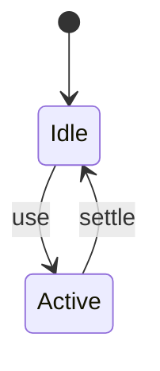
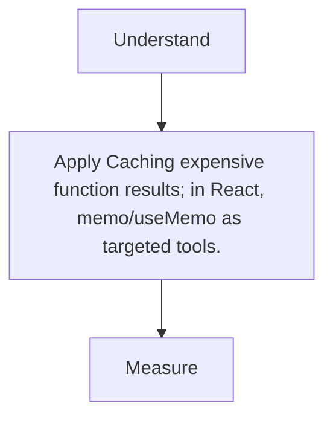

# Memoization

<TopicMeta />

<Prerequisites />

::: tip Published
This page meets the handbook **published** bar: deep explanation, ≥10 common mistakes, and official references. Further engine-level errata welcome via PR.
:::

## Introduction

**Memoization** stores outputs for prior inputs to avoid recomputation. In UI, React `memo`/`useMemo`/`useCallback` are forms of memoization—often overused.

## Why does it exist?

True hot expensive pure calculations benefit. Accidental O(n²) renders need structural fixes more than memo wrappers.

## Historical Background

Classic CS → React memo APIs → React Compiler auto-memoizing in newer setups.

## Mental Model

Cache key = inputs; invalidate on change. Wrong keys ⇒ stale or useless caches.

## Internal Workflow

1. Profile to find expensive pure work.
2. Memoize that work or child.
3. Ensure dependency correctness.
4. Prefer better data structures/algorithms first.

## Lifecycle



## Browser Perspective

Not applicable.

## JavaScript Engine Perspective

Caches trade CPU for memory.

## React Perspective

Measure with Profiler before memo.

## Next.js Perspective

Not applicable.

## Server Perspective

Not applicable.

## Network Perspective

Not applicable.

## Memory Perspective

Not applicable.

## Performance

Measure before/after with lab + field tools. Optimize the attributed bottleneck for Caching expensive function results; in React, memo/useMemo as targeted tools., not folklore.

## Production Example

Teams adopt Caching expensive function results; in React, memo/useMemo as targeted tools. on critical routes, add monitoring, and guard regressions with budgets or reviews.

## Code Examples

```ts
import { useMemo } from 'react'

export function Stats({ rows }: { rows: number[] }) {
  const total = useMemo(() => rows.reduce((a, b) => a + b, 0), [rows])
  return <p>{total}</p>
}
```

## Diagrams



## Common Mistakes

1. memo everywhere by default
2. Unstable deps defeating useMemo
3. Memoizing cheap operations
4. Stale closures from bad deps
5. Using memo to hide prop identity thrash from parents
6. Ignoring React Compiler guidance of the codebase
7. Missing a production edge case for 13-performance.memoization-perf (#1)
8. Missing a production edge case for 13-performance.memoization-perf (#2)
9. Missing a production edge case for 13-performance.memoization-perf (#3)
10. Missing a production edge case for 13-performance.memoization-perf (#4)


## Best Practices

- Prefer platform/framework primitives
- Measure impact on real user metrics
- Keep the change reviewable and reversible
- Document the invariant you are protecting

## Anti-patterns

- Copy-paste without understanding failure modes
- Premature abstraction around a single use
- Optimizing without a baseline

## Comparison

| Approach | When |
| --- | --- |
| Use as designed | Default |
| Simpler alternative | If constraints differ |

## Interview Questions

### Easy

**Q:** What is memoization?

**A:** Caching results of expensive pure functions keyed by inputs.

### Medium

**Q:** When is React.memo useless?

**A:** When props change by identity every render anyway, or render is already cheap.

### Hard

**Q:** How does React Compiler change memo strategy?

**A:** It auto-inserts memoization where profitable; manual memo becomes exception-based—follow project guidance.

## Summary

- Caching expensive function results; in React, memo/useMemo as targeted tools.
- Know why it exists and when not to use it
- Measure production impact
- Link related handbook topics instead of duplicating

## References

- [React — useMemo](https://react.dev/reference/react/useMemo)
- [React — React Compiler](https://react.dev/learn/react-compiler)

<RelatedTopics />


Prev: [`13-performance.throttle`](/13-performance/throttle/) · Next: [`13-performance.virtualization`](/13-performance/virtualization/)
