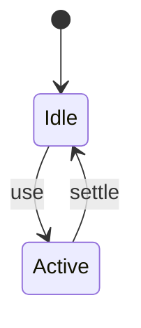
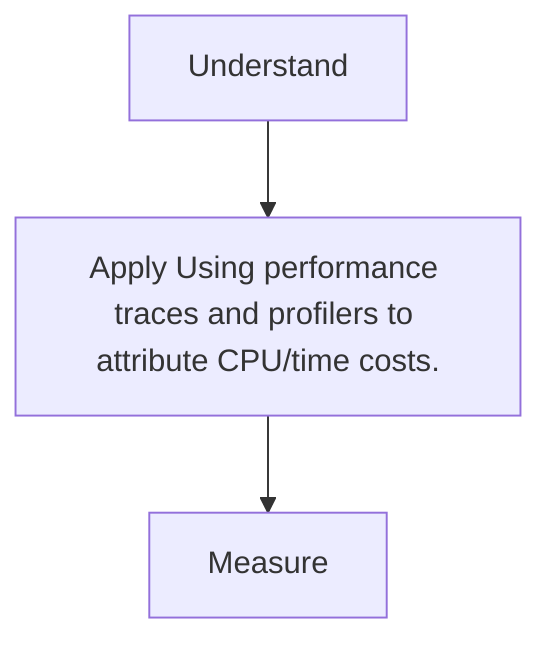

# Profiling

<TopicMeta />

<Prerequisites />

::: tip Published
This page meets the handbook **published** bar: deep explanation, ≥10 common mistakes, and official references. Further engine-level errata welcome via PR.
:::

## Introduction

**Profiling** captures runtime behavior—Performance panel, React Profiler, server CPU profiles—to attribute where time goes before optimizing.

## Why does it exist?

Guessing optimizations wastes effort. Traces show long tasks, layout thrash, and React commits.

## Historical Background

Browser DevTools + sampling profilers; React Profiler; continuous profiling in prod backends.

## Mental Model

Record → find long tasks/flamechart hotspots → hypothesize → fix → re-record.

## Internal Workflow

1. Reproduce on a realistic device throttle.
2. Record Performance (+ screenshots).
3. Mark user actions.
4. Attribute JS vs layout vs network.
5. Fix and compare traces.

## Lifecycle



## Browser Perspective

Not applicable.

## JavaScript Engine Perspective

Not applicable.

## React Perspective

Not applicable.

## Next.js Perspective

Not applicable.

## Server Perspective

Not applicable.

## Network Perspective

Not applicable.

## Memory Perspective

Not applicable.

## Performance

Measure before/after with lab + field tools. Optimize the attributed bottleneck for Using performance traces and profilers to attribute CPU/time costs., not folklore.

## Production Example

Teams adopt Using performance traces and profilers to attribute CPU/time costs. on critical routes, add monitoring, and guard regressions with budgets or reviews.

## Code Examples

```ts
performance.mark('cart:start')
await updateCart()
performance.mark('cart:end')
performance.measure('cart', 'cart:start', 'cart:end')
```

## Diagrams



## Common Mistakes

1. Optimizing without a trace
2. Profiling dev builds only
3. Ignoring main-thread vs network
4. Too short recordings missing interactions
5. Misreading minified frames without source maps
6. React Profiler without why-did-you render context
7. Missing a production edge case for 13-performance.profiling (#1)
8. Missing a production edge case for 13-performance.profiling (#2)
9. Missing a production edge case for 13-performance.profiling (#3)
10. Missing a production edge case for 13-performance.profiling (#4)


## Best Practices

- Prefer platform/framework primitives
- Measure impact on real user metrics
- Keep the change reviewable and reversible
- Document the invariant you are protecting

## Anti-patterns

- Copy-paste without understanding failure modes
- Premature abstraction around a single use
- Optimizing without a baseline

## Comparison

| Approach | When |
| --- | --- |
| Use as designed | Default |
| Simpler alternative | If constraints differ |

## Interview Questions

### Easy

**Q:** What tool profiles page runtime in Chrome?

**A:** The Performance panel (and Lighthouse for lab summaries).

### Medium

**Q:** How locate a layout thrash?

**A:** Look for recurring Recalculate Style/Layout interleaved with JS forcing geometry reads.

### Hard

**Q:** How profile production React cost safely?

**A:** Sampled RUM + optional React Profiler in staging; use source maps; never ship heavy profiling always-on to all users without sampling.

## Summary

- Using performance traces and profilers to attribute CPU/time costs.
- Know why it exists and when not to use it
- Measure production impact
- Link related handbook topics instead of duplicating

## References

- [Chrome — Performance panel](https://developer.chrome.com/docs/devtools/performance/)
- [React — Profiler](https://react.dev/reference/react/Profiler)

<RelatedTopics />


Prev: [`13-performance.tbt`](/13-performance/tbt/) · Next: [`13-performance.long-tasks`](/13-performance/long-tasks/)
