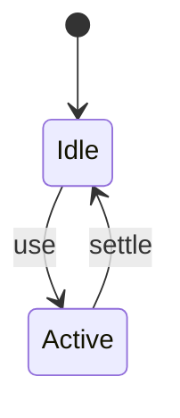
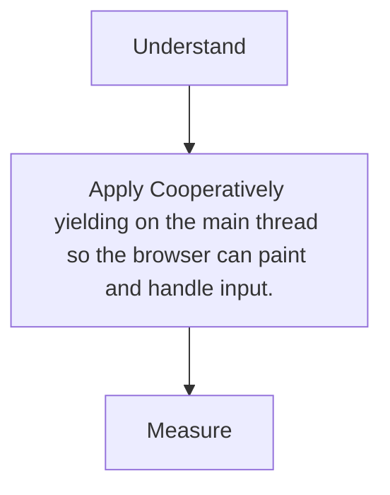

# Scheduler and Yielding

<TopicMeta />

<Prerequisites />

::: tip Published
This page meets the handbook **published** bar: deep explanation, ≥10 common mistakes, and official references. Further engine-level errata welcome via PR.
:::

## Introduction

**Scheduler yielding** means breaking work and returning control to the browser—via `scheduler.yield`, `isInputPending`, `setTimeout`, or `requestIdleCallback`—so input/paint can run between chunks.

## Why does it exist?

Long tasks are often necessary work done without breathing room. Yielding preserves INP while finishing jobs.

## Historical Background

setTimeout(0) hacks → requestIdleCallback → Scheduler API / yield proposals in Chromium.

## Mental Model

Do a slice → yield → continue. Prioritize user-blocking work higher than background.

## Internal Workflow

1. Identify chunkable work.
2. Yield between chunks.
3. Prefer `scheduler.yield` where available.
4. Don’t yield in the middle of atomic UI consistency needs without care.

## Lifecycle



## Browser Perspective

Not applicable.

## JavaScript Engine Perspective

Not applicable.

## React Perspective

Not applicable.

## Next.js Perspective

Not applicable.

## Server Perspective

Not applicable.

## Network Perspective

Not applicable.

## Memory Perspective

Not applicable.

## Performance

Measure before/after with lab + field tools. Optimize the attributed bottleneck for Cooperatively yielding on the main thread so the browser can paint and handle input., not folklore.

## Production Example

Teams adopt Cooperatively yielding on the main thread so the browser can paint and handle input. on critical routes, add monitoring, and guard regressions with budgets or reviews.

## Code Examples

```ts
async function processAll(items: Item[]) {
  for (const item of items) {
    work(item)
    // @ts-expect-error experimental in some browsers
    if (globalThis.scheduler?.yield) await scheduler.yield()
    else await new Promise((r) => setTimeout(r, 0))
  }
}
```

## Diagrams



## Common Mistakes

1. Yielding so finely that overhead dominates
2. Leaving UI half-updated across yields without coordination
3. Using idle callbacks for user-critical work
4. Polyfill soup differing per browser untested
5. Assuming workers are always better than yielding
6. Yielding without measuring INP improvement
7. Missing a production edge case for 13-performance.scheduler-yielding (#1)
8. Missing a production edge case for 13-performance.scheduler-yielding (#2)
9. Missing a production edge case for 13-performance.scheduler-yielding (#3)
10. Missing a production edge case for 13-performance.scheduler-yielding (#4)


## Best Practices

- Prefer platform/framework primitives
- Measure impact on real user metrics
- Keep the change reviewable and reversible
- Document the invariant you are protecting

## Anti-patterns

- Copy-paste without understanding failure modes
- Premature abstraction around a single use
- Optimizing without a baseline

## Comparison

| Approach | When |
| --- | --- |
| Use as designed | Default |
| Simpler alternative | If constraints differ |

## Interview Questions

### Easy

**Q:** Why yield on the main thread?

**A:** To let the browser handle input and painting between chunks of work.

### Medium

**Q:** Idle vs yield for click response work?

**A:** Do not put click-critical work in requestIdleCallback; yield inside the task or use transitions for non-urgent React updates.

### Hard

**Q:** Compare web workers vs yielding.

**A:** Workers move CPU off main thread (great for pure compute) but have structured-clone costs; yielding keeps shared DOM access with cooperative multitasking.

## Summary

- Cooperatively yielding on the main thread so the browser can paint and handle input.
- Know why it exists and when not to use it
- Measure production impact
- Link related handbook topics instead of duplicating

## References

- [Chrome — Optimize long tasks](https://developer.chrome.com/docs/performance/insights/optimize-long-tasks)
- [MDN — scheduler.yield](https://developer.mozilla.org/en-US/docs/Web/API/Scheduler/yield)

<RelatedTopics />


Prev: [`13-performance.long-tasks`](/13-performance/long-tasks/)
