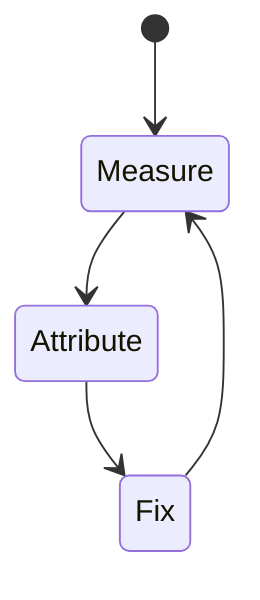
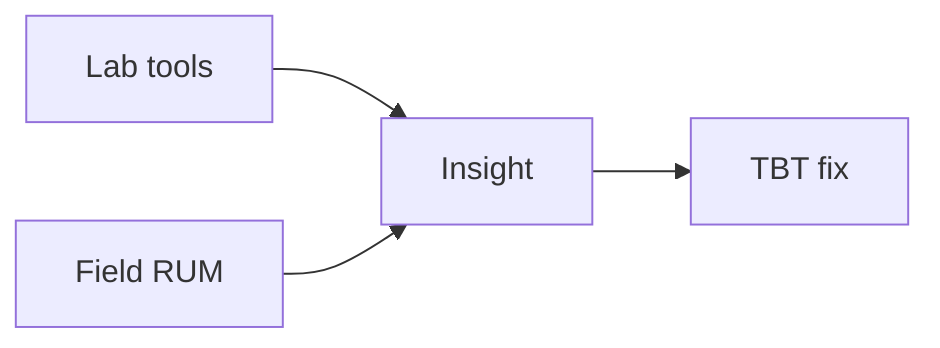

# TBT

<TopicMeta />

<Prerequisites />

::: tip Published
This page meets the handbook **published** bar: deep explanation, ≥10 common mistakes, and official references. Further engine-level errata welcome via PR.
:::

## Introduction

**TBT** aggregates how much main-thread blocking (>50ms tasks) occurs after FCP in lab metrics. It correlates with poor interactivity.

## Why does it exist?

It turns “we have long tasks” into a single optimization target during Lighthouse work.

## Historical Background

Lighthouse metric bridging lab traces to responsiveness before INP field ubiquity.

## Mental Model

Each long task contributes (duration − 50ms) to TBT. Split work to stay under ~50ms slices.

## Internal Workflow

1. Define what TBT measures and the “good” threshold.
2. Collect lab (Lighthouse/Perf panel) and field (CrUX/RUM) data.
3. Attribute the slow stage in a trace.
4. Change one cause; remeasure.
5. Guard with budgets in CI/RUM alerts.

## Lifecycle



## Browser Perspective

TBT is observed in Chromium Performance/Lighthouse and via web-vitals JS APIs in the field.

## JavaScript Engine Perspective

JS long tasks, layout, and paint feed into how TBT feels to users.

## React Perspective

Unnecessary renders/hydration inflate interaction and paint costs that show up in TBT.

## Next.js Perspective

Server TTFB, streaming, and client bundle size all influence TBT depending on the metric.

## Server Perspective

Not applicable.

## Network Perspective

RTT, bytes, and CDN behavior often dominate before JS micro-optimizations.

## Memory Perspective

GC pauses and large DOM/images can indirectly worsen TBT.

## Performance

Code-split, defer, web workers, yield (`scheduler.yield`), shrink hydration.

## Production Example

A team tracks TBT in RUM by route template, sets a regression alert at p75, and ties fixes to specific owners (images, JS, server).

## Code Examples

```ts
new PerformanceObserver((list) => {
  for (const e of list.getEntries()) console.log('longtask', e.duration)
}).observe({ type: 'longtask', buffered: true })
```

## Diagrams



## Common Mistakes

1. Ignoring third-party long tasks
2. Bundling polyfills unnecessarily
3. Sync large JSON.parse on boot
4. Hydrating whole pages
5. Optimizing TBT in lab only
6. Yielding incorrectly so work still janks
7. Missing a production edge case for 13-performance.tbt (#1)
8. Missing a production edge case for 13-performance.tbt (#2)
9. Missing a production edge case for 13-performance.tbt (#3)
10. Missing a production edge case for 13-performance.tbt (#4)


## Best Practices

- Optimize TBT with field data, not vanity lab scores alone
- Fix the attributed cause, not a random best practice list
- Keep a performance budget for the owning surface
- Re-check after framework upgrades

## Anti-patterns

- Chasing Lighthouse while ignoring RUM
- Micro-optimizing JS before cutting bytes/RTT
- Declaring victory from one local run on fiber

## Comparison

| Signal | Use |
| --- | --- |
| Lab | Debug & regressions |
| Field | Real users / SEO signals |

## Interview Questions

### Easy

**Q:** What is a long task?

**A:** A main-thread task lasting more than 50ms.

### Medium

**Q:** How is TBT related to long tasks?

**A:** It sums the blocking portion (over 50ms) of long tasks after FCP in lab.

### Hard

**Q:** Give a concrete TBT reduction plan for a React app.

**A:** Reduce client JS, split bundles, defer non-critical providers, move parsing off critical path, break handlers, consider workers for CPU work.

## Summary

- TBT: Total Blocking Time: sum of long-task blocking time after FCP in lab traces.
- Measure lab + field
- Attribute before optimizing
- Budget and alert on p75

## References

- [web.dev — TBT](https://web.dev/articles/tbt)
- [MDN — Long Tasks API](https://developer.mozilla.org/en-US/docs/Web/API/PerformanceLongTaskTiming)

<RelatedTopics />


Prev: [`13-performance.fcp`](/13-performance/fcp/) · Next: [`13-performance.profiling`](/13-performance/profiling/)
