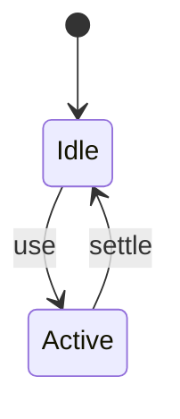
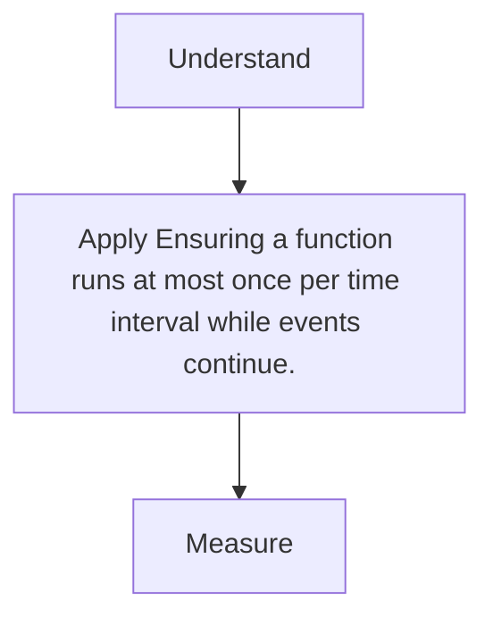

# Throttle

<TopicMeta />

<Prerequisites />

::: tip Published
This page meets the handbook **published** bar: deep explanation, ≥10 common mistakes, and official references. Further engine-level errata welcome via PR.
:::

## Introduction

**Throttle** limits invocation rate—useful for scroll/mousemove handlers that must track continuously but not at 200Hz event rate.

## Why does it exist?

Scroll handlers doing layout/work every event create jank.

## Historical Background

Companion to debounce in utility libraries; rAF throttling is a common variant.

## Mental Model

Leading/trailing edges fire on a fixed cadence while events stream.

## Internal Workflow

1. Choose interval or use rAF.
2. Throttle handler.
3. Prefer CSS/IntersectionObserver over scroll JS when possible.
4. Profile INP/long tasks.

## Lifecycle



## Browser Perspective

Not applicable.

## JavaScript Engine Perspective

Not applicable.

## React Perspective

Not applicable.

## Next.js Perspective

Not applicable.

## Server Perspective

Not applicable.

## Network Perspective

Not applicable.

## Memory Perspective

Not applicable.

## Performance

Measure before/after with lab + field tools. Optimize the attributed bottleneck for Ensuring a function runs at most once per time interval while events continue., not folklore.

## Production Example

Teams adopt Ensuring a function runs at most once per time interval while events continue. on critical routes, add monitoring, and guard regressions with budgets or reviews.

## Code Examples

```ts
export function throttle<T extends (...a: any[]) => void>(fn: T, ms: number) {
  let last = 0
  let t: ReturnType<typeof setTimeout> | undefined
  return (...args: Parameters<T>) => {
    const now = Date.now()
    const remaining = ms - (now - last)
    clearTimeout(t)
    if (remaining <= 0) {
      last = now
      fn(...args)
    } else {
      t = setTimeout(() => {
        last = Date.now()
        fn(...args)
      }, remaining)
    }
  }
}
```

## Diagrams



## Common Mistakes

1. Throttle when debounce was needed (search)
2. Doing layout reads/writes in throttled scroll without batching
3. Too heavy work even when throttled
4. Forgetting passive listeners for scroll
5. Throttle + React setState every frame unnecessarily
6. Ignoring pointerrawupdate storms
7. Missing a production edge case for 13-performance.throttle (#1)
8. Missing a production edge case for 13-performance.throttle (#2)
9. Missing a production edge case for 13-performance.throttle (#3)
10. Missing a production edge case for 13-performance.throttle (#4)


## Best Practices

- Prefer platform/framework primitives
- Measure impact on real user metrics
- Keep the change reviewable and reversible
- Document the invariant you are protecting

## Anti-patterns

- Copy-paste without understanding failure modes
- Premature abstraction around a single use
- Optimizing without a baseline

## Comparison

| Approach | When |
| --- | --- |
| Use as designed | Default |
| Simpler alternative | If constraints differ |

## Interview Questions

### Easy

**Q:** When prefer throttle over debounce?

**A:** When you need periodic updates during continuous input (scroll position), not only the final value.

### Medium

**Q:** Why rAF throttle for visual work?

**A:** Aligns with paint frames (~16ms) and avoids extra layouts between frames.

### Hard

**Q:** Modern alternatives to scroll throttling?

**A:** IntersectionObserver, CSS scroll-driven animations, and scroll timelines reduce JS scroll handlers.

## Summary

- Ensuring a function runs at most once per time interval while events continue.
- Know why it exists and when not to use it
- Measure production impact
- Link related handbook topics instead of duplicating

## References

- [MDN — scroll event](https://developer.mozilla.org/en-US/docs/Web/API/Document/scroll_event)
- [web.dev — IntersectionObserver](https://web.dev/articles/intersectionobserver)

<RelatedTopics />


Prev: [`13-performance.debounce`](/13-performance/debounce/) · Next: [`13-performance.memoization-perf`](/13-performance/memoization-perf/)
