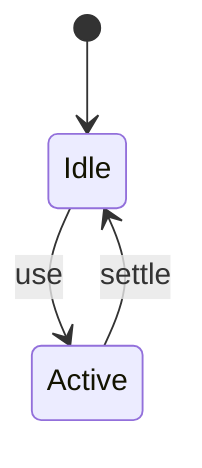
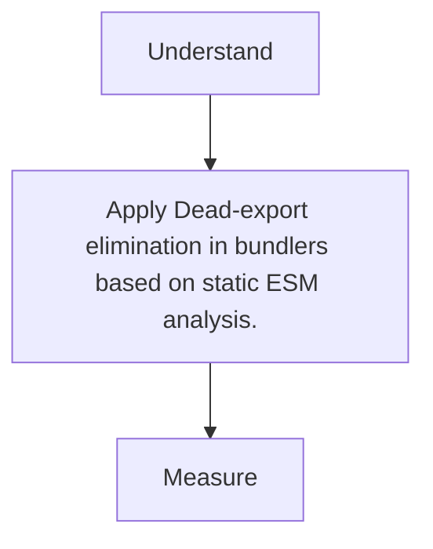

# Tree Shaking

<TopicMeta />

<Prerequisites />

::: tip Published
This page meets the handbook **published** bar: deep explanation, ≥10 common mistakes, and official references. Further engine-level errata welcome via PR.
:::

## Introduction

**Tree shaking** removes unused module exports from production bundles when using static `import`/`export` ESM graphs.

## Why does it exist?

Libraries export more than you use. Shaking keeps only referenced exports.

## Historical Background

Rollup popularized; webpack/Vite/esbuild implement variants with caveats for side effects.

## Mental Model

Static import graph + `sideEffects` hints → drop unreferenced exports. Dynamic import/CJS limit shaking.

## Internal Workflow

1. Prefer ESM packages.
2. Import named paths, avoid mega barrels.
3. Mark side-effect-free in package.json when authoring libs.
4. Verify with analyzer.

## Lifecycle



## Browser Perspective

Not applicable.

## JavaScript Engine Perspective

Less JS to parse/compile.

## React Perspective

Not applicable.

## Next.js Perspective

Client bundles benefit most.

## Server Perspective

Not applicable.

## Network Perspective

Not applicable.

## Memory Perspective

Not applicable.

## Performance

Measure before/after with lab + field tools. Optimize the attributed bottleneck for Dead-export elimination in bundlers based on static ESM analysis., not folklore.

## Production Example

Teams adopt Dead-export elimination in bundlers based on static ESM analysis. on critical routes, add monitoring, and guard regressions with budgets or reviews.

## Code Examples

```ts
// Good (often shakeable)
import debounce from 'lodash-es/debounce'
// Bad (often pulls a lot)
import _ from 'lodash'
```

## Diagrams



## Common Mistakes

1. import _ from "lodash" instead of per-method/ESM
2. Barrel index re-exports defeating shake
3. Relying on shaking for CJS packages
4. Side-effectful modules unmarked
5. Assuming TypeScript elides runtime imports always
6. Testing shake only in dev mode
7. Missing a production edge case for 13-performance.tree-shaking (#1)
8. Missing a production edge case for 13-performance.tree-shaking (#2)
9. Missing a production edge case for 13-performance.tree-shaking (#3)
10. Missing a production edge case for 13-performance.tree-shaking (#4)


## Best Practices

- Prefer platform/framework primitives
- Measure impact on real user metrics
- Keep the change reviewable and reversible
- Document the invariant you are protecting

## Anti-patterns

- Copy-paste without understanding failure modes
- Premature abstraction around a single use
- Optimizing without a baseline

## Comparison

| Approach | When |
| --- | --- |
| Use as designed | Default |
| Simpler alternative | If constraints differ |

## Interview Questions

### Easy

**Q:** What is tree shaking?

**A:** Bundler removal of unused ESM exports from the output.

### Medium

**Q:** Why does CommonJS shake poorly?

**A:** Exports are dynamic properties; static analysis cannot prove safety as well as ESM.

### Hard

**Q:** What does sideEffects: false mean?

**A:** Tells bundlers files can be dropped if exports unused—dangerous if the file actually runs polyfills on import.

## Summary

- Dead-export elimination in bundlers based on static ESM analysis.
- Know why it exists and when not to use it
- Measure production impact
- Link related handbook topics instead of duplicating

## References

- [webpack — Tree Shaking](https://webpack.js.org/guides/tree-shaking/)
- [Rollup — Tree-shaking](https://rollupjs.org/introduction/#tree-shaking)

<RelatedTopics />


Prev: [`13-performance.code-splitting`](/13-performance/code-splitting/) · Next: [`13-performance.dead-code-elimination`](/13-performance/dead-code-elimination/)
