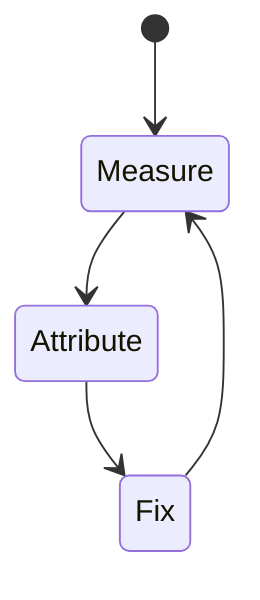
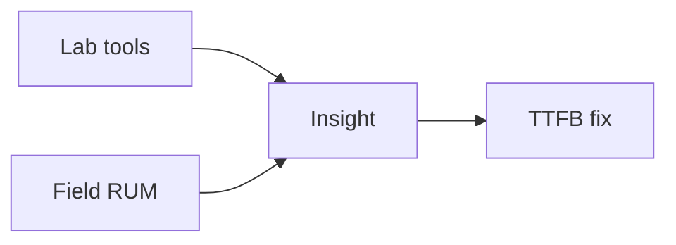

# TTFB

<TopicMeta />

<Prerequisites />

::: tip Published
This page meets the handbook **published** bar: deep explanation, ≥10 common mistakes, and official references. Further engine-level errata welcome via PR.
:::

## Introduction

**TTFB** measures waiting time from request start to the first response byte. It bounds how early streaming/painting can begin.

## Why does it exist?

No front-end trick fixes a 2s origin wait. TTFB separates network/server issues from rendering issues.

## Historical Background

Classic networking metric; still foundational under CWV (feeds LCP).

## Mental Model

DNS + TCP/TLS + server think time + early flush. Streaming helps after first byte.

## Internal Workflow

1. Define what TTFB measures and the “good” threshold.
2. Collect lab (Lighthouse/Perf panel) and field (CrUX/RUM) data.
3. Attribute the slow stage in a trace.
4. Change one cause; remeasure.
5. Guard with budgets in CI/RUM alerts.

## Lifecycle



## Browser Perspective

TTFB is observed in Chromium Performance/Lighthouse and via web-vitals JS APIs in the field.

## JavaScript Engine Perspective

JS long tasks, layout, and paint feed into how TTFB feels to users.

## React Perspective

Unnecessary renders/hydration inflate interaction and paint costs that show up in TTFB.

## Next.js Perspective

Server TTFB, streaming, and client bundle size all influence TTFB depending on the metric.

## Server Perspective

Not applicable.

## Network Perspective

RTT, bytes, and CDN behavior often dominate before JS micro-optimizations.

## Memory Perspective

GC pauses and large DOM/images can indirectly worsen TTFB.

## Performance

Cache at CDN, optimize SSR data, pool DB, edge for tiny work, avoid request waterfalls on server.

## Production Example

A team tracks TTFB in RUM by route template, sets a regression alert at p75, and ties fixes to specific owners (images, JS, server).

## Code Examples

```ts
const nav = performance.getEntriesByType('navigation')[0] as PerformanceNavigationTiming
console.log('TTFB', nav.responseStart - nav.requestStart)
```

## Diagrams



## Common Mistakes

1. Blaming React for a slow API origin
2. SSR waterfalls (await A then B) before first byte
3. No CDN for static HTML that could be static
4. Cold starts ignored in serverless p95
5. Measuring TTFB only on localhost
6. Flushing late because of buffered middleware
7. Missing a production edge case for 13-performance.ttfb (#1)
8. Missing a production edge case for 13-performance.ttfb (#2)
9. Missing a production edge case for 13-performance.ttfb (#3)
10. Missing a production edge case for 13-performance.ttfb (#4)


## Best Practices

- Optimize TTFB with field data, not vanity lab scores alone
- Fix the attributed cause, not a random best practice list
- Keep a performance budget for the owning surface
- Re-check after framework upgrades

## Anti-patterns

- Chasing Lighthouse while ignoring RUM
- Micro-optimizing JS before cutting bytes/RTT
- Declaring victory from one local run on fiber

## Comparison

| Signal | Use |
| --- | --- |
| Lab | Debug & regressions |
| Field | Real users / SEO signals |

## Interview Questions

### Easy

**Q:** What is TTFB?

**A:** Time until the first byte of the response arrives.

### Medium

**Q:** How does streaming relate to TTFB?

**A:** TTFB is still gated by whatever you await before sending the first chunk; streaming helps subsequent bytes, not magic before first flush.

### Hard

**Q:** Outline a TTFB debug path for Next.js.

**A:** Split edge middleware time, server data fetch time, and render time with server timings/logs; check region, pool, cache hits, and whether the route is dynamic.

## Summary

- TTFB: Time to First Byte: latency until the browser receives the first response byte.
- Measure lab + field
- Attribute before optimizing
- Budget and alert on p75

## References

- [web.dev — TTFB](https://web.dev/articles/ttfb)
- [MDN — Navigation Timing](https://developer.mozilla.org/en-US/docs/Web/API/PerformanceNavigationTiming)

<RelatedTopics />


Prev: [`13-performance.inp`](/13-performance/inp/) · Next: [`13-performance.tti`](/13-performance/tti/)
