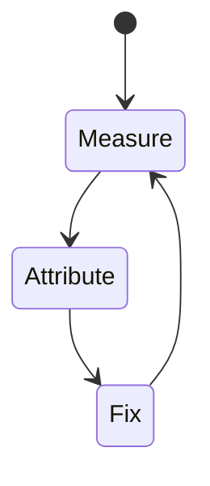
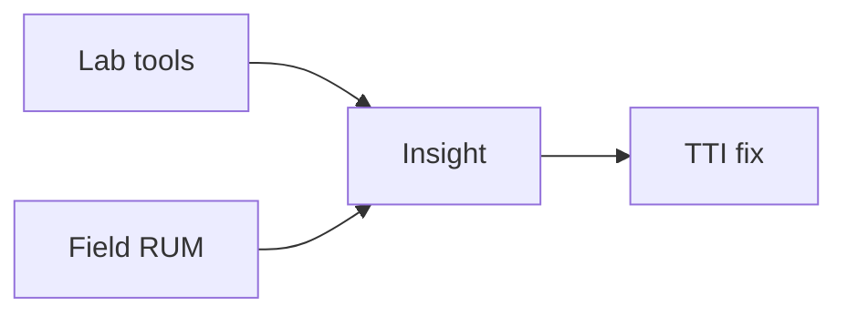

# TTI

<TopicMeta />

<Prerequisites />

::: tip Published
This page meets the handbook **published** bar: deep explanation, ≥10 common mistakes, and official references. Further engine-level errata welcome via PR.
:::

## Introduction

**TTI** estimates when the main thread is quiet enough that the page can handle interactions consistently. It is lab-oriented and less central than INP in modern CWV, but still useful historically and in Lighthouse.

## Why does it exist?

A painted page that ignores taps is a trap. TTI tried to capture “usable” time before INP matured.

## Historical Background

Prominent in Lighthouse earlier; field focus shifted toward INP.

## Mental Model

After FCP, wait until long tasks settle and network quiets—heuristic, noisy, but directional.

## Internal Workflow

1. Define what TTI measures and the “good” threshold.
2. Collect lab (Lighthouse/Perf panel) and field (CrUX/RUM) data.
3. Attribute the slow stage in a trace.
4. Change one cause; remeasure.
5. Guard with budgets in CI/RUM alerts.

## Lifecycle



## Browser Perspective

TTI is observed in Chromium Performance/Lighthouse and via web-vitals JS APIs in the field.

## JavaScript Engine Perspective

JS long tasks, layout, and paint feed into how TTI feels to users.

## React Perspective

Unnecessary renders/hydration inflate interaction and paint costs that show up in TTI.

## Next.js Perspective

Server TTFB, streaming, and client bundle size all influence TTI depending on the metric.

## Server Perspective

Not applicable.

## Network Perspective

RTT, bytes, and CDN behavior often dominate before JS micro-optimizations.

## Memory Perspective

GC pauses and large DOM/images can indirectly worsen TTI.

## Performance

Reduce JS, break long tasks, defer third parties—same levers as INP, measured differently.

## Production Example

A team tracks TTI in RUM by route template, sets a regression alert at p75, and ties fixes to specific owners (images, JS, server).

## Code Examples

```bash
npx lighthouse https://example.com --only-categories=performance
```

## Diagrams



## Common Mistakes

1. Optimizing TTI lab score while ignoring field INP
2. Assuming TTI equals LCP
3. Blocking hydration with giant bundles
4. Third-party tags destroying interactivity
5. Treating TTI as a CWV
6. Overfitting to Lighthouse simulated throttling quirks
7. Missing a production edge case for 13-performance.tti (#1)
8. Missing a production edge case for 13-performance.tti (#2)
9. Missing a production edge case for 13-performance.tti (#3)
10. Missing a production edge case for 13-performance.tti (#4)


## Best Practices

- Optimize TTI with field data, not vanity lab scores alone
- Fix the attributed cause, not a random best practice list
- Keep a performance budget for the owning surface
- Re-check after framework upgrades

## Anti-patterns

- Chasing Lighthouse while ignoring RUM
- Micro-optimizing JS before cutting bytes/RTT
- Declaring victory from one local run on fiber

## Comparison

| Signal | Use |
| --- | --- |
| Lab | Debug & regressions |
| Field | Real users / SEO signals |

## Interview Questions

### Easy

**Q:** Is TTI a Core Web Vital?

**A:** No. Prefer INP for interactivity in CWV; TTI remains a lab heuristic.

### Medium

**Q:** Why can TTI and INP disagree?

**A:** Different definitions/windows; INP observes real interactions in field data.

### Hard

**Q:** What replaced TTI in product conversations?

**A:** INP plus total blocking time/long tasks analysis for main-thread health.

## Summary

- TTI: Time to Interactive: when the page is visually ready and reliably responds to input.
- Measure lab + field
- Attribute before optimizing
- Budget and alert on p75

## References

- [web.dev — TTI](https://web.dev/articles/tti)
- [web.dev — Core Web Vitals](https://web.dev/explore/learn-core-web-vitals)
- [Chrome — Web Vitals](https://developer.chrome.com/docs/performance/insights/web-vitals)

<RelatedTopics />


Prev: [`13-performance.ttfb`](/13-performance/ttfb/) · Next: [`13-performance.fcp`](/13-performance/fcp/)
