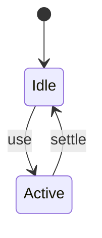
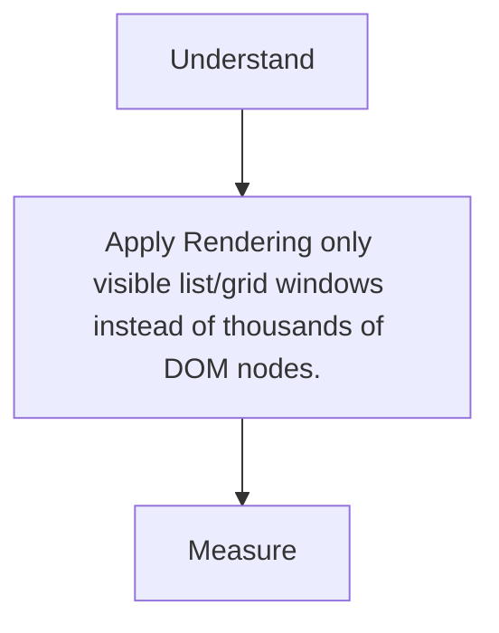

# Virtualization

<TopicMeta />

<Prerequisites />

::: tip Published
This page meets the handbook **published** bar: deep explanation, ≥10 common mistakes, and official references. Further engine-level errata welcome via PR.
:::

## Introduction

**Virtualization** (windowing) mounts only viewport-adjacent rows/cells for large lists, recycling DOM as the user scrolls.

## Why does it exist?

10k DOM nodes destroy memory, style, and scroll performance.

## Historical Background

react-window/react-virtualized → TanStack Virtual; native content-visibility helps some cases.

## Mental Model

Spacer height = total size; absolute-position visible slice; on scroll, update slice.

## Internal Workflow

1. Measure row height strategy (fixed vs dynamic).
2. Adopt a virtualizer.
3. Keep row components cheap.
4. Preserve a11y (focus, announcements).

## Lifecycle



## Browser Perspective

Fewer elements → less layout/paint.

## JavaScript Engine Perspective

Not applicable.

## React Perspective

Reconcile only visible window.

## Next.js Perspective

Not applicable.

## Server Perspective

Not applicable.

## Network Perspective

Not applicable.

## Memory Perspective

Not applicable.

## Performance

Measure before/after with lab + field tools. Optimize the attributed bottleneck for Rendering only visible list/grid windows instead of thousands of DOM nodes., not folklore.

## Production Example

Teams adopt Rendering only visible list/grid windows instead of thousands of DOM nodes. on critical routes, add monitoring, and guard regressions with budgets or reviews.

## Code Examples

```tsx
// Conceptual
const start = Math.floor(scrollTop / rowHeight)
const visible = items.slice(start, start + pageSize)
```

## Diagrams



## Common Mistakes

1. Virtualizing small lists needlessly
2. Dynamic heights without measurement causing jumps
3. Breaking keyboard focus
4. Heavy row children defeating the win
5. SSR mismatch with window sizes
6. Nested virtualizers without plan
7. Missing a production edge case for 13-performance.virtualization (#1)
8. Missing a production edge case for 13-performance.virtualization (#2)
9. Missing a production edge case for 13-performance.virtualization (#3)
10. Missing a production edge case for 13-performance.virtualization (#4)


## Best Practices

- Prefer platform/framework primitives
- Measure impact on real user metrics
- Keep the change reviewable and reversible
- Document the invariant you are protecting

## Anti-patterns

- Copy-paste without understanding failure modes
- Premature abstraction around a single use
- Optimizing without a baseline

## Comparison

| Approach | When |
| --- | --- |
| Use as designed | Default |
| Simpler alternative | If constraints differ |

## Interview Questions

### Easy

**Q:** Why virtualize long lists?

**A:** To keep DOM size roughly constant so scroll/memory stay healthy.

### Medium

**Q:** Fixed vs dynamic row heights?

**A:** Fixed is simpler/faster; dynamic needs measurement and can cause more layout work.

### Hard

**Q:** How handle a11y in virtual lists?

**A:** Ensure focusable items can be reached, maintain aria set size/pos insets carefully, and avoid removing focused nodes abruptly.

## Summary

- Rendering only visible list/grid windows instead of thousands of DOM nodes.
- Know why it exists and when not to use it
- Measure production impact
- Link related handbook topics instead of duplicating

## References

- [TanStack Virtual](https://tanstack.com/virtual/latest)
- [web.dev — content-visibility](https://web.dev/articles/content-visibility)

<RelatedTopics />


Prev: [`13-performance.memoization-perf`](/13-performance/memoization-perf/) · Next: [`13-performance.image-optimization-perf`](/13-performance/image-optimization-perf/)
