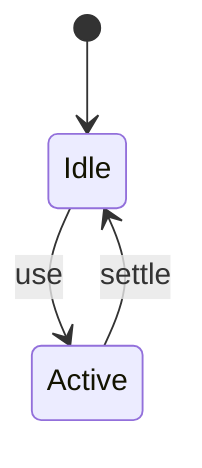
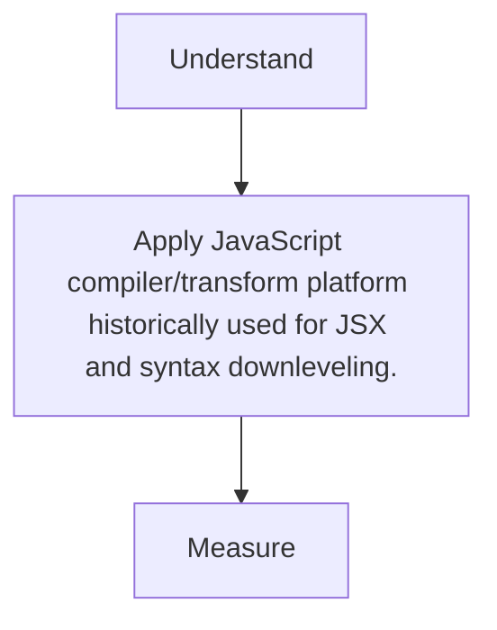

# Babel

<TopicMeta />

<Prerequisites />

::: tip Published
This page meets the handbook **published** bar: deep explanation, ≥10 common mistakes, and official references. Further engine-level errata welcome via PR.
:::

## Introduction

**Babel** transforms JS syntax (and via presets/plugins JSX/TS) into target-compatible code. Still common, though many pipelines moved to SWC/esbuild for speed.

## Why does it exist?

It let the community adopt new syntax early and share an ecosystem of codemods/plugins.

## Historical Background

6to5 → Babel; peaked as default CRA/webpack transform; Next moved toward SWC.

## Mental Model

Parse → AST transform plugins → generate. Preset-env targets browserslist.

## Internal Workflow

1. babel.config.js presets.
2. Cache transforms.
3. Avoid duplicate TS transpilation paths.
4. Prefer SWC/esbuild when plugin needs allow.

## Lifecycle



## Browser Perspective

Not applicable.

## JavaScript Engine Perspective

Not applicable.

## React Perspective

Not applicable.

## Next.js Perspective

Not applicable.

## Server Perspective

Not applicable.

## Network Perspective

Not applicable.

## Memory Perspective

Not applicable.

## Performance

Measure before/after with lab + field tools. Optimize the attributed bottleneck for JavaScript compiler/transform platform historically used for JSX and syntax downleveling., not folklore.

## Production Example

Teams adopt JavaScript compiler/transform platform historically used for JSX and syntax downleveling. on critical routes, add monitoring, and guard regressions with budgets or reviews.

## Code Examples

```json
{
  "presets": [["@babel/preset-env", { "targets": "defaults" }], "@babel/preset-react"]
}
```

## Diagrams



## Common Mistakes

1. Double-transpiling with tsc + babel + swc
2. Over-polyfilling with bad targets
3. Huge plugin stacks slowing CI
4. Shipping babel-runtime helpers duplicated
5. Using Babel only for TS types (it doesn’t typecheck)
6. Outdated preset-env targets
7. Missing a production edge case for 14-build-tools.babel (#1)
8. Missing a production edge case for 14-build-tools.babel (#2)
9. Missing a production edge case for 14-build-tools.babel (#3)
10. Missing a production edge case for 14-build-tools.babel (#4)


## Best Practices

- Prefer platform/framework primitives
- Measure impact on real user metrics
- Keep the change reviewable and reversible
- Document the invariant you are protecting

## Anti-patterns

- Copy-paste without understanding failure modes
- Premature abstraction around a single use
- Optimizing without a baseline

## Comparison

| Approach | When |
| --- | --- |
| Use as designed | Default |
| Simpler alternative | If constraints differ |

## Interview Questions

### Easy

**Q:** Does Babel typecheck TypeScript?

**A:** No—it strips types; use tsc/eslint for typechecking.

### Medium

**Q:** What is preset-env?

**A:** A preset that loads transforms/polyfills based on browserslist targets.

### Hard

**Q:** Why migrate Babel→SWC?

**A:** Order-of-magnitude faster transforms for common React/TS paths; lose some custom Babel plugins.

## Summary

- JavaScript compiler/transform platform historically used for JSX and syntax downleveling.
- Know why it exists and when not to use it
- Measure production impact
- Link related handbook topics instead of duplicating

## References

- [Babel Docs](https://babeljs.io/docs/)
- [Browserslist](https://browsersl.ist/)

<RelatedTopics />


Prev: [`14-build-tools.parcel`](/14-build-tools/parcel/) · Next: [`14-build-tools.swc`](/14-build-tools/swc/)
