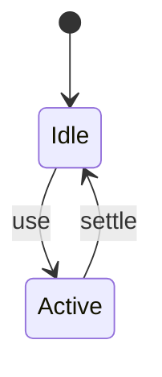
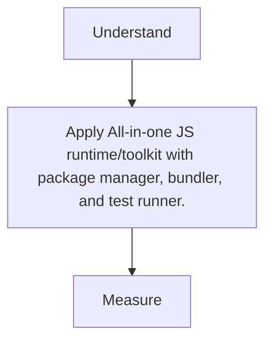

# Bun

<TopicMeta />

<Prerequisites />

::: tip Published
This page meets the handbook **published** bar: deep explanation, ≥10 common mistakes, and official references. Further engine-level errata welcome via PR.
:::

## Introduction

**Bun** is a modern toolkit (Zig + JavaScriptCore) aiming to replace pieces of Node+npm+bundler+jest with one fast binary.

## Why does it exist?

Dev speed and simpler tooling stacks attract greenfield projects; Node compatibility is improving but not perfect.

## Historical Background

Rapid 2022–2024 rise; production caution varies by team.

## Mental Model

Drop-in aspirations for many Node APIs + built-in bundler/test—verify compatibility.

## Internal Workflow

1. Install bun.
2. bun install / bun run.
3. Validate native addons & edge APIs.
4. Keep an escape hatch to Node CI if needed.

## Lifecycle



## Browser Perspective

Not applicable.

## JavaScript Engine Perspective

Not applicable.

## React Perspective

Not applicable.

## Next.js Perspective

Not applicable.

## Server Perspective

Not applicable.

## Network Perspective

Not applicable.

## Memory Perspective

Not applicable.

## Performance

Measure before/after with lab + field tools. Optimize the attributed bottleneck for All-in-one JS runtime/toolkit with package manager, bundler, and test runner., not folklore.

## Production Example

Teams adopt All-in-one JS runtime/toolkit with package manager, bundler, and test runner. on critical routes, add monitoring, and guard regressions with budgets or reviews.

## Code Examples

```bash
bun install
bun test
bun build ./src/index.ts --outdir dist
```

## Diagrams



## Common Mistakes

1. Assuming 100% Node API compatibility
2. Native modules failing silently
3. Team split between bun.lockb and npm lock
4. Production runtime switch without load tests
5. Ignoring Windows/path quirks
6. Using bun only locally with different CI runtime
7. Missing a production edge case for 14-build-tools.bun (#1)
8. Missing a production edge case for 14-build-tools.bun (#2)
9. Missing a production edge case for 14-build-tools.bun (#3)
10. Missing a production edge case for 14-build-tools.bun (#4)


## Best Practices

- Prefer platform/framework primitives
- Measure impact on real user metrics
- Keep the change reviewable and reversible
- Document the invariant you are protecting

## Anti-patterns

- Copy-paste without understanding failure modes
- Premature abstraction around a single use
- Optimizing without a baseline

## Comparison

| Approach | When |
| --- | --- |
| Use as designed | Default |
| Simpler alternative | If constraints differ |

## Interview Questions

### Easy

**Q:** What is Bun?

**A:** A fast JS runtime and toolkit including package manager, bundler, and test runner.

### Medium

**Q:** Engine difference vs Node?

**A:** Bun uses JavaScriptCore; Node uses V8—subtle compat differences exist.

### Hard

**Q:** When not to adopt Bun as prod runtime?

**A:** Heavy native addons, niche Node APIs, or strict enterprise support matrices—use bun for DX but deploy on Node if needed.

## Summary

- All-in-one JS runtime/toolkit with package manager, bundler, and test runner.
- Know why it exists and when not to use it
- Measure production impact
- Link related handbook topics instead of duplicating

## References

- [Bun Docs](https://bun.sh/docs)
- [Bun Runtime](https://bun.sh/docs/runtime)

<RelatedTopics />


Prev: [`14-build-tools.yarn`](/14-build-tools/yarn/) · Next: [`14-build-tools.module-resolution`](/14-build-tools/module-resolution/)
