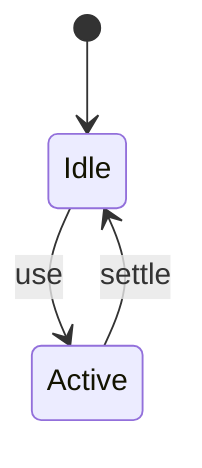
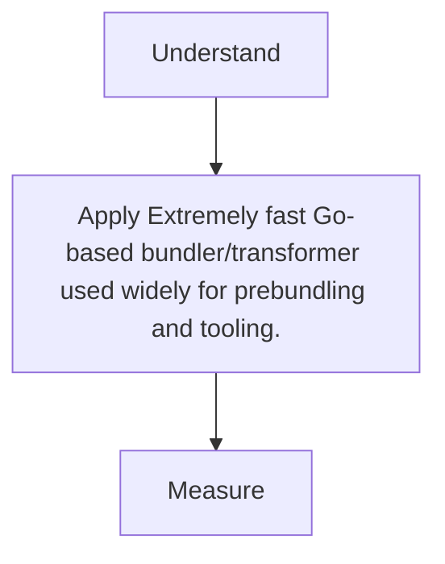

# esbuild

<TopicMeta />

<Prerequisites />

::: tip Published
This page meets the handbook **published** bar: deep explanation, ≥10 common mistakes, and official references. Further engine-level errata welcome via PR.
:::

## Introduction

**esbuild** is a high-performance bundler/transformer written in Go. Vite uses it to prebundle dependencies; many tools use it for TS transpile and minify.

## Why does it exist?

JS-written bundlers were too slow for iterative DX; esbuild reset expectations.

## Historical Background

Evan Wallace; foundational to Vite’s success.

## Mental Model

Limited plugin model vs webpack, but incredible speed for common cases.

## Internal Workflow

1. esbuild entry --bundle.
2. Or rely via Vite optimizeDeps.
3. Know when Rollup/webpack still needed.
4. Use for scripts/TS transpile in CI.

## Lifecycle



## Browser Perspective

Not applicable.

## JavaScript Engine Perspective

Not applicable.

## React Perspective

Not applicable.

## Next.js Perspective

Not applicable.

## Server Perspective

Not applicable.

## Network Perspective

Not applicable.

## Memory Perspective

Not applicable.

## Performance

Measure before/after with lab + field tools. Optimize the attributed bottleneck for Extremely fast Go-based bundler/transformer used widely for prebundling and tooling., not folklore.

## Production Example

Teams adopt Extremely fast Go-based bundler/transformer used widely for prebundling and tooling. on critical routes, add monitoring, and guard regressions with budgets or reviews.

## Code Examples

```bash
esbuild app.ts --bundle --minify --outfile=out.js --format=esm
```

## Diagrams



## Common Mistakes

1. Expecting full webpack loader ecosystem
2. Incorrect platform (browser vs node) settings
3. CSS code-splitting expectations mismatch
4. Typecheck skipped
5. Minify legal comments stripping licenses unintentionally
6. Using esbuild alone for complex app code-splitting needs without evaluation
7. Missing a production edge case for 14-build-tools.esbuild (#1)
8. Missing a production edge case for 14-build-tools.esbuild (#2)
9. Missing a production edge case for 14-build-tools.esbuild (#3)
10. Missing a production edge case for 14-build-tools.esbuild (#4)


## Best Practices

- Prefer platform/framework primitives
- Measure impact on real user metrics
- Keep the change reviewable and reversible
- Document the invariant you are protecting

## Anti-patterns

- Copy-paste without understanding failure modes
- Premature abstraction around a single use
- Optimizing without a baseline

## Comparison

| Approach | When |
| --- | --- |
| Use as designed | Default |
| Simpler alternative | If constraints differ |

## Interview Questions

### Easy

**Q:** Where does Vite use esbuild?

**A:** Primarily to pre-bundle dependencies in development (and some transforms).

### Medium

**Q:** esbuild vs Rollup in Vite?

**A:** esbuild for dep prebundle/speed; Rollup for production app bundling features/plugins.

### Hard

**Q:** When is esbuild enough alone?

**A:** Simple bundles/scripts/libraries with modest plugin needs; complex apps may want Vite/webpack ecosystems.

## Summary

- Extremely fast Go-based bundler/transformer used widely for prebundling and tooling.
- Know why it exists and when not to use it
- Measure production impact
- Link related handbook topics instead of duplicating

## References

- [esbuild Docs](https://esbuild.github.io/)
- [Vite Dep Pre-Bundling](https://vitejs.dev/guide/dep-pre-bundling.html)

<RelatedTopics />


Prev: [`14-build-tools.swc`](/14-build-tools/swc/) · Next: [`14-build-tools.postcss`](/14-build-tools/postcss/)
