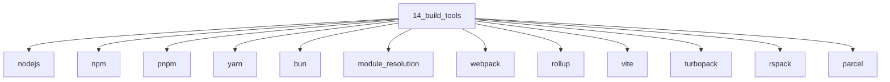

# Build Tools

## Scope

Runtimes, package managers, bundlers, and compilers

## Prerequisites

See the learning paths and each topic's prerequisites in the registry.

## Topics in order

- [Node.js](/14-build-tools/nodejs/) — junior, ~35 min
- [npm](/14-build-tools/npm/) — beginner, ~25 min
- [pnpm](/14-build-tools/pnpm/) — junior, ~25 min
- [Yarn](/14-build-tools/yarn/) — junior, ~20 min
- [Bun](/14-build-tools/bun/) — mid, ~25 min
- [Module Resolution](/14-build-tools/module-resolution/) — mid, ~40 min
- [Webpack](/14-build-tools/webpack/) — mid, ~40 min
- [Rollup](/14-build-tools/rollup/) — mid, ~30 min
- [Vite](/14-build-tools/vite/) — junior, ~35 min
- [Turbopack](/14-build-tools/turbopack/) — mid, ~25 min
- [Rspack](/14-build-tools/rspack/) — mid, ~25 min
- [Parcel](/14-build-tools/parcel/) — mid, ~20 min
- [Babel](/14-build-tools/babel/) — mid, ~30 min
- [SWC](/14-build-tools/swc/) — mid, ~25 min
- [esbuild](/14-build-tools/esbuild/) — mid, ~25 min
- [PostCSS](/14-build-tools/postcss/) — junior, ~25 min
- [Source Maps](/14-build-tools/source-maps/) — mid, ~30 min
- [Monorepo Tooling](/14-build-tools/monorepo-tooling/) — mid, ~35 min

## Module knowledge graph

## Suggested learning paths

Browse [Learning Paths](/learning-paths/).
