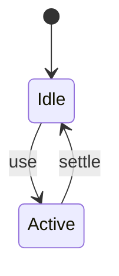

# Module Resolution

<TopicMeta />

<Prerequisites />

::: tip Published
This page meets the handbook **published** bar: deep explanation, ≥10 common mistakes, and official references. Further engine-level errata welcome via PR.
:::

## Introduction

**Module resolution** maps `import 'x'` / `from './y'` to actual files using Node’s algorithm, package `exports`, TypeScript `paths`, and bundler aliases. Most “module not found” bugs are resolution bugs.

## Why does it exist?

Without deterministic resolution, builds differ across tools and Deep Imports break across package versions.

## Historical Background

Node CJS algorithm → ESM + exports field → bundlers adding aliases; TS paths needing bundler mirroring.

## Mental Model

Relative vs bare specifiers; `exports` conditions (`import`/`require`/`types`); extension resolution rules differ CJS/ESM.

## Internal Workflow

1. Prefer package exports over deep paths.
2. Align TS paths with Vite/webpack aliases.
3. Understand conditions.
4. Avoid dual publishing traps when you can.

## Lifecycle



## Browser Perspective

Not applicable.

## JavaScript Engine Perspective

N/A beyond runtime loaders.

## React Perspective

Not applicable.

## Next.js Perspective

Transpile bundler resolves differently from tsc alone.

## Server Perspective

Not applicable.

## Network Perspective

Not applicable.

## Memory Perspective

Not applicable.

## Performance

Measure before/after with lab + field tools. Optimize the attributed bottleneck for How tools find files for import specifiers (node algorithm, exports, TS paths)., not folklore.

## Production Example

Teams adopt How tools find files for import specifiers (node algorithm, exports, TS paths). on critical routes, add monitoring, and guard regressions with budgets or reviews.

## Code Examples

```json
{
  "name": "my-lib",
  "exports": {
    ".": {
      "types": "./dist/index.d.ts",
      "import": "./dist/index.js"
    }
  }
}
```

## Diagrams

```mermaid
flowchart TD
  A[Understand] --> B[Apply How tools find files for import specifiers (node algorithm, exports, TS paths).]
  B --> C[Measure]
```

## Common Mistakes

1. TS paths that the bundler does not understand
2. Importing package internals bypassing exports
3. Extensionless ESM issues in Node
4. Wrong main/module/exports fields in libraries
5. Case-sensitive path bugs (mac vs linux CI)
6. Circular deps masked by resolution order
7. Missing a production edge case for 14-build-tools.module-resolution (#1)
8. Missing a production edge case for 14-build-tools.module-resolution (#2)
9. Missing a production edge case for 14-build-tools.module-resolution (#3)
10. Missing a production edge case for 14-build-tools.module-resolution (#4)


## Best Practices

- Prefer platform/framework primitives
- Measure impact on real user metrics
- Keep the change reviewable and reversible
- Document the invariant you are protecting

## Anti-patterns

- Copy-paste without understanding failure modes
- Premature abstraction around a single use
- Optimizing without a baseline

## Comparison

| Approach | When |
| --- | --- |
| Use as designed | Default |
| Simpler alternative | If constraints differ |

## Interview Questions

### Easy

**Q:** What is a bare specifier?

**A:** An import like `lodash` that is not relative/absolute—resolved via node_modules/package exports.

### Medium

**Q:** What is the exports field for?

**A:** Explicit public entrypoints and conditions so consumers cannot rely on arbitrary file paths.

### Hard

**Q:** Why do dual CJS/ESM packages break?

**A:** Named export interop and incorrect conditional exports lead to undefined exports or dual-package hazards.

## Summary

- How tools find files for import specifiers (node algorithm, exports, TS paths).
- Know why it exists and when not to use it
- Measure production impact
- Link related handbook topics instead of duplicating

## References

- [Node — package exports](https://nodejs.org/api/packages.html#package-entry-points)
- [TypeScript — Module Resolution](https://www.typescriptlang.org/docs/handbook/module-resolution.html)

<RelatedTopics />


Prev: [`14-build-tools.bun`](/14-build-tools/bun/) · Next: [`14-build-tools.webpack`](/14-build-tools/webpack/)
