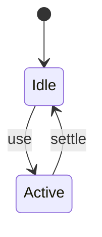
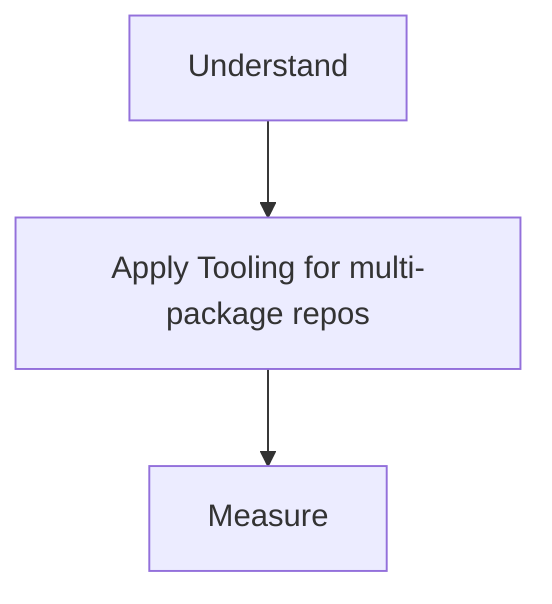

# Monorepo Tooling

<TopicMeta />

<Prerequisites />

::: tip Published
This page meets the handbook **published** bar: deep explanation, ≥10 common mistakes, and official references. Further engine-level errata welcome via PR.
:::

## Introduction

**Monorepo tooling** covers workspaces (pnpm/yarn/npm), task orchestration (Turborepo, Nx), and remote caching so many packages share one repo without O(n²) CI pain.

## Why does it exist?

Shared design systems and apps need atomic changes across packages; tooling makes filtering/caching feasible.

## Historical Background

Bazel-inspired remote cache ideas → JS-native Turborepo/Nx popularity.

## Mental Model

Packages + dependency graph + cached tasks. Build only what changed.

## Internal Workflow

1. Define workspaces.
2. Express package deps.
3. Add pipeline cache (turbo/nx).
4. Filter tasks in CI.
5. Enforce boundaries.

## Lifecycle



## Browser Perspective

Not applicable.

## JavaScript Engine Perspective

Not applicable.

## React Perspective

Not applicable.

## Next.js Perspective

Apps often live beside UI packages in monorepos.

## Server Perspective

Not applicable.

## Network Perspective

Remote cache fetches artifacts.

## Memory Perspective

Not applicable.

## Performance

Measure before/after with lab + field tools. Optimize the attributed bottleneck for Tooling for multi-package repos, not folklore.

## Production Example

Teams adopt Tooling for multi-package repos on critical routes, add monitoring, and guard regressions with budgets or reviews.

## Code Examples

```json
{
  "scripts": {
    "build": "turbo run build",
    "test": "turbo run test --filter=web..."
  }
}
```

## Diagrams



## Common Mistakes

1. No task cache → CI hours
2. Circular package deps
3. Publishing private packages accidentally
4. One version policy chaos
5. Cross-importing app internals
6. Not isolating env per package
7. Missing a production edge case for 14-build-tools.monorepo-tooling (#1)
8. Missing a production edge case for 14-build-tools.monorepo-tooling (#2)
9. Missing a production edge case for 14-build-tools.monorepo-tooling (#3)
10. Missing a production edge case for 14-build-tools.monorepo-tooling (#4)


## Best Practices

- Prefer platform/framework primitives
- Measure impact on real user metrics
- Keep the change reviewable and reversible
- Document the invariant you are protecting

## Anti-patterns

- Copy-paste without understanding failure modes
- Premature abstraction around a single use
- Optimizing without a baseline

## Comparison

| Tool | Focus |
| --- | --- |
| pnpm workspaces | Linking packages |
| Turborepo | Task pipelines + cache |
| Nx | Graphs, generators, cache |

## Interview Questions

### Easy

**Q:** What is a JS monorepo workspace?

**A:** A single repo with multiple packages linked via the package manager’s workspace feature.

### Medium

**Q:** How do task caches help CI?

**A:** They reuse outputs of unchanged packages/tasks based on input hashes.

### Hard

**Q:** How enforce module boundaries?

**A:** Lint rules / Nx tags / dependency-cruiser / package exports so apps cannot import deep internals illegally.

## Summary

- Tooling for multi-package repos: workspaces, task runners, and build caching.
- Know why it exists and when not to use it
- Measure production impact
- Link related handbook topics instead of duplicating

## References

- [pnpm Workspaces](https://pnpm.io/workspaces)
- [Turborepo Docs](https://turbo.build/repo/docs)
- [Nx Docs](https://nx.dev/getting-started/intro)

<RelatedTopics />


Prev: [`14-build-tools.source-maps`](/14-build-tools/source-maps/)
