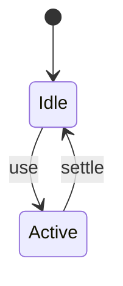
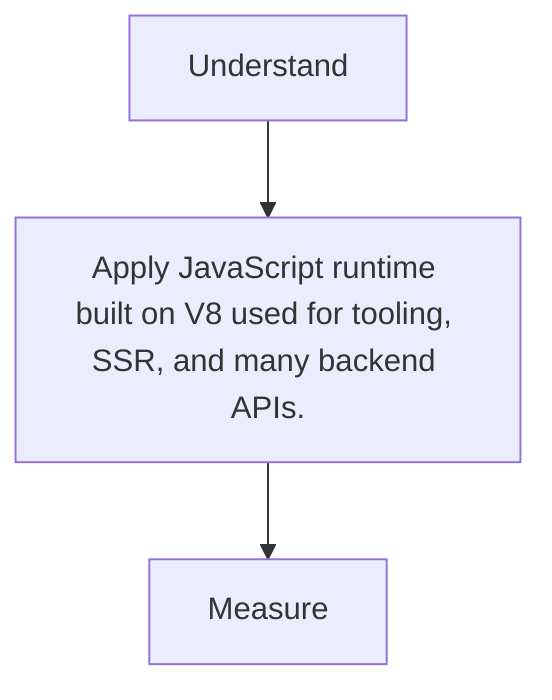

# Node.js

<TopicMeta />

<Prerequisites />

::: tip Published
This page meets the handbook **published** bar: deep explanation, ≥10 common mistakes, and official references. Further engine-level errata welcome via PR.
:::

## Introduction

**Node.js** is the dominant JS runtime outside the browser—powering package managers, bundlers, Next.js servers, and scripts. Frontend engineers live in Node even when shipping browser code.

## Why does it exist?

One language across client/tooling/server reduces context switches and enables isomorphic libraries.

## Historical Background

2009 Ryan Dahl; npm ecosystem explosion; ESM + LTS cadence; competitors (Deno/Bun) push performance.

## Mental Model

Event-loop async I/O + npm modules + semver. Not a browser—no DOM.

## Internal Workflow

1. Install LTS.
2. Use package manager.
3. Run scripts/dev servers.
4. Target engines in package.json.

## Lifecycle



## Browser Perspective

Not applicable.

## JavaScript Engine Perspective

V8 shared lineage with Chrome.

## React Perspective

Not applicable.

## Next.js Perspective

Not applicable.

## Server Perspective

Default Next runtime.

## Network Perspective

http/https modules / fetch.

## Memory Perspective

Not applicable.

## Performance

Measure before/after with lab + field tools. Optimize the attributed bottleneck for JavaScript runtime built on V8 used for tooling, SSR, and many backend APIs., not folklore.

## Production Example

Teams adopt JavaScript runtime built on V8 used for tooling, SSR, and many backend APIs. on critical routes, add monitoring, and guard regressions with budgets or reviews.

## Code Examples

```bash
node -v
node --experimental-vm-modules ./script.mjs
```

## Diagrams



## Common Mistakes

1. Assuming browser APIs exist in Node
2. Ignoring engines field / LTS
3. Blocking the event loop with sync CPU
4. Committing platform-specific binaries blindly
5. Using ancient Node in CI vs local mismatch
6. Leaking secrets in scripts
7. Missing a production edge case for 14-build-tools.nodejs (#1)
8. Missing a production edge case for 14-build-tools.nodejs (#2)
9. Missing a production edge case for 14-build-tools.nodejs (#3)
10. Missing a production edge case for 14-build-tools.nodejs (#4)


## Best Practices

- Prefer platform/framework primitives
- Measure impact on real user metrics
- Keep the change reviewable and reversible
- Document the invariant you are protecting

## Anti-patterns

- Copy-paste without understanding failure modes
- Premature abstraction around a single use
- Optimizing without a baseline

## Comparison

| Approach | When |
| --- | --- |
| Use as designed | Default |
| Simpler alternative | If constraints differ |

## Interview Questions

### Easy

**Q:** What is Node.js?

**A:** A V8-based JavaScript runtime for servers and tooling, with libuv async I/O.

### Medium

**Q:** Why does blocking the event loop hurt?

**A:** Node is mostly single-threaded for JS; sync CPU stalls all concurrent requests/timers.

### Hard

**Q:** How do ESM and CJS interop bite bundlers?

**A:** Dual packages, named export mismatches, and conditional exports require careful resolution—see module-resolution topic.

## Summary

- JavaScript runtime built on V8 used for tooling, SSR, and many backend APIs.
- Know why it exists and when not to use it
- Measure production impact
- Link related handbook topics instead of duplicating

## References

- [Node.js Docs](https://nodejs.org/docs/latest/api/)
- [Node.js Releases](https://nodejs.org/en/about/previous-releases)

<RelatedTopics />


Next: [`14-build-tools.npm`](/14-build-tools/npm/)
