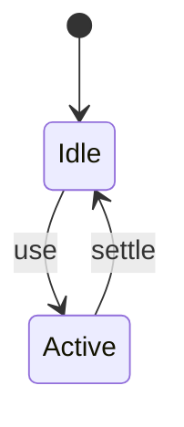
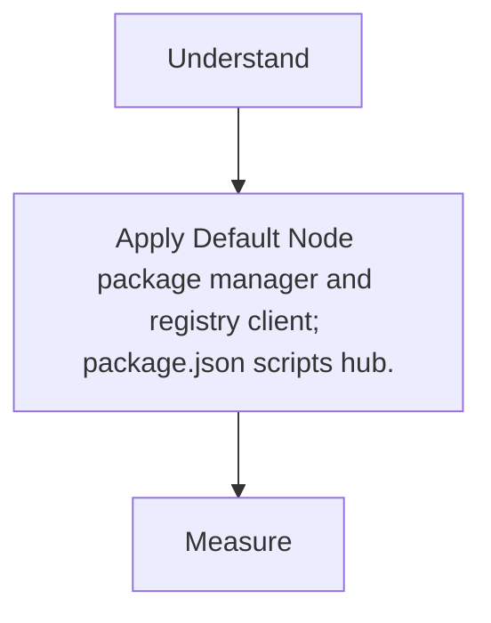

# npm

<TopicMeta />

<Prerequisites />

::: tip Published
This page meets the handbook **published** bar: deep explanation, ≥10 common mistakes, and official references. Further engine-level errata welcome via PR.
:::

## Introduction

**npm** installs packages from the npm registry, manages `package-lock.json`, and runs scripts. Even when you prefer pnpm/yarn, you speak npm’s package.json schema.

## Why does it exist?

Shared package metadata is the lingua franca of JS dependencies.

## Historical Background

Bundled with Node for years; lockfiles and workspaces matured over time.

## Mental Model

manifest (package.json) + lockfile + node_modules layout (hoisted by default).

## Internal Workflow

1. npm install.
2. Run a package script with `npm run <name>`.
3. npm outdated / audit.
4. Publish with care.

## Lifecycle



## Browser Perspective

Not applicable.

## JavaScript Engine Perspective

Not applicable.

## React Perspective

Not applicable.

## Next.js Perspective

Not applicable.

## Server Perspective

Not applicable.

## Network Perspective

Not applicable.

## Memory Perspective

Not applicable.

## Performance

Measure before/after with lab + field tools. Optimize the attributed bottleneck for Default Node package manager and registry client; package.json scripts hub., not folklore.

## Production Example

Teams adopt Default Node package manager and registry client; package.json scripts hub. on critical routes, add monitoring, and guard regressions with budgets or reviews.

## Code Examples

```bash
npm install lodash-es
npm run build
```

## Diagrams



## Common Mistakes

1. Deleting lockfiles casually
2. Mixing npm/yarn/pnpm locks in one repo
3. Installing packages as wrong dependency type
4. Ignoring peer dependency warnings
5. Publishing with secrets in files
6. Using latest tags unpinned in apps
7. Missing a production edge case for 14-build-tools.npm (#1)
8. Missing a production edge case for 14-build-tools.npm (#2)
9. Missing a production edge case for 14-build-tools.npm (#3)
10. Missing a production edge case for 14-build-tools.npm (#4)


## Best Practices

- Prefer platform/framework primitives
- Measure impact on real user metrics
- Keep the change reviewable and reversible
- Document the invariant you are protecting

## Anti-patterns

- Copy-paste without understanding failure modes
- Premature abstraction around a single use
- Optimizing without a baseline

## Comparison

| Approach | When |
| --- | --- |
| Use as designed | Default |
| Simpler alternative | If constraints differ |

## Interview Questions

### Easy

**Q:** What does package-lock.json do?

**A:** Pins exact resolved dependency trees for reproducible installs.

### Medium

**Q:** dependencies vs devDependencies?

**A:** Runtime needed in prod vs tooling needed to build/test; bundlers may still compile deps either way—deploy images often omit devDeps.

### Hard

**Q:** How do npm workspaces relate to monorepos?

**A:** Native multi-package repos with hoisting; alternatives like pnpm workspaces offer stricter linking.

## Summary

- Default Node package manager and registry client; package.json scripts hub.
- Know why it exists and when not to use it
- Measure production impact
- Link related handbook topics instead of duplicating

## References

- [npm Docs](https://docs.npmjs.com/)
- [package.json](https://docs.npmjs.com/cli/v10/configuring-npm/package-json)

<RelatedTopics />


Prev: [`14-build-tools.nodejs`](/14-build-tools/nodejs/) · Next: [`14-build-tools.pnpm`](/14-build-tools/pnpm/)
