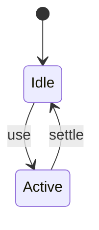
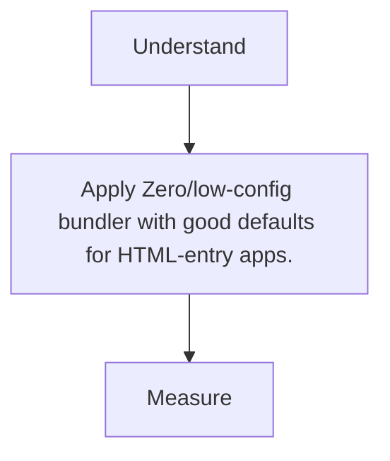

# Parcel

<TopicMeta />

<Prerequisites />

::: tip Published
This page meets the handbook **published** bar: deep explanation, ≥10 common mistakes, and official references. Further engine-level errata welcome via PR.
:::

## Introduction

**Parcel** emphasizes convention and automatic transforms with minimal config—point at HTML and go.

## Why does it exist?

Reduces config tax for smaller projects and prototypes.

## Historical Background

Competed with webpack on DX; continues with Parcel 2 architecture.

## Mental Model

Entry HTML/assets → automatic pipeline → outputs.

## Internal Workflow

1. parcel index.html.
2. Add transformers as needed.
3. Production build.
4. Prefer when config fatigue > need for deep control.

## Lifecycle



## Browser Perspective

Not applicable.

## JavaScript Engine Perspective

Not applicable.

## React Perspective

Not applicable.

## Next.js Perspective

Not applicable.

## Server Perspective

Not applicable.

## Network Perspective

Not applicable.

## Memory Perspective

Not applicable.

## Performance

Measure before/after with lab + field tools. Optimize the attributed bottleneck for Zero/low-config bundler with good defaults for HTML-entry apps., not folklore.

## Production Example

Teams adopt Zero/low-config bundler with good defaults for HTML-entry apps. on critical routes, add monitoring, and guard regressions with budgets or reviews.

## Code Examples

```bash
npx parcel src/index.html
```

## Diagrams



## Common Mistakes

1. Fighting Parcel with webpack mental models
2. Needing exotic loader chains Parcel lacks
3. Monorepo resolution surprises
4. Not pinning versions
5. Expecting identical plugin ecosystem to webpack
6. Skipping explicit optimization audits
7. Missing a production edge case for 14-build-tools.parcel (#1)
8. Missing a production edge case for 14-build-tools.parcel (#2)
9. Missing a production edge case for 14-build-tools.parcel (#3)
10. Missing a production edge case for 14-build-tools.parcel (#4)


## Best Practices

- Prefer platform/framework primitives
- Measure impact on real user metrics
- Keep the change reviewable and reversible
- Document the invariant you are protecting

## Anti-patterns

- Copy-paste without understanding failure modes
- Premature abstraction around a single use
- Optimizing without a baseline

## Comparison

| Approach | When |
| --- | --- |
| Use as designed | Default |
| Simpler alternative | If constraints differ |

## Interview Questions

### Easy

**Q:** What is Parcel known for?

**A:** Zero/low-config bundling with strong defaults.

### Medium

**Q:** When choose Vite/webpack instead?

**A:** When you need specific plugin ecosystems, library mode conventions, or team-standard toolchains.

### Hard

**Q:** How does Parcel discover dependencies?

**A:** From HTML/JS/CSS entries via static analysis and its transformer pipeline.

## Summary

- Zero/low-config bundler with good defaults for HTML-entry apps.
- Know why it exists and when not to use it
- Measure production impact
- Link related handbook topics instead of duplicating

## References

- [Parcel Docs](https://parceljs.org/)
- [Parcel Getting Started](https://parceljs.org/getting-started/webapp/)

<RelatedTopics />


Prev: [`14-build-tools.rspack`](/14-build-tools/rspack/) · Next: [`14-build-tools.babel`](/14-build-tools/babel/)
