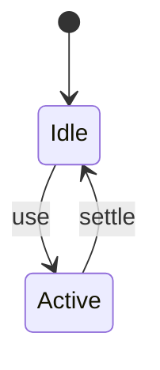
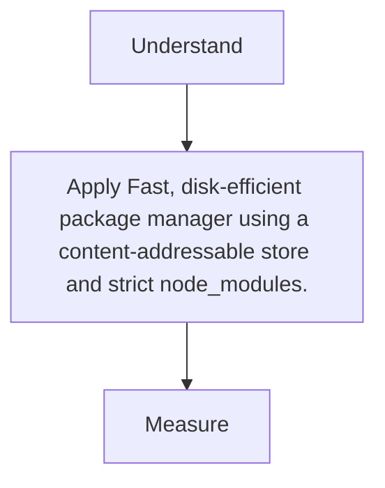

# pnpm

<TopicMeta />

<Prerequisites />

::: tip Published
This page meets the handbook **published** bar: deep explanation, ≥10 common mistakes, and official references. Further engine-level errata welcome via PR.
:::

## Introduction

**pnpm** installs dependencies via a global content-addressable store and hard/symlinks, with a stricter `node_modules` layout that prevents phantom dependencies.

## Why does it exist?

npm/yarn classic hoisting lets you import packages you didn’t declare. pnpm makes illegal imports fail—good for correctness—and saves disk.

## Historical Background

Grew with monorepos; adopted widely in modern frontend toolchains.

## Mental Model

Store → symlink layout → only declared deps visible.

## Internal Workflow

1. Corepack/enable pnpm.
2. pnpm install.
3. pnpm --filter for workspaces.
4. Commit pnpm-lock.yaml.

## Lifecycle



## Browser Perspective

Not applicable.

## JavaScript Engine Perspective

Not applicable.

## React Perspective

Not applicable.

## Next.js Perspective

Not applicable.

## Server Perspective

Not applicable.

## Network Perspective

Not applicable.

## Memory Perspective

Not applicable.

## Performance

Measure before/after with lab + field tools. Optimize the attributed bottleneck for Fast, disk-efficient package manager using a content-addressable store and strict node_modules., not folklore.

## Production Example

Teams adopt Fast, disk-efficient package manager using a content-addressable store and strict node_modules. on critical routes, add monitoring, and guard regressions with budgets or reviews.

## Code Examples

```bash
pnpm add react
pnpm --filter web build
```

## Diagrams



## Common Mistakes

1. Relying on phantom deps that pnpm blocks
2. Mixing lockfiles
3. Forgetting shamefully-hoist when a legacy tool requires it
4. Not using filters in monorepos
5. CI without pnpm store cache
6. Editing node_modules manually
7. Missing a production edge case for 14-build-tools.pnpm (#1)
8. Missing a production edge case for 14-build-tools.pnpm (#2)
9. Missing a production edge case for 14-build-tools.pnpm (#3)
10. Missing a production edge case for 14-build-tools.pnpm (#4)


## Best Practices

- Prefer platform/framework primitives
- Measure impact on real user metrics
- Keep the change reviewable and reversible
- Document the invariant you are protecting

## Anti-patterns

- Copy-paste without understanding failure modes
- Premature abstraction around a single use
- Optimizing without a baseline

## Comparison

| Approach | When |
| --- | --- |
| Use as designed | Default |
| Simpler alternative | If constraints differ |

## Interview Questions

### Easy

**Q:** Why is pnpm disk-efficient?

**A:** It reuses a global content-addressable store instead of copying every package into each project.

### Medium

**Q:** What is a phantom dependency?

**A:** A package your code imports that you did not declare, only available via hoisting accidents.

### Hard

**Q:** When use shamefully-hoist?

**A:** When legacy tooling expects flat node_modules; prefer fixing declarations over permanent hoist when possible.

## Summary

- Fast, disk-efficient package manager using a content-addressable store and strict node_modules.
- Know why it exists and when not to use it
- Measure production impact
- Link related handbook topics instead of duplicating

## References

- [pnpm Docs](https://pnpm.io/motivation)
- [pnpm Workspaces](https://pnpm.io/workspaces)

<RelatedTopics />


Prev: [`14-build-tools.npm`](/14-build-tools/npm/) · Next: [`14-build-tools.yarn`](/14-build-tools/yarn/)
