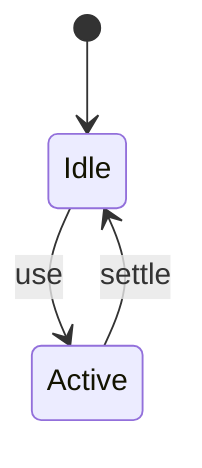

# PostCSS

<TopicMeta />

<Prerequisites />

::: tip Published
This page meets the handbook **published** bar: deep explanation, ≥10 common mistakes, and official references. Further engine-level errata welcome via PR.
:::

## Introduction

**PostCSS** runs JS plugins over CSS ASTs—autoprefixer, nesting, Tailwind’s engine, CSS Modules integrations, and more.

## Why does it exist?

CSS evolves unevenly across browsers; build-time transforms keep authoring modern and output compatible.

## Historical Background

Became the CSS Babel; underpinning CRA/Vite/Next CSS pipelines and Tailwind.

## Mental Model

CSS in → plugin chain → CSS out. Order matters.

## Internal Workflow

1. postcss.config.js plugins.
2. Integrate via bundler.
3. Target browserslist for autoprefixer.
4. Don’t duplicate with lightningcss blindly.

## Lifecycle



## Browser Perspective

Not applicable.

## JavaScript Engine Perspective

Not applicable.

## React Perspective

Not applicable.

## Next.js Perspective

Not applicable.

## Server Perspective

Not applicable.

## Network Perspective

Not applicable.

## Memory Perspective

Not applicable.

## Performance

Measure before/after with lab + field tools. Optimize the attributed bottleneck for CSS transformation pipeline (autoprefixer, nesting, Tailwind, etc.)., not folklore.

## Production Example

Teams adopt CSS transformation pipeline (autoprefixer, nesting, Tailwind, etc.). on critical routes, add monitoring, and guard regressions with budgets or reviews.

## Code Examples

```js
export default {
  plugins: {
    autoprefixer: {},
  },
}
```

## Diagrams

```mermaid
flowchart TD
  A[Understand] --> B[Apply CSS transformation pipeline (autoprefixer, nesting, Tailwind, etc.).]
  B --> C[Measure]
```

## Common Mistakes

1. Plugin order bugs
2. Autoprefixer with outdated browserslist
3. Running PostCSS twice
4. Huge custom plugin stacks
5. Confusing PostCSS with Sass features 1:1
6. Committing generated CSS inconsistently
7. Missing a production edge case for 14-build-tools.postcss (#1)
8. Missing a production edge case for 14-build-tools.postcss (#2)
9. Missing a production edge case for 14-build-tools.postcss (#3)
10. Missing a production edge case for 14-build-tools.postcss (#4)


## Best Practices

- Prefer platform/framework primitives
- Measure impact on real user metrics
- Keep the change reviewable and reversible
- Document the invariant you are protecting

## Anti-patterns

- Copy-paste without understanding failure modes
- Premature abstraction around a single use
- Optimizing without a baseline

## Comparison

| Approach | When |
| --- | --- |
| Use as designed | Default |
| Simpler alternative | If constraints differ |

## Interview Questions

### Easy

**Q:** What is PostCSS?

**A:** A tool for transforming CSS with a plugin pipeline.

### Medium

**Q:** Name a common PostCSS plugin.

**A:** Autoprefixer (or Tailwind’s PostCSS plugin).

### Hard

**Q:** How does Tailwind relate?

**A:** Tailwind v3 uses PostCSS to scan templates and emit utility CSS; configuration rides that pipeline.

## Summary

- CSS transformation pipeline (autoprefixer, nesting, Tailwind, etc.).
- Know why it exists and when not to use it
- Measure production impact
- Link related handbook topics instead of duplicating

## References

- [PostCSS](https://postcss.org/)
- [Autoprefixer](https://github.com/postcss/autoprefixer)

<RelatedTopics />


Prev: [`14-build-tools.esbuild`](/14-build-tools/esbuild/) · Next: [`14-build-tools.source-maps`](/14-build-tools/source-maps/)
