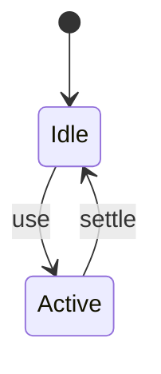
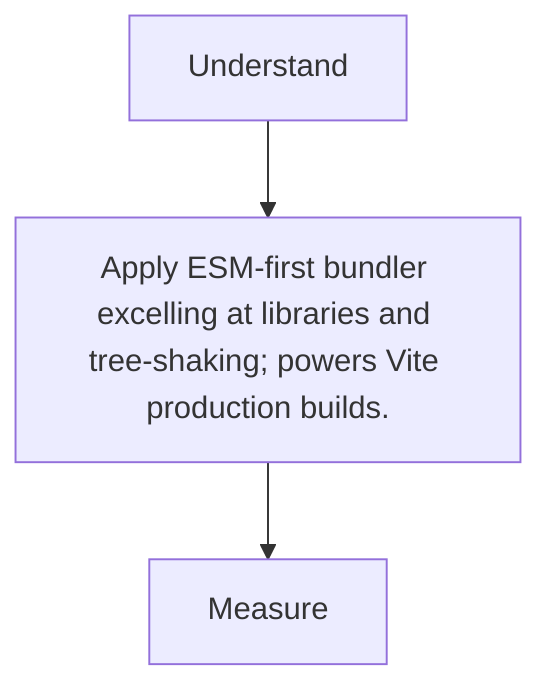

# Rollup

<TopicMeta />

<Prerequisites />

::: tip Published
This page meets the handbook **published** bar: deep explanation, ≥10 common mistakes, and official references. Further engine-level errata welcome via PR.
:::

## Introduction

**Rollup** focuses on clean ESM output and aggressive tree shaking—ideal for libraries and as Vite’s production bundler.

## Why does it exist?

Library authors need small, shakeable artifacts without webpack’s app-oriented complexity.

## Historical Background

ESM champion; Vite adopted Rollup for prod builds while using esbuild/native ESM in dev.

## Mental Model

Input → tree-shake graph → chunks/outputs (ES/CJS). Plugins extend.

## Internal Workflow

1. rollup.config.js inputs.
2. Externalize peer deps.
3. Emit formats.
4. Check package exports.

## Lifecycle



## Browser Perspective

Not applicable.

## JavaScript Engine Perspective

Not applicable.

## React Perspective

Not applicable.

## Next.js Perspective

Not applicable.

## Server Perspective

Not applicable.

## Network Perspective

Not applicable.

## Memory Perspective

Not applicable.

## Performance

Measure before/after with lab + field tools. Optimize the attributed bottleneck for ESM-first bundler excelling at libraries and tree-shaking; powers Vite production builds., not folklore.

## Production Example

Teams adopt ESM-first bundler excelling at libraries and tree-shaking; powers Vite production builds. on critical routes, add monitoring, and guard regressions with budgets or reviews.

## Code Examples

```js
export default {
  input: 'src/index.js',
  external: ['react', 'react-dom'],
  output: { file: 'dist/index.js', format: 'es' },
}
```

## Diagrams



## Common Mistakes

1. Bundling React into a component library
2. Forgetting to external peerDependencies
3. CJS default export interop surprises
4. Not providing types entry
5. Deep node builtins in browser builds
6. Multiple competing versions of helpers
7. Missing a production edge case for 14-build-tools.rollup (#1)
8. Missing a production edge case for 14-build-tools.rollup (#2)
9. Missing a production edge case for 14-build-tools.rollup (#3)
10. Missing a production edge case for 14-build-tools.rollup (#4)


## Best Practices

- Prefer platform/framework primitives
- Measure impact on real user metrics
- Keep the change reviewable and reversible
- Document the invariant you are protecting

## Anti-patterns

- Copy-paste without understanding failure modes
- Premature abstraction around a single use
- Optimizing without a baseline

## Comparison

| Approach | When |
| --- | --- |
| Use as designed | Default |
| Simpler alternative | If constraints differ |

## Interview Questions

### Easy

**Q:** What is Rollup great at?

**A:** Tree-shaken ESM builds, especially for libraries.

### Medium

**Q:** How does Vite use Rollup?

**A:** Dev server is native ESM/esbuild prebundle; production build uses Rollup.

### Hard

**Q:** Why externalize peers?

**A:** So consumers dedupe a single React (etc.) instead of shipping duplicates inside the library bundle.

## Summary

- ESM-first bundler excelling at libraries and tree-shaking; powers Vite production builds.
- Know why it exists and when not to use it
- Measure production impact
- Link related handbook topics instead of duplicating

## References

- [Rollup Guide](https://rollupjs.org/introduction/)
- [Vite Build](https://vitejs.dev/guide/build.html)

<RelatedTopics />


Prev: [`14-build-tools.webpack`](/14-build-tools/webpack/) · Next: [`14-build-tools.vite`](/14-build-tools/vite/)
