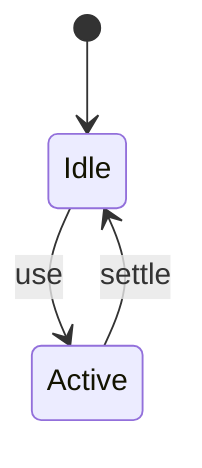
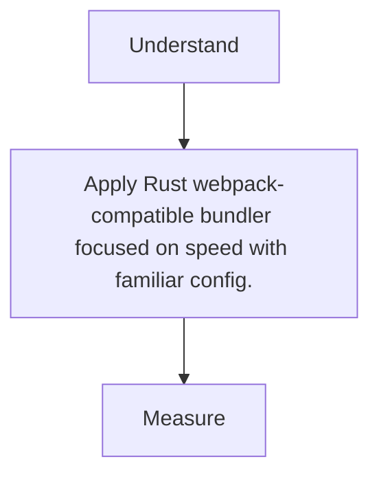

# Rspack

<TopicMeta />

<Prerequisites />

::: tip Published
This page meets the handbook **published** bar: deep explanation, ≥10 common mistakes, and official references. Further engine-level errata welcome via PR.
:::

## Introduction

**Rspack** aims for webpack-compatible APIs/loaders with a Rust core for much faster builds—attractive for migrating large webpack codebases.

## Why does it exist?

Teams invested in webpack configs want speed without a full Vite rewrite.

## Historical Background

ByteDance open source; growing plugin compatibility.

## Mental Model

webpack-shaped config → faster engine. Verify loader parity.

## Internal Workflow

1. Swap bundler package.
2. Adjust incompatible plugins.
3. Compare outputs.
4. Adopt Rsbuild if desired.

## Lifecycle



## Browser Perspective

Not applicable.

## JavaScript Engine Perspective

Not applicable.

## React Perspective

Not applicable.

## Next.js Perspective

Not applicable.

## Server Perspective

Not applicable.

## Network Perspective

Not applicable.

## Memory Perspective

Not applicable.

## Performance

Measure before/after with lab + field tools. Optimize the attributed bottleneck for Rust webpack-compatible bundler focused on speed with familiar config., not folklore.

## Production Example

Teams adopt Rust webpack-compatible bundler focused on speed with familiar config. on critical routes, add monitoring, and guard regressions with budgets or reviews.

## Code Examples

```js
// rspack.config.js — webpack-like
module.exports = { entry: './src/index.tsx' }
```

## Diagrams



## Common Mistakes

1. Assuming 100% plugin parity
2. Not snapshotting bundle diffs
3. Mixed versions of webpack types
4. Ignoring CSS extract differences
5. Skipping source map verification
6. Migrating mid-release without canary
7. Missing a production edge case for 14-build-tools.rspack (#1)
8. Missing a production edge case for 14-build-tools.rspack (#2)
9. Missing a production edge case for 14-build-tools.rspack (#3)
10. Missing a production edge case for 14-build-tools.rspack (#4)


## Best Practices

- Prefer platform/framework primitives
- Measure impact on real user metrics
- Keep the change reviewable and reversible
- Document the invariant you are protecting

## Anti-patterns

- Copy-paste without understanding failure modes
- Premature abstraction around a single use
- Optimizing without a baseline

## Comparison

| Approach | When |
| --- | --- |
| Use as designed | Default |
| Simpler alternative | If constraints differ |

## Interview Questions

### Easy

**Q:** What problem does Rspack target?

**A:** webpack-compatible tooling with significantly faster builds via Rust.

### Medium

**Q:** Who benefits most?

**A:** Large existing webpack apps that cannot rewrite to Vite overnight.

### Hard

**Q:** Migration validation plan?

**A:** Diff chunk graphs/sizes, run e2e, compare runtime perf, and canary deploy.

## Summary

- Rust webpack-compatible bundler focused on speed with familiar config.
- Know why it exists and when not to use it
- Measure production impact
- Link related handbook topics instead of duplicating

## References

- [Rspack Docs](https://rspack.dev/)
- [Rsbuild](https://rsbuild.dev/)

<RelatedTopics />


Prev: [`14-build-tools.turbopack`](/14-build-tools/turbopack/) · Next: [`14-build-tools.parcel`](/14-build-tools/parcel/)
