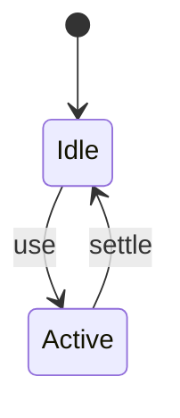
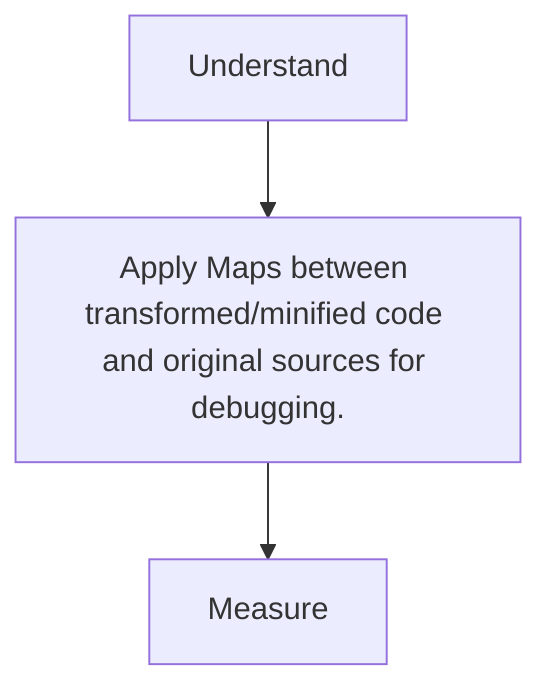

# Source Maps

<TopicMeta />

<Prerequisites />

::: tip Published
This page meets the handbook **published** bar: deep explanation, ≥10 common mistakes, and official references. Further engine-level errata welcome via PR.
:::

## Introduction

**Source maps** correlate generated JS/CSS positions back to original files so DevTools/stack traces remain readable after transpile/minify.

## Why does it exist?

Without maps, production debugging is guesswork in minified soup.

## Historical Background

Source Map v3 format; tooling differences around `hidden`/`inline`/`nosources`.

## Mental Model

Mappings file + optional source contents. Upload maps to error trackers; don’t expose to public if policy forbids.

## Internal Workflow

1. Enable maps in prod builds carefully.
2. Upload to Sentry/etc.
3. Restrict public access if needed.
4. Verify stack traces resolve.

## Lifecycle



## Browser Perspective

DevTools consumes maps.

## JavaScript Engine Perspective

Not applicable.

## React Perspective

Not applicable.

## Next.js Perspective

Production browser maps configurable; server maps for Node too.

## Server Perspective

Not applicable.

## Network Perspective

Not applicable.

## Memory Perspective

Not applicable.

## Performance

Measure before/after with lab + field tools. Optimize the attributed bottleneck for Maps between transformed/minified code and original sources for debugging., not folklore.

## Production Example

Teams adopt Maps between transformed/minified code and original sources for debugging. on critical routes, add monitoring, and guard regressions with budgets or reviews.

## Code Examples

```js
// vite
export default { build: { sourcemap: true } }
```

## Diagrams



## Common Mistakes

1. No maps → unreadable prod errors
2. Publishing maps with source content publicly against policy
3. Broken maps from incorrect paths
4. Maps pointing at outdated deploys
5. Inline maps blowing payload size
6. CSS maps ignored when debugging FOUC
7. Missing a production edge case for 14-build-tools.source-maps (#1)
8. Missing a production edge case for 14-build-tools.source-maps (#2)
9. Missing a production edge case for 14-build-tools.source-maps (#3)
10. Missing a production edge case for 14-build-tools.source-maps (#4)


## Best Practices

- Prefer platform/framework primitives
- Measure impact on real user metrics
- Keep the change reviewable and reversible
- Document the invariant you are protecting

## Anti-patterns

- Copy-paste without understanding failure modes
- Premature abstraction around a single use
- Optimizing without a baseline

## Comparison

| Approach | When |
| --- | --- |
| Use as designed | Default |
| Simpler alternative | If constraints differ |

## Interview Questions

### Easy

**Q:** What do source maps do?

**A:** Map transformed/minified code back to original source locations for debugging.

### Medium

**Q:** hidden-source-map purpose?

**A:** Generate maps for upload without linking them from the shipped file—harder for public inspection.

### Hard

**Q:** Security trade-off?

**A:** Maps can expose original source; use private uploads to error trackers or nosources variants per policy.

## Summary

- Maps between transformed/minified code and original sources for debugging.
- Know why it exists and when not to use it
- Measure production impact
- Link related handbook topics instead of duplicating

## References

- [MDN — Source maps](https://developer.mozilla.org/en-US/docs/Tools/Debugger/How_to/Use_a_source_map)
- [Source Map spec](https://tc39.es/source-map/)

<RelatedTopics />


Prev: [`14-build-tools.postcss`](/14-build-tools/postcss/) · Next: [`14-build-tools.monorepo-tooling`](/14-build-tools/monorepo-tooling/)
