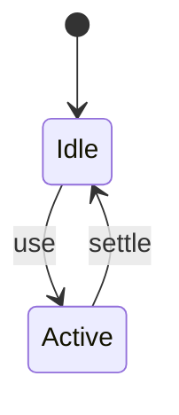
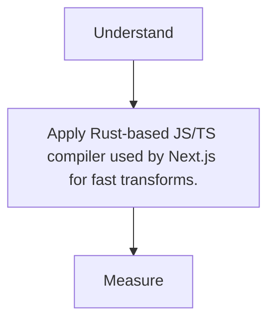

# SWC

<TopicMeta />

<Prerequisites />

::: tip Published
This page meets the handbook **published** bar: deep explanation, ≥10 common mistakes, and official references. Further engine-level errata welcome via PR.
:::

## Introduction

**SWC** (Speedy Web Compiler) compiles JS/TS/JSX extremely quickly and powers Next.js transforms (replacing much Babel usage).

## Why does it exist?

Babel’s speed became a bottleneck; SWC keeps modern syntax/React support with Rust performance.

## Historical Background

Adopted by Next; also used standalone and in other tools.

## Mental Model

Fast parse/transform/minify; plugin ecosystem smaller than Babel’s.

## Internal Workflow

1. Prefer framework defaults (Next).
2. .swcrc if standalone.
3. Keep typecheck in tsc.
4. Check custom Babel plugins needing alternatives.

## Lifecycle



## Browser Perspective

Not applicable.

## JavaScript Engine Perspective

Not applicable.

## React Perspective

Not applicable.

## Next.js Perspective

Default compiler for many transforms.

## Server Perspective

Not applicable.

## Network Perspective

Not applicable.

## Memory Perspective

Not applicable.

## Performance

Measure before/after with lab + field tools. Optimize the attributed bottleneck for Rust-based JS/TS compiler used by Next.js for fast transforms., not folklore.

## Production Example

Teams adopt Rust-based JS/TS compiler used by Next.js for fast transforms. on critical routes, add monitoring, and guard regressions with budgets or reviews.

## Code Examples

```json
{ "jsc": { "parser": { "syntax": "typescript", "tsx": true }, "target": "es2022" } }
```

## Diagrams



## Common Mistakes

1. Expecting every Babel plugin
2. Skipping typecheck because SWC compiles
3. Wrong jsc.target causing runtime syntax errors
4. Mixed swc/babel on same files
5. Ignoring minify differences
6. Custom AST transforms without support plan
7. Missing a production edge case for 14-build-tools.swc (#1)
8. Missing a production edge case for 14-build-tools.swc (#2)
9. Missing a production edge case for 14-build-tools.swc (#3)
10. Missing a production edge case for 14-build-tools.swc (#4)


## Best Practices

- Prefer platform/framework primitives
- Measure impact on real user metrics
- Keep the change reviewable and reversible
- Document the invariant you are protecting

## Anti-patterns

- Copy-paste without understanding failure modes
- Premature abstraction around a single use
- Optimizing without a baseline

## Comparison

| Approach | When |
| --- | --- |
| Use as designed | Default |
| Simpler alternative | If constraints differ |

## Interview Questions

### Easy

**Q:** What is SWC?

**A:** A Rust-based compiler for JS/TS used for fast transforms (notably in Next.js).

### Medium

**Q:** SWC vs Babel?

**A:** SWC is much faster for common transforms; Babel has a broader plugin ecosystem.

### Hard

**Q:** How does Next use SWC?

**A:** For compilation/minification paths; Turbopack/webpack still orchestrate bundling around compiled modules.

## Summary

- Rust-based JS/TS compiler used by Next.js for fast transforms.
- Know why it exists and when not to use it
- Measure production impact
- Link related handbook topics instead of duplicating

## References

- [SWC Docs](https://swc.rs/docs/)
- [Next.js — SWC](https://nextjs.org/docs/architecture/nextjs-compiler)

<RelatedTopics />


Prev: [`14-build-tools.babel`](/14-build-tools/babel/) · Next: [`14-build-tools.esbuild`](/14-build-tools/esbuild/)
