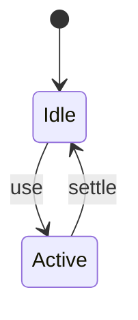
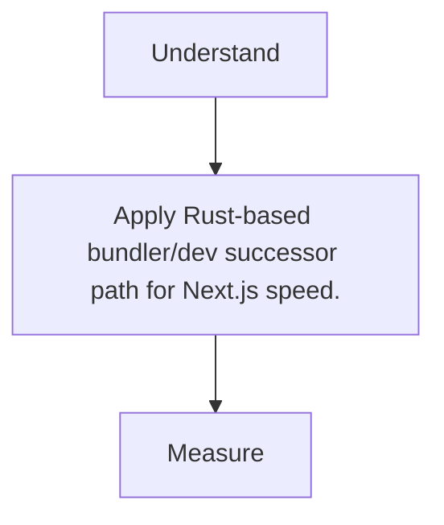

# Turbopack

<TopicMeta />

<Prerequisites />

::: tip Published
This page meets the handbook **published** bar: deep explanation, ≥10 common mistakes, and official references. Further engine-level errata welcome via PR.
:::

## Introduction

**Turbopack** is Vercel’s Rust-powered bundler aiming to replace webpack in Next.js for faster local/dev (and expanding production support over time).

## Why does it exist?

Next apps outgrew webpack’s cold-start/HMR performance; Turbopack targets incremental computation.

## Historical Background

Announced with Next 13 era; features land progressively—check current Next docs for stability.

## Mental Model

Next-integrated incremental bundler; not a general Vite replacement for every stack (yet).

## Internal Workflow

1. next dev --turbopack (per docs).
2. Note unsupported webpack loaders.
3. File issues for gaps.
4. Verify prod bundler setting for your version.

## Lifecycle



## Browser Perspective

Not applicable.

## JavaScript Engine Perspective

Not applicable.

## React Perspective

Not applicable.

## Next.js Perspective

Primary integration surface.

## Server Perspective

Not applicable.

## Network Perspective

Not applicable.

## Memory Perspective

Not applicable.

## Performance

Measure before/after with lab + field tools. Optimize the attributed bottleneck for Rust-based bundler/dev successor path for Next.js speed., not folklore.

## Production Example

Teams adopt Rust-based bundler/dev successor path for Next.js speed. on critical routes, add monitoring, and guard regressions with budgets or reviews.

## Code Examples

```bash
next dev --turbopack
```

## Diagrams



## Common Mistakes

1. Assuming all webpack plugins work
2. Ignoring version-specific stability notes
3. Comparing unfairly without warm cache
4. Custom webpack hacks blocking migration
5. Expecting identical stack traces without maps
6. Using Turbopack outside Next without checking support
7. Missing a production edge case for 14-build-tools.turbopack (#1)
8. Missing a production edge case for 14-build-tools.turbopack (#2)
9. Missing a production edge case for 14-build-tools.turbopack (#3)
10. Missing a production edge case for 14-build-tools.turbopack (#4)


## Best Practices

- Prefer platform/framework primitives
- Measure impact on real user metrics
- Keep the change reviewable and reversible
- Document the invariant you are protecting

## Anti-patterns

- Copy-paste without understanding failure modes
- Premature abstraction around a single use
- Optimizing without a baseline

## Comparison

| Approach | When |
| --- | --- |
| Use as designed | Default |
| Simpler alternative | If constraints differ |

## Interview Questions

### Easy

**Q:** What is Turbopack?

**A:** A Rust-based bundler developed to speed up Next.js (especially development).

### Medium

**Q:** Why might a Next app not use Turbopack yet?

**A:** Missing loader/plugin support or production maturity for a specific feature set.

### Hard

**Q:** How does incremental bundling help?

**A:** It recomputes only affected graph parts, reducing rebuild cost vs full bundling.

## Summary

- Rust-based bundler/dev successor path for Next.js speed.
- Know why it exists and when not to use it
- Measure production impact
- Link related handbook topics instead of duplicating

## References

- [Next.js — Turbopack](https://nextjs.org/docs/app/api-reference/turbopack)
- [Turbopack](https://turbo.build/pack)

<RelatedTopics />


Prev: [`14-build-tools.vite`](/14-build-tools/vite/) · Next: [`14-build-tools.rspack`](/14-build-tools/rspack/)
