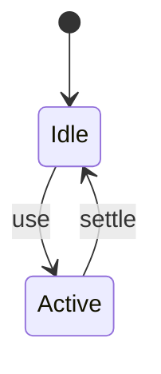
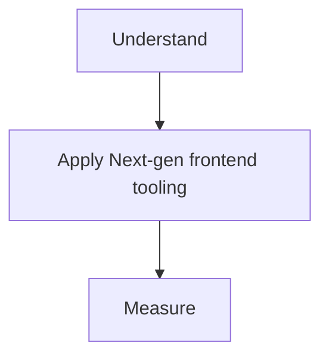

# Vite

<TopicMeta />

<Prerequisites />

::: tip Published
This page meets the handbook **published** bar: deep explanation, ≥10 common mistakes, and official references. Further engine-level errata welcome via PR.
:::

## Introduction

**Vite** serves source over native ESM in development (pre-bundling deps with esbuild) and bundles for production with Rollup. It delivers famously fast DX for React/Vue/etc. SPAs and libraries.

## Why does it exist?

webpack HMR/dev cold starts struggled at scale. Vite exploits browser ESM + esbuild for instant server start.

## Historical Background

Evan You; exploded 2020+; ecosystem of plugins.

## Mental Model

Dev ≠ prod pipeline. Dev: ESM on demand. Prod: Rollup optimize.

## Internal Workflow

1. npm create vite.
2. Configure plugins (React).
3. env via import.meta.env.
4. build + preview.

## Lifecycle



## Browser Perspective

Dev uses native ESM imports.

## JavaScript Engine Perspective

Not applicable.

## React Perspective

Not applicable.

## Next.js Perspective

Not applicable.

## Server Perspective

Not applicable.

## Network Perspective

Many small modules in dev; few chunks in prod.

## Memory Perspective

Not applicable.

## Performance

Measure before/after with lab + field tools. Optimize the attributed bottleneck for Next-gen frontend tooling, not folklore.

## Production Example

Teams adopt Next-gen frontend tooling on critical routes, add monitoring, and guard regressions with budgets or reviews.

## Code Examples

```ts
import { defineConfig } from 'vite'
import react from '@vitejs/plugin-react'

export default defineConfig({
  plugins: [react()],
  build: { sourcemap: true },
})
```

## Diagrams



## Common Mistakes

1. Assuming prod quirks match dev exactly
2. Wrong base path for nested deploys
3. Node polyfills needed unexpectedly
4. Deep CJS deps without optimizeDeps hints
5. Leaking secrets via VITE_ env prefix
6. Manual webpack brain in vite without learning plugin API
7. Missing a production edge case for 14-build-tools.vite (#1)
8. Missing a production edge case for 14-build-tools.vite (#2)
9. Missing a production edge case for 14-build-tools.vite (#3)
10. Missing a production edge case for 14-build-tools.vite (#4)


## Best Practices

- Prefer platform/framework primitives
- Measure impact on real user metrics
- Keep the change reviewable and reversible
- Document the invariant you are protecting

## Anti-patterns

- Copy-paste without understanding failure modes
- Premature abstraction around a single use
- Optimizing without a baseline

## Comparison

| Approach | When |
| --- | --- |
| Use as designed | Default |
| Simpler alternative | If constraints differ |

## Interview Questions

### Easy

**Q:** Why is Vite’s dev server fast?

**A:** It serves source as native ESM and pre-bundles dependencies with esbuild instead of bundling the whole app up front.

### Medium

**Q:** What bundler does Vite use for production?

**A:** Rollup (by default).

### Hard

**Q:** How handle a problematic CJS dependency?

**A:** Add to optimizeDeps.include, or patch/replace with ESM; investigate dual-package issues.

## Summary

- Next-gen frontend tooling: native ESM dev server + Rollup production builds.
- Know why it exists and when not to use it
- Measure production impact
- Link related handbook topics instead of duplicating

## References

- [Vite Guide](https://vitejs.dev/guide/)
- [Vite Features](https://vitejs.dev/guide/features.html)

<RelatedTopics />


Prev: [`14-build-tools.rollup`](/14-build-tools/rollup/) · Next: [`14-build-tools.turbopack`](/14-build-tools/turbopack/)
