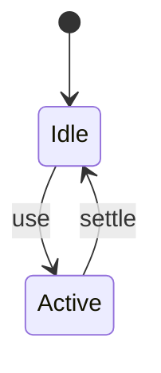
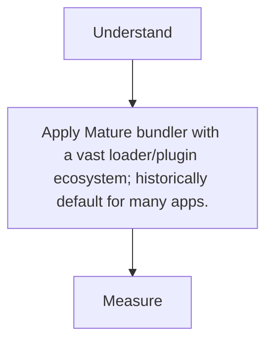

# Webpack

<TopicMeta />

<Prerequisites />

::: tip Published
This page meets the handbook **published** bar: deep explanation, ≥10 common mistakes, and official references. Further engine-level errata welcome via PR.
:::

## Introduction

**webpack** builds dependency graphs through loaders/plugins, outputting optimized bundles. Still powers many apps and (historically/default) Next.js production builds.

## Why does it exist?

Unmatched ecosystem for custom pipelines when you need deep control.

## Historical Background

Dominated 2015–2020; now shares space with Vite/Rspack/Turbopack for speed.

## Mental Model

Entry → modules → loaders → plugins → chunks. Everything is configurable—at a complexity cost.

## Internal Workflow

1. Define entry/output.
2. Configure loaders (ts/css/assets).
3. SplitChunks/minimize.
4. Analyze bundle.

## Lifecycle



## Browser Perspective

Not applicable.

## JavaScript Engine Perspective

Not applicable.

## React Perspective

Not applicable.

## Next.js Perspective

Not applicable.

## Server Perspective

Not applicable.

## Network Perspective

Not applicable.

## Memory Perspective

Not applicable.

## Performance

Measure before/after with lab + field tools. Optimize the attributed bottleneck for Mature bundler with a vast loader/plugin ecosystem; historically default for many apps., not folklore.

## Production Example

Teams adopt Mature bundler with a vast loader/plugin ecosystem; historically default for many apps. on critical routes, add monitoring, and guard regressions with budgets or reviews.

## Code Examples

```js
export default {
  entry: './src/index.js',
  output: { filename: '[name].[contenthash].js' },
  module: { rules: [{ test: /\.tsx?$/, use: 'ts-loader' }] },
}
```

## Diagrams



## Common Mistakes

1. Giant hand-rolled config without need
2. Wrong target/polyfills bloat
3. Ignoring cache/filesystem cache
4. Duplicate frameworks from alias mistakes
5. Devtool source maps leaking in prod incorrectly
6. Loader order confusion
7. Missing a production edge case for 14-build-tools.webpack (#1)
8. Missing a production edge case for 14-build-tools.webpack (#2)
9. Missing a production edge case for 14-build-tools.webpack (#3)
10. Missing a production edge case for 14-build-tools.webpack (#4)


## Best Practices

- Prefer platform/framework primitives
- Measure impact on real user metrics
- Keep the change reviewable and reversible
- Document the invariant you are protecting

## Anti-patterns

- Copy-paste without understanding failure modes
- Premature abstraction around a single use
- Optimizing without a baseline

## Comparison

| Approach | When |
| --- | --- |
| Use as designed | Default |
| Simpler alternative | If constraints differ |

## Interview Questions

### Easy

**Q:** What is webpack?

**A:** A bundler that transforms a module graph into optimized browser/server assets via loaders/plugins.

### Medium

**Q:** What is a loader vs plugin?

**A:** Loaders transform individual files; plugins hook the whole compilation lifecycle.

### Hard

**Q:** How does Module Federation relate?

**A:** A webpack feature for sharing modules across independently deployed apps at runtime—see microfrontends.

## Summary

- Mature bundler with a vast loader/plugin ecosystem; historically default for many apps.
- Know why it exists and when not to use it
- Measure production impact
- Link related handbook topics instead of duplicating

## References

- [webpack Docs](https://webpack.js.org/)
- [webpack Concepts](https://webpack.js.org/concepts/)

<RelatedTopics />


Prev: [`14-build-tools.module-resolution`](/14-build-tools/module-resolution/) · Next: [`14-build-tools.rollup`](/14-build-tools/rollup/)
