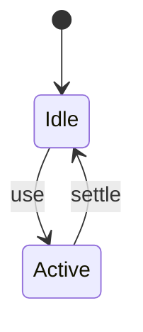

# Yarn

<TopicMeta />

<Prerequisites />

::: tip Published
This page meets the handbook **published** bar: deep explanation, ≥10 common mistakes, and official references. Further engine-level errata welcome via PR.
:::

## Introduction

**Yarn** provides deterministic installs and strong monorepo/workspaces features. Yarn Berry (2+) introduced Plug’n’Play (PnP) as an optional node_modules alternative.

## Why does it exist?

Historically fixed npm pain (speed/determinism); still chosen in many enterprise monorepos.

## Historical Background

Facebook Yarn 1 → Berry rewrite → PnP and constraints.

## Mental Model

Classic ≈ node_modules; Berry PnP ≈ virtual map resolved by runtime.

## Internal Workflow

1. Choose classic vs berry intentionally.
2. Use yarn.lock exclusively.
3. Workspaces for monorepos.
4. Align CI with the same major.

## Lifecycle



## Browser Perspective

Not applicable.

## JavaScript Engine Perspective

Not applicable.

## React Perspective

Not applicable.

## Next.js Perspective

Not applicable.

## Server Perspective

Not applicable.

## Network Perspective

Not applicable.

## Memory Perspective

Not applicable.

## Performance

Measure before/after with lab + field tools. Optimize the attributed bottleneck for Alternative Node package manager (classic and Berry/Yarn 2+) with workspaces focus., not folklore.

## Production Example

Teams adopt Alternative Node package manager (classic and Berry/Yarn 2+) with workspaces focus. on critical routes, add monitoring, and guard regressions with budgets or reviews.

## Code Examples

```bash
yarn install
yarn workspace web build
```

## Diagrams

```mermaid
flowchart TD
  A[Understand] --> B[Apply Alternative Node package manager (classic and Berry/Yarn 2+) with workspaces focus.]
  B --> C[Measure]
```

## Common Mistakes

1. Accidentally upgrading to Berry without PnP readiness
2. Mixing yarn and npm locks
3. Ignoring PnP IDE SDK setup
4. Different Yarn majors across machines
5. Disabling checksums carelessly
6. Assuming yarn and pnpm semantics match
7. Missing a production edge case for 14-build-tools.yarn (#1)
8. Missing a production edge case for 14-build-tools.yarn (#2)
9. Missing a production edge case for 14-build-tools.yarn (#3)
10. Missing a production edge case for 14-build-tools.yarn (#4)


## Best Practices

- Prefer platform/framework primitives
- Measure impact on real user metrics
- Keep the change reviewable and reversible
- Document the invariant you are protecting

## Anti-patterns

- Copy-paste without understanding failure modes
- Premature abstraction around a single use
- Optimizing without a baseline

## Comparison

| Approach | When |
| --- | --- |
| Use as designed | Default |
| Simpler alternative | If constraints differ |

## Interview Questions

### Easy

**Q:** What problem did Yarn originally address?

**A:** Faster, more deterministic installs than early npm.

### Medium

**Q:** What is Yarn PnP?

**A:** A mode that resolves packages via a map instead of a traditional nested node_modules tree.

### Hard

**Q:** Migration risk Classic→Berry?

**A:** PnP breaks tools assuming node_modules paths; need SDKs/patches or node_modules linker mode.

## Summary

- Alternative Node package manager (classic and Berry/Yarn 2+) with workspaces focus.
- Know why it exists and when not to use it
- Measure production impact
- Link related handbook topics instead of duplicating

## References

- [Yarn Docs](https://yarnpkg.com/)
- [Yarn PnP](https://yarnpkg.com/features/pnp)

<RelatedTopics />


Prev: [`14-build-tools.pnpm`](/14-build-tools/pnpm/) · Next: [`14-build-tools.bun`](/14-build-tools/bun/)
