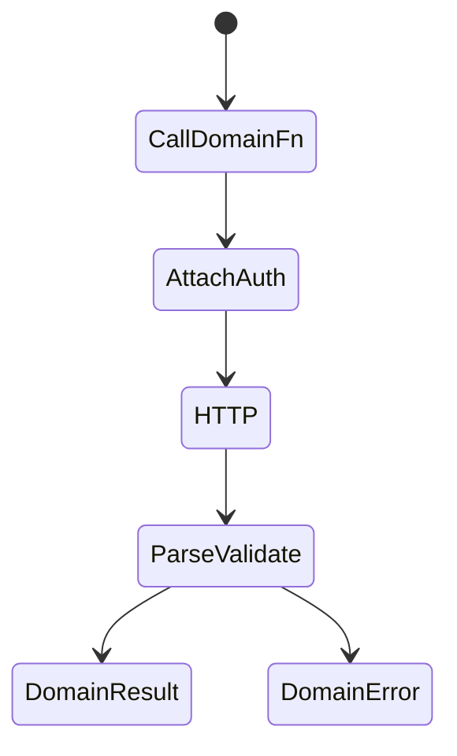

# API Layer Design

<TopicMeta />

<Prerequisites />

::: tip Published
This page meets the handbook **published** bar: deep explanation, ≥10 common mistakes, and official references. Further engine-level errata welcome via PR.
:::

## Introduction

An **API layer** sits between UI features and HTTP (or RPC). It centralizes base URL, auth, tracing headers, DTO validation, error normalization, and endpoint functions so components do not sprinkle raw `fetch` calls.

## Why does it exist?

Scattered `fetch` duplicates headers, mishandles 401s, and skips runtime validation. A layer makes contracts explicit and swappable (REST → BFF) without rewriting UI.

## Historical Background

From ad-hoc XHR helpers to OpenAPI-generated clients, tRPC, and BFF patterns. Frontend API layers increasingly validate responses (Zod) because TypeScript types alone are not runtime-safe.

## Mental Model

UI speaks **domain functions** (`getUser`, `placeOrder`). The API layer maps those to HTTP, parses responses, and throws **typed domain errors**. Caching belongs in TanStack Query calling this layer—not inside every button.

## Internal Workflow

1. Define transport (fetch/axios) with interceptors.
2. Generate or hand-write endpoint modules.
3. Validate responses at the boundary.
4. Map status codes to domain errors.
5. Call from loaders/Query `queryFn` only.

## Lifecycle



## Browser Perspective

Credentials/cookies/`CORS` mode configured once.

## JavaScript Engine Perspective

Not applicable.

## React Perspective

Keep `fetch` out of presentational components; use hooks/queryFns that call the layer.

## Next.js Perspective

Server-side API modules can use secrets; client modules must not. Split `api/server` vs `api/client`.

## Server Perspective

BFF can tailor DTOs to the UI and hide backend sprawl.

## Network Perspective

Retries, timeouts, idempotency keys for writes.

## Memory Perspective

Not applicable.

## Performance

Share one client; enable HTTP/2; avoid over-fetching via BFF aggregates. Deduplicate via Query.

## Production Example

`packages/api` exposes `users.get`/`users.update` with Zod schemas. 401 triggers a single auth refresh handler; features never parse tokens.

## Code Examples

```ts
import { z } from 'zod'

const UserSchema = z.object({ id: z.string(), name: z.string() })
export type User = z.infer<typeof UserSchema>

export class ApiError extends Error {
  constructor(public status: number, message: string) {
    super(message)
  }
}

export async function getUser(id: string, signal?: AbortSignal): Promise<User> {
  const res = await fetch(`/api/users/${id}`, { signal, headers: { Accept: 'application/json' } })
  if (!res.ok) throw new ApiError(res.status, 'getUser failed')
  return UserSchema.parse(await res.json())
}
```

## Diagrams


## Common Mistakes

1. Raw fetch in dozens of components
2. Trusting `as User` without parsing
3. Client bundle importing server-only secrets
4. Inconsistent error shapes per endpoint
5. Retrying non-idempotent POST by default
6. Missing a production edge case for 15-architecture.api-layer-design (#1)
7. Missing a production edge case for 15-architecture.api-layer-design (#2)
8. Missing a production edge case for 15-architecture.api-layer-design (#3)
9. Missing a production edge case for 15-architecture.api-layer-design (#4)
10. Missing a production edge case for 15-architecture.api-layer-design (#5)


## Best Practices

- Validate at boundary
- Typed domain errors
- Single auth/header policy

## Anti-patterns

- God `api.ts` with 5k lines and no modules
- UI constructing Authorization headers ad hoc

## Comparison

| Approach | Pros |
| --- | --- |
| Hand-written + Zod | Control, runtime safety |
| OpenAPI generated | Sync with backend spec |
| tRPC | End-to-end types in TS monorepos |

## Interview Questions

### Easy

**Q:** Why centralize an API layer?

**A:** To unify auth, errors, validation, and endpoint definitions so UI stays free of transport details.

### Medium

**Q:** Why validate responses if you have TypeScript types?

**A:** Types are erased at runtime; the network can return anything. Schemas enforce the contract in production.

### Hard

**Q:** How do you design idempotent writes from the client?

**A:** Idempotency keys, safe retries only for retryable methods/statuses, clear mutation lifetimes, and server support for dedupe.

## Summary

- API layer = domain functions over HTTP
- Validate and normalize errors centrally
- Split client/server modules for secrets

## References

- [MDN — Fetch API](https://developer.mozilla.org/en-US/docs/Web/API/Fetch_API)
- [Zod](https://zod.dev/)
- [OpenAPI Specification](https://spec.openapis.org/oas/latest.html)

<RelatedTopics />


Prev: [`15-architecture.component-libraries`](/15-architecture/component-libraries/) · Next: [`15-architecture.error-handling-architecture`](/15-architecture/error-handling-architecture/)
