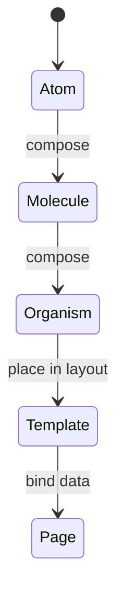

# Atomic Design

<TopicMeta />

<Prerequisites />

::: tip Published
This page meets the handbook **published** bar: deep explanation, ≥10 common mistakes, and official references. Further engine-level errata welcome via PR.
:::

## Introduction

**Atomic Design** names UI building blocks by composition level: **atoms** (button, input), **molecules** (search field), **organisms** (header), **templates** (layout skeleton), **pages** (real content). It is a vocabulary for design systems—not a mandatory folder law.

## Why does it exist?

Without shared language, “component” means everything from an icon to a checkout flow. Atomic Design helps designers and engineers agree on reuse levels and avoid rebuilding the same molecule in every feature.

## Historical Background

Brad Frost popularized Atomic Design (2013) for pattern libraries. It predates React but maps cleanly onto component trees. Modern teams often flatten “templates/pages” into app routes while keeping atom/molecule/organism in the design system.

## Mental Model

Lower levels are more reusable and less opinionated about product domain. Atoms have no business meaning; organisms may. If a “molecule” needs cart pricing rules, it is probably a feature component, not a design-system molecule.

## Internal Workflow

1. Inventory UI into levels with designers.
2. Implement atoms with tokens (color, space, type).
3. Compose molecules/organisms without feature API calls.
4. Wire pages/features to real data.
5. Document in Storybook by level.

## Lifecycle



## Browser Perspective

Not applicable.

## JavaScript Engine Perspective

Not applicable.

## React Perspective

Map atoms/molecules to presentational components; keep data fetching in page/feature containers—not inside atoms.

## Next.js Perspective

Pages/templates often live in `app/`; the design system package holds atoms→organisms.

## Server Perspective

Not applicable.

## Network Perspective

Not applicable.

## Memory Perspective

Not applicable.

## Performance

Deep composition is fine; avoid prop-drilling huge themes through every atom—use CSS variables or context at the root.

## Production Example

A design system package exports `Button`, `TextField`, `SearchField`, `AppHeader`. Product features import those; they never reimplement a primary button.

## Code Examples

```tsx
// Atom
export function Button(props: React.ButtonHTMLAttributes<HTMLButtonElement>) {
  return <button className="btn" {...props} />
}

// Molecule
export function SearchField({ onSubmit }: { onSubmit: (q: string) => void }) {
  return (
    <form onSubmit={(e) => { e.preventDefault(); onSubmit(new FormData(e.currentTarget).get('q') as string) }}>
      <input name="q" aria-label="Search" />
      <Button type="submit">Go</Button>
    </form>
  )
}
```

## Diagrams

```mermaid
flowchart bottom
  Pages --> Templates
  Templates --> Organisms
  Organisms --> Molecules
  Molecules --> Atoms
```

## Common Mistakes

1. Treating Atomic Design as rigid folders that fight feature architecture
2. Putting API calls inside atoms
3. Calling every large component an organism without reuse criteria
4. Duplicating atoms per feature “for speed”
5. Skipping accessibility on atoms (then every consumer inherits the bug)
6. Missing a production edge case for 15-architecture.atomic-design (#1)
7. Missing a production edge case for 15-architecture.atomic-design (#2)
8. Missing a production edge case for 15-architecture.atomic-design (#3)
9. Missing a production edge case for 15-architecture.atomic-design (#4)
10. Missing a production edge case for 15-architecture.atomic-design (#5)


## Best Practices

- Use Atomic Design as a shared vocabulary with design
- Keep domain logic out of the design system
- Document composition rules in Storybook

## Anti-patterns

- Page-sized “atoms”
- Design system that imports app feature stores

## Comparison

| Approach | Best for |
| --- | --- |
| Atomic Design | Design-system taxonomy |
| Feature folders | Product code ownership |
| Both | Atoms in DS + features compose them |

## Interview Questions

### Easy

**Q:** Name the five Atomic Design levels.

**A:** Atoms, molecules, organisms, templates, pages.

### Medium

**Q:** Where should fetch logic live in Atomic Design + React?

**A:** In pages/features (containers), not in atoms/molecules of the design system.

### Hard

**Q:** How do Atomic Design and feature-based architecture work together?

**A:** Atomic levels classify reusable UI in the design system; features own domain composition and data. Cross-link, do not force one folder scheme to do both jobs.

## Summary

- Atomic Design is a composition vocabulary
- Keep domain out of low-level atoms
- Combine with feature architecture in product code

## References

- [Atomic Design — Brad Frost](https://atomicdesign.bradfrost.com/)
- [Storybook — Documenting design systems](https://storybook.js.org/docs/sharing/design-systems)

<RelatedTopics />


Prev: [`15-architecture.feature-based-architecture`](/15-architecture/feature-based-architecture/) · Next: [`15-architecture.design-systems`](/15-architecture/design-systems/)
