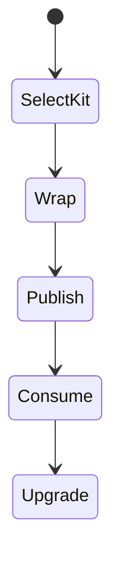
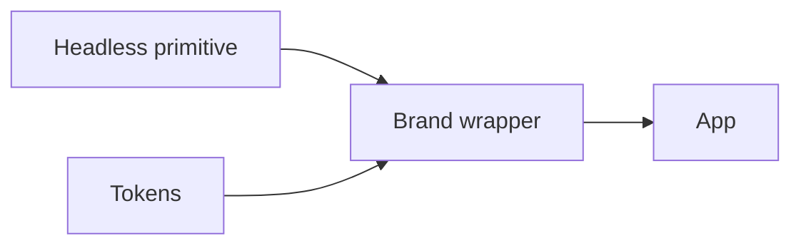

# Component Libraries

<TopicMeta />

<Prerequisites />

::: tip Published
This page meets the handbook **published** bar: deep explanation, ≥10 common mistakes, and official references. Further engine-level errata welcome via PR.
:::

## Introduction

A **component library** packages reusable UI primitives for consumption by apps. It may be the implementation core of a design system (MUI, Chakra, Radix + your styles) or an internal `@acme/ui`. Success is measured by adoption, a11y, and upgrade ergonomics—not component count.

## Why does it exist?

Duplicated components diverge in behavior and accessibility. A library concentrates fixes and visual language. Third-party libraries accelerate delivery when customized carefully.

## Historical Background

jQuery widgets → Bootstrap → React libraries (Material-UI, Ant Design) → headless primitives (Radix, Headless UI, React Aria) separating behavior from styling.

## Mental Model

Prefer **accessible behavior primitives** + your tokens over heavily opinionated themes you must fight. Treat the library as a dependency with a public API and semver.

## Internal Workflow

1. Choose headless vs styled kit based on design constraints.
2. Wrap primitives in your brand components.
3. Tree-shakeable exports + docs.
4. Visual/a11y regression in CI.
5. Version and changelog upgrades.

## Lifecycle



## Browser Perspective

Components must work with keyboard, AT, and zoom.

## JavaScript Engine Perspective

Not applicable.

## React Perspective

Peer-depend on React. Forward refs and support composition (`asChild` / slots) where needed.

## Next.js Perspective

Mark client-only interactive wrappers with `"use client"`. Prefer RSC-safe presentational pieces when possible.

## Server Perspective

Not applicable.

## Network Perspective

Import paths affect bundle size—avoid barrel side effects.

## Memory Perspective

Not applicable.

## Performance

Publish per-component entrypoints. Document bundle impact of heavy components (date pickers, charts).

## Production Example

Team wraps Radix Dialog/Select with brand styles in `@acme/ui`, tests with Testing Library + axe, and releases via changesets.

## Code Examples

```tsx
import * as Dialog from '@radix-ui/react-dialog'

export function Modal({ title, children }: { title: string; children: React.ReactNode }) {
  return (
    <Dialog.Root>
      <Dialog.Trigger>Open</Dialog.Trigger>
      <Dialog.Portal>
        <Dialog.Overlay />
        <Dialog.Content aria-describedby={undefined}>
          <Dialog.Title>{title}</Dialog.Title>
          {children}
        </Dialog.Content>
      </Dialog.Portal>
    </Dialog.Root>
  )
}
```

## Diagrams



## Common Mistakes

1. Forking the whole library into the app repo
2. Ignoring a11y because “the library handles it” without verification
3. Importing the entire library from a single entry
4. Theming by deep CSS overrides that break on upgrade
5. No ref forwarding breaking focus management
6. Missing a production edge case for 15-architecture.component-libraries (#1)
7. Missing a production edge case for 15-architecture.component-libraries (#2)
8. Missing a production edge case for 15-architecture.component-libraries (#3)
9. Missing a production edge case for 15-architecture.component-libraries (#4)
10. Missing a production edge case for 15-architecture.component-libraries (#5)


## Best Practices

- Wrap third-party primitives behind your API
- A11y + visual tests on core components
- Semver + migration notes

## Anti-patterns

- Exposing 50 props that mirror internals 1:1
- Styling via descendant selectors into library internals

## Comparison

| Kind | Example |
| --- | --- |
| Headless | Radix, React Aria |
| Styled system | MUI, Chakra |
| Internal | @acme/ui |

## Interview Questions

### Easy

**Q:** What is a headless component library?

**A:** It provides behavior and accessibility without imposing visual styles, leaving styling to you.

### Medium

**Q:** Why wrap third-party components?

**A:** To stabilize your app API, enforce brand defaults, and ease replacing the underlying library later.

### Hard

**Q:** How do you evaluate adopting a component library?

**A:** A11y quality, bundle size, customization model, maintenance, SSR/RSC fit, and upgrade history—not just aesthetics.

## Summary

- Component libraries concentrate reusable UI
- Prefer accessible primitives + tokens
- Version and test them like products

## References

- [Radix Primitives](https://www.radix-ui.com/primitives)
- [React Aria](https://react-spectrum.adobe.com/v1/react-aria/)
- [WAI-ARIA APG](https://www.w3.org/WAI/ARIA/apg/)

<RelatedTopics />


Prev: [`15-architecture.url-as-state`](/15-architecture/url-as-state/) · Next: [`15-architecture.api-layer-design`](/15-architecture/api-layer-design/)
