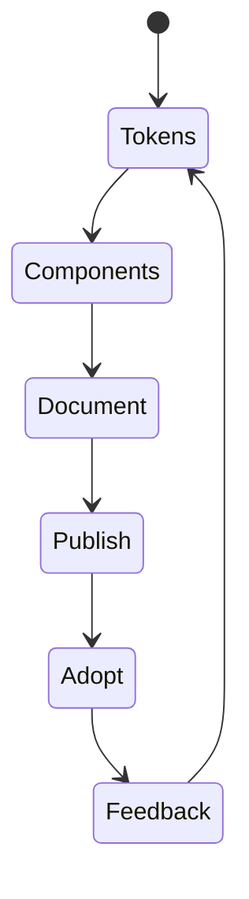
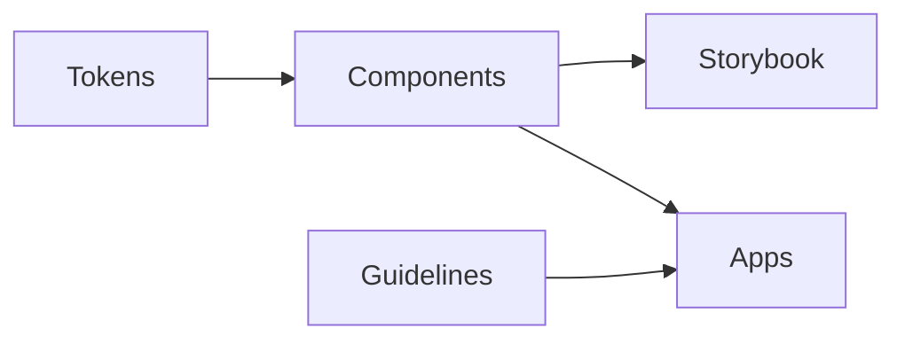

# Design Systems

<TopicMeta />

<Prerequisites />

::: tip Published
This page meets the handbook **published** bar: deep explanation, ≥10 common mistakes, and official references. Further engine-level errata welcome via PR.
:::

## Introduction

A **design system** is the productized kit of visual tokens, accessible components, content guidelines, and distribution tooling (Storybook, packages) that multiple surfaces reuse. It is both a UI library and an organizational agreement.

## Why does it exist?

Without one, each team invents buttons, spacing, and focus styles. UX drifts, a11y bugs multiply, and rebrands become archaeological digs. A design system amortizes quality (contrast, keyboard, i18n) across the company.

## Historical Background

Pattern libraries evolved into design systems (Lightning, Material, Polaris, Spectrum). On the web, CSS-in-JS, CSS Modules, and token pipelines (Style Dictionary) made cross-platform tokens practical.

## Mental Model

Three layers: **tokens** (decisions), **components** (implemented decisions), **guidelines** (when to use what). Version the package; treat breaking visual changes like API breaks.

## Internal Workflow

1. Define tokens (color, type, space, elevation, motion).
2. Build accessible primitives.
3. Publish as versioned package(s).
4. Document in Storybook + usage guidelines.
5. Govern contributions (RFC, visual review, a11y checks).

## Lifecycle



## Browser Perspective

Ship CSS that respects `prefers-reduced-motion` and system contrast where relevant.

## JavaScript Engine Perspective

Not applicable.

## React Perspective

Prefer headless or lightly styled primitives composed with tokens. Peer-depend on React; do not bundle a second copy.

## Next.js Perspective

Consume the DS from Server and Client Components carefully—client-only primitives need `"use client"` at the leaf.

## Server Perspective

Not applicable.

## Network Perspective

Tree-shakeable exports matter; a single mega-barrel import can pull the entire library into a route.

## Memory Perspective

Not applicable.

## Performance

Split package entrypoints (`Button`, `Modal`). Avoid side-effectful CSS imports at the root of every page if routes need only a few components.

## Production Example

A multi-app company publishes `@acme/ui@4`. Apps upgrade on a schedule; codemods handle renames. CI runs axe on Storybook stories for core components.

## Code Examples

```ts
// tokens.css
:root {
  --color-fg: #121212;
  --space-2: 0.5rem;
  --focus-ring: 0 0 0 3px #4c9ffe;
}

// Button.tsx
export function Button({ children, ...rest }: React.ButtonHTMLAttributes<HTMLButtonElement>) {
  return (
    <button
      {...rest}
      style={{ padding: 'var(--space-2)', color: 'var(--color-fg)' }}
    >
      {children}
    </button>
  )
}
```

## Diagrams



## Common Mistakes

1. Shipping components without keyboard/focus/a11y baselines
2. One giant export that destroys code-splitting
3. Allowing product teams to fork buttons instead of contributing
4. Tokens that are just raw hex copies with no semantic names
5. Versioning chaos (apps on three major versions forever)
6. Missing a production edge case for 15-architecture.design-systems (#1)
7. Missing a production edge case for 15-architecture.design-systems (#2)
8. Missing a production edge case for 15-architecture.design-systems (#3)
9. Missing a production edge case for 15-architecture.design-systems (#4)
10. Missing a production edge case for 15-architecture.design-systems (#5)


## Best Practices

- Semantic tokens (`--color-danger`) over raw palette in components
- Accessibility is a release gate
- Clear contribution + deprecation policy

## Anti-patterns

- Design system that depends on app-specific API clients
- Visual changes without changelogs

## Comparison

| Artifact | Role |
| --- | --- |
| Design system | Shared product UI language |
| Component library | Implementation subset of a DS |
| Feature UI | Domain-specific composition |

## Interview Questions

### Easy

**Q:** What belongs in a design system?

**A:** Tokens, reusable accessible components, usage guidelines, and distribution/docs tooling.

### Medium

**Q:** Why semantic tokens?

**A:** They separate meaning (danger, foreground) from palette values so themes and rebrands change one layer.

### Hard

**Q:** How do you roll out a breaking DS major version?

**A:** Codemods, dual-publish compatibility window, visual regression, per-app upgrade trains, and clear deprecation timelines.

## Summary

- Design systems encode UI decisions as tokens + components + rules
- Treat the package like a product with versions and a11y gates
- Keep domain features out of the system

## References

- [Material Design](https://m3.material.io/)
- [WCAG 2.2](https://www.w3.org/TR/WCAG22/)
- [Storybook](https://storybook.js.org/)

<RelatedTopics />


Prev: [`15-architecture.atomic-design`](/15-architecture/atomic-design/) · Next: [`15-architecture.monorepo`](/15-architecture/monorepo/)
