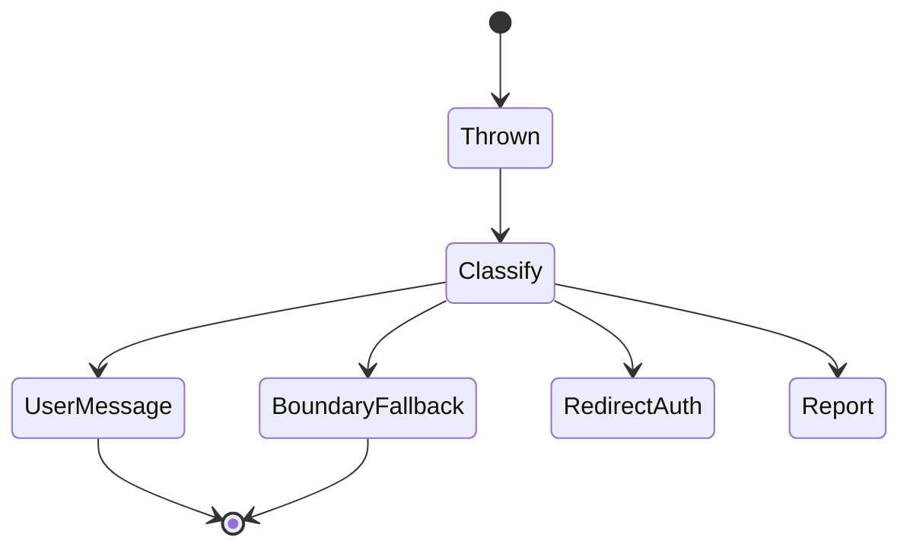
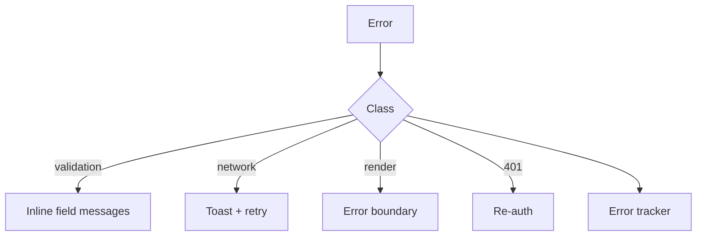

# Error Handling Architecture

<TopicMeta />

<Prerequisites />

::: tip Published
This page meets the handbook **published** bar: deep explanation, ≥10 common mistakes, and official references. Further engine-level errata welcome via PR.
:::

## Introduction

**Error handling architecture** defines how failures propagate from APIs, render trees, and async tasks to users and operators. It combines domain error types, UI recovery (error boundaries, toasts), retry policies, and telemetry—without `try/catch` spaghetti in every component.

## Why does it exist?

Unhandled rejections blank screens; raw server strings confuse users; swallowed errors hide outages. A layered approach separates **detection**, **translation**, **presentation**, and **reporting**.

## Historical Background

React 16 error boundaries covered render errors; concurrent features and SSR added more failure modes. Production frontends adopted Sentry/etc. plus user-friendly fallbacks.

## Mental Model

Classify errors: **user-fixable** (validation), **retryable** (network), **fatal UI** (render throw), **auth** (401/403), **unknown**. Each class has a default policy (inline message, toast, boundary fallback, redirect to login, report).

## Internal Workflow

1. Define domain error types at API boundary.
2. Map to UX policies.
3. Place React error boundaries at route/feature levels.
4. Centralize reporting (scrub PII).
5. Test failure paths, not only happy paths.

## Lifecycle



## Browser Perspective

`window.onerror` / `unhandledrejection` as last-resort reporting.

## JavaScript Engine Perspective

OOM and long tasks are not catchable as normal JS errors—observe via performance tooling.

## React Perspective

Error boundaries catch render/lifecycle errors in the tree below—not event handlers or async unless you rethrow into state. Use `error.tsx` in Next App Router.

## Next.js Perspective

`error.tsx` / `global-error.tsx` + `digest` for server errors. Never show stack traces to end users.

## Server Perspective

Not applicable.

## Network Perspective

Timeouts and status mapping live in the API layer.

## Memory Perspective

Not applicable.

## Performance

Retries with jitter prevent thundering herds. Do not retry 4xx blindly.

## Production Example

Feature route boundary shows “section unavailable” with retry; global boundary for catastrophic failures; Sentry receives scrubbed errors with release + user id hash.

## Code Examples

```tsx
class FeatureErrorBoundary extends React.Component<
  { children: React.ReactNode },
  { error: Error | null }
> {
  state = { error: null as Error | null }
  static getDerivedStateFromError(error: Error) {
    return { error }
  }
  componentDidCatch(error: Error) {
    reportError(error)
  }
  render() {
    if (this.state.error) return <button onClick={() => this.setState({ error: null })}>Retry</button>
    return this.props.children
  }
}
```

## Diagrams



## Common Mistakes

1. Empty catch blocks
2. Showing stack traces or SQL/internal messages to users
3. One giant boundary for the whole app only
4. Reporting PII/tokens in error payloads
5. Assuming error boundaries catch async handler errors
6. Missing a production edge case for 15-architecture.error-handling-architecture (#1)
7. Missing a production edge case for 15-architecture.error-handling-architecture (#2)
8. Missing a production edge case for 15-architecture.error-handling-architecture (#3)
9. Missing a production edge case for 15-architecture.error-handling-architecture (#4)
10. Missing a production edge case for 15-architecture.error-handling-architecture (#5)


## Best Practices

- Classify errors and map to UX policies
- Boundaries per feature/route
- Scrub before report

## Anti-patterns

- toast.error on every validated field
- Retry loops without backoff/jitter

## Comparison

| Layer | Responsibility |
| --- | --- |
| API | Normalize transport errors |
| Domain | Typed failures |
| UI | Present recovery |
| Telemetry | Report unknowns |

## Interview Questions

### Easy

**Q:** What do React error boundaries catch?

**A:** Errors during rendering, lifecycle methods, and constructors in the subtree—not asynchronous event handler code unless rethrown into render.

### Medium

**Q:** How should a 401 be handled architecturally?

**A:** API layer detects 401, auth module refreshes or redirects once, UI does not each invent its own login redirect.

### Hard

**Q:** Design error handling for a payments mutation.

**A:** Idempotency key, no blind retry on unknown success, clear user states for pending/failed/succeeded, boundary around payment widget, high-priority telemetry with scrubbing.

## Summary

- Separate classify → present → report
- Use boundaries and route error UI deliberately
- Never leak internals; always scrub telemetry

## References

- [React — Error Boundaries](https://react.dev/reference/react/Component#catching-rendering-errors-with-an-error-boundary)
- [Next.js — error.js](https://nextjs.org/docs/app/api-reference/file-conventions/error)

<RelatedTopics />


Prev: [`15-architecture.api-layer-design`](/15-architecture/api-layer-design/)
