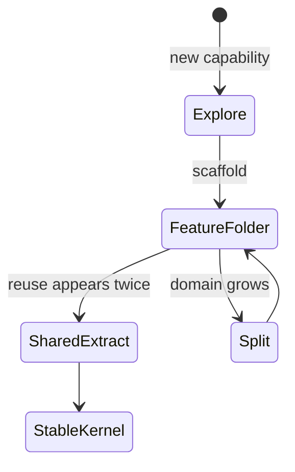
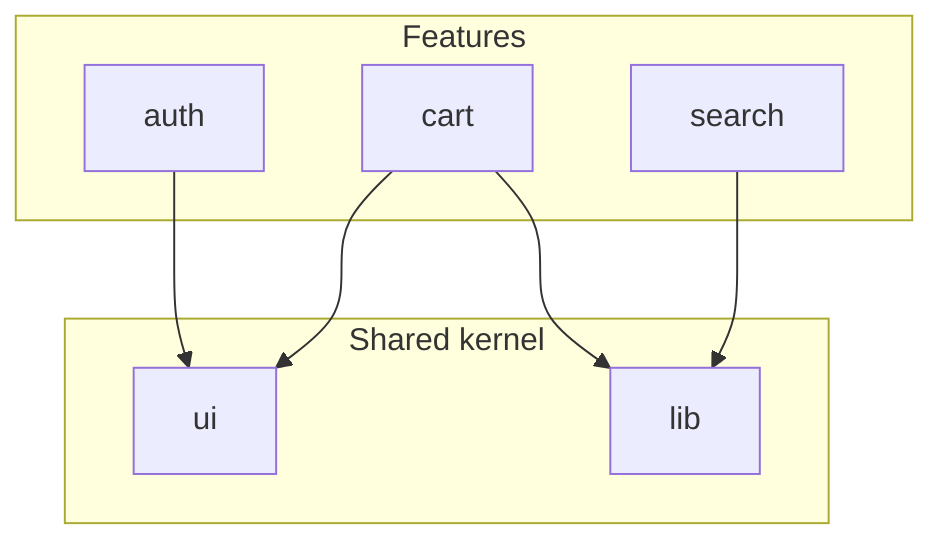

# Feature-Based Architecture

<TopicMeta />

<Prerequisites />

::: tip Published
This page meets the handbook **published** bar: deep explanation, ≥10 common mistakes, and official references. Further engine-level errata welcome via PR.
:::

## Introduction

**Feature-based architecture** groups code by business capability — `features/checkout`, `features/auth` — rather than only by technical role (`components/`, `hooks/`, `utils/`). Each feature owns its UI, local state, API calls, and tests. Shared kernels (`ui/`, `lib/`, `api/`) stay thin and stable.

## Why does it exist?

Layer-first folders scale poorly: changing “add to cart” touches five distant directories, ownership is unclear, and circular imports creep in. Feature folders localize change, clarify team ownership, and keep domain language next to the code that implements it.

## Historical Background

Vertical slicing and “screaming architecture” ideas from backend design migrated to SPAs as apps grew past CRUD demos. React’s component model made feature folders natural; monorepos and module boundaries later hardened the pattern.

## Mental Model

Ask: “If we deleted this feature, which folder disappears?” That folder is the feature. Cross-feature imports should go through public APIs (`index.ts` barrels or packages), not deep relative paths into another feature’s internals.

## Internal Workflow

1. Identify bounded UI capabilities (routes, user journeys).
2. Create `features/<name>/` with `ui`, `model`, `api`, `tests`.
3. Extract only truly shared primitives upward.
4. Enforce import rules (ESLint `boundaries` / Nx tags).
5. Grow features independently; split when a folder becomes a second domain.

## Lifecycle



## Browser Perspective

Not applicable.

## JavaScript Engine Perspective

Not applicable.

## React Perspective

Colocate route components, feature hooks, and feature-only context. Avoid a global `contexts/` dumping ground.

## Next.js Perspective

Map App Router segments to features (`app/(shop)/cart` ↔ `features/cart`). Keep Server Components’ data access inside the feature’s `api`/`server` module.

## Server Perspective

Not applicable.

## Network Perspective

Not applicable.

## Memory Perspective

Feature-level code-splitting (`React.lazy` / dynamic import) keeps unused features out of the initial bundle.

## Performance

Feature folders enable route-level and feature-level splits. Keep shared UI small so features do not all depend on a mega design-system entry that defeats splitting.

## Production Example

A marketplace teams owns `features/search`, `features/listing`, `features/checkout`. Checkout may import `ui/Button` and `lib/money`, but search cannot import checkout’s payment form — CI fails the boundary lint.

## Code Examples

```ts
// features/cart/index.ts — public API
export { CartPage } from './ui/CartPage'
export { useCart } from './model/useCart'

// features/cart/model/useCart.ts
export function useCart() {
  // cart-only state + mutations
}

// Forbidden: features/search/ui/Results.tsx importing
// '../../cart/model/internalStore'
```

## Diagrams



## Common Mistakes

1. Calling everything a feature but still dumping all hooks into global folders
2. Deep imports across features that create hidden coupling
3. Extracting shared code too early (one reuse ≠ a shared package)
4. Giant `features/common` that becomes a junk drawer
5. Ignoring lint boundaries so architecture exists only in a README
6. Missing a production edge case for 15-architecture.feature-based-architecture (#1)
7. Missing a production edge case for 15-architecture.feature-based-architecture (#2)
8. Missing a production edge case for 15-architecture.feature-based-architecture (#3)
9. Missing a production edge case for 15-architecture.feature-based-architecture (#4)
10. Missing a production edge case for 15-architecture.feature-based-architecture (#5)


## Best Practices

- One public entry per feature
- Colocate tests with the feature
- Name folders in product language
- Keep shared kernel boring and stable

## Anti-patterns

- Circular feature imports
- God `utils` imported by every feature for domain logic

## Comparison

| Style | Strength | Weakness |
| --- | --- | --- |
| Feature-based | Local change, clear ownership | Requires discipline on shared code |
| Layer-based | Familiar for tiny apps | Cross-cutting changes scatter |
| Domain packages (monorepo) | Strong boundaries | Higher tooling cost |

## Interview Questions

### Easy

**Q:** What is feature-based architecture?

**A:** Organizing code by product capability so UI, state, and API for that capability live together, with a thin shared kernel.

### Medium

**Q:** How do you prevent features from coupling?

**A:** Public barrels, lint/import boundaries, and extracting shared code only after repeated real reuse.

### Hard

**Q:** When would you split a feature into a package or micro-frontend?

**A:** When team ownership, release cadence, or bundle isolation demand a harder boundary—and the coordination cost is justified by org size, not fashion.

## Summary

- Group by business capability, not only by file type
- Protect feature boundaries with tooling
- Keep shared code thin and intentional

## References

- [Bulletproof React — project structure](https://github.com/alan2207/bulletproof-react)
- [Feature-Sliced Design](https://feature-sliced.design/)

<RelatedTopics />


Next: [`15-architecture.atomic-design`](/15-architecture/atomic-design/)
