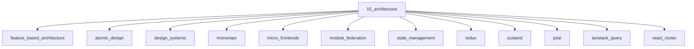

# Architecture

## Scope

Application structure, state, design systems, monorepos, and micro frontends

## Prerequisites

See the learning paths and each topic's prerequisites in the registry.

## Topics in order

- [Feature-Based Architecture](/15-architecture/feature-based-architecture/) — mid, ~35 min
- [Atomic Design](/15-architecture/atomic-design/) — junior, ~25 min
- [Design Systems](/15-architecture/design-systems/) — mid, ~40 min
- [Monorepo](/15-architecture/monorepo/) — mid, ~40 min
- [Micro Frontends](/15-architecture/micro-frontends/) — senior, ~45 min
- [Module Federation](/15-architecture/module-federation/) — senior, ~40 min
- [State Management](/15-architecture/state-management/) — mid, ~35 min
- [Redux](/15-architecture/redux/) — mid, ~40 min
- [Zustand](/15-architecture/zustand/) — junior, ~25 min
- [Jotai](/15-architecture/jotai/) — mid, ~25 min
- [TanStack Query](/15-architecture/tanstack-query/) — mid, ~40 min
- [React Router](/15-architecture/react-router/) — junior, ~35 min
- [URL as State](/15-architecture/url-as-state/) — mid, ~30 min
- [Component Libraries](/15-architecture/component-libraries/) — mid, ~30 min
- [API Layer Design](/15-architecture/api-layer-design/) — mid, ~35 min
- [Error Handling Architecture](/15-architecture/error-handling-architecture/) — mid, ~30 min

## Module knowledge graph

## Suggested learning paths

Browse [Learning Paths](/learning-paths/).
