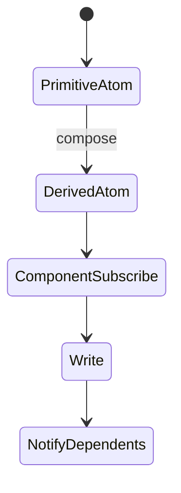
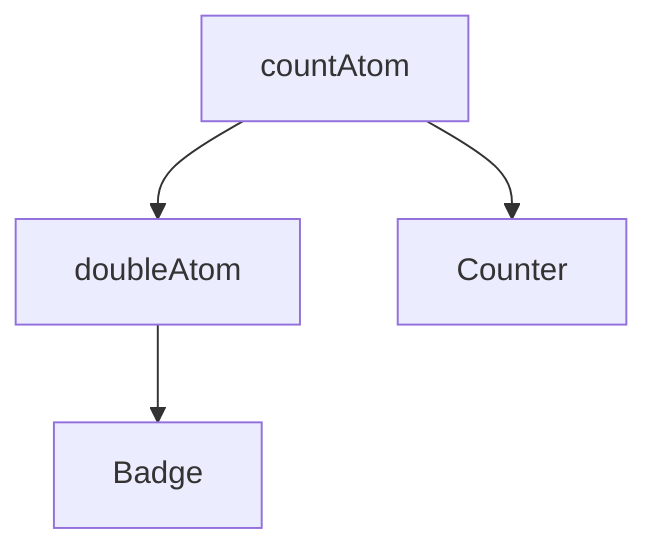

# Jotai

<TopicMeta />

<Prerequisites />

::: tip Published
This page meets the handbook **published** bar: deep explanation, ≥10 common mistakes, and official references. Further engine-level errata welcome via PR.
:::

## Introduction

**Jotai** models state as **atoms**—units of state that components subscribe to. Derived atoms compute values; writes can update multiple atoms. It fits bottom-up composition better than one big store object.

## Why does it exist?

Context rerenders and monolithic stores make fine-grained updates hard. Atoms let you subscribe to exactly what a component needs, similar in spirit to Recoil.

## Historical Background

Part of the pmndrs ecosystem as a Recoil-inspired, simpler atomic model for React.

## Mental Model

Atoms are building blocks. Components read/write atoms via hooks. Dependency graphs of derived atoms recompute when upstream atoms change—like a spreadsheet for UI state.

## Internal Workflow

1. Define primitive atoms.
2. Build derived atoms for computed views.
3. Use atom families for dynamic IDs.
4. Scope with Provider when SSR/tests need isolation.
5. Keep server data in query libraries; atoms for client graph.

## Lifecycle



## Browser Perspective

Not applicable.

## JavaScript Engine Perspective

Not applicable.

## React Perspective

Provider optional for simple SPA; recommended for SSR and tests.

## Next.js Perspective

Use Provider per request/tree to avoid shared atom state across users.

## Server Perspective

Not applicable.

## Network Perspective

Not applicable.

## Memory Perspective

Atom families can grow without bounds—delete unused keys.

## Performance

Fine-grained subscriptions reduce rerenders. Extremely chatty atoms (per-pixel) still need throttling.

## Production Example

A design tool stores selected node id, zoom, and tool mode as atoms; the canvas subscribes narrowly while the inspector reads derived selection atoms.

## Code Examples

```ts
import { atom, useAtom } from 'jotai'

const countAtom = atom(0)
const doubleAtom = atom((get) => get(countAtom) * 2)

export function Counter() {
  const [count, setCount] = useAtom(countAtom)
  const [double] = useAtom(doubleAtom)
  return (
    <button onClick={() => setCount((c) => c + 1)}>
      {count} / {double}
    </button>
  )
}
```

## Diagrams



## Common Mistakes

1. One huge atom recreating Redux without benefits
2. Forgetting Provider in SSR
3. Leaking atomFamily keys
4. Fetching in atoms without a server-state strategy
5. Over-atomizing every local input
6. Missing a production edge case for 15-architecture.jotai (#1)
7. Missing a production edge case for 15-architecture.jotai (#2)
8. Missing a production edge case for 15-architecture.jotai (#3)
9. Missing a production edge case for 15-architecture.jotai (#4)
10. Missing a production edge case for 15-architecture.jotai (#5)


## Best Practices

- Primitive + derived atom split
- Provider for SSR/tests
- Delete atomFamily entries when entities go away

## Anti-patterns

- Duplicating TanStack Query cache into atoms
- Uncontrolled growth of global atoms for local UI

## Comparison

| | Jotai | Zustand |
| --- | --- | --- |
| Model | Many atoms | One store (usually) |
| Rerenders | Very fine-grained | Selector-based |
| Learning curve | Graph thinking | Simpler object store |

## Interview Questions

### Easy

**Q:** What is an atom in Jotai?

**A:** A unit of state that components can subscribe to; derived atoms compute from other atoms.

### Medium

**Q:** Why use a Provider with Jotai?

**A:** To isolate atom stores per React tree—important for SSR, tests, and parallel instances.

### Hard

**Q:** When prefer Jotai over Zustand?

**A:** When many independent pieces of state compose into derived graphs and you want bottom-up subscription control rather than one store object.

## Summary

- Jotai: atomic, bottom-up React state
- Derived atoms model computed UI state
- Isolate with Provider for SSR

## References

- [Jotai documentation](https://jotai.org/)
- [Jotai — Core concepts](https://jotai.org/docs/core/atom)

<RelatedTopics />


Prev: [`15-architecture.zustand`](/15-architecture/zustand/) · Next: [`15-architecture.tanstack-query`](/15-architecture/tanstack-query/)
