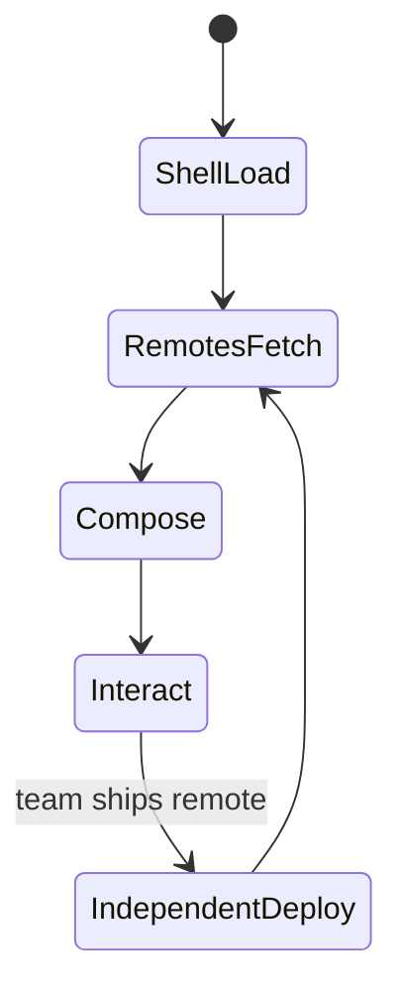
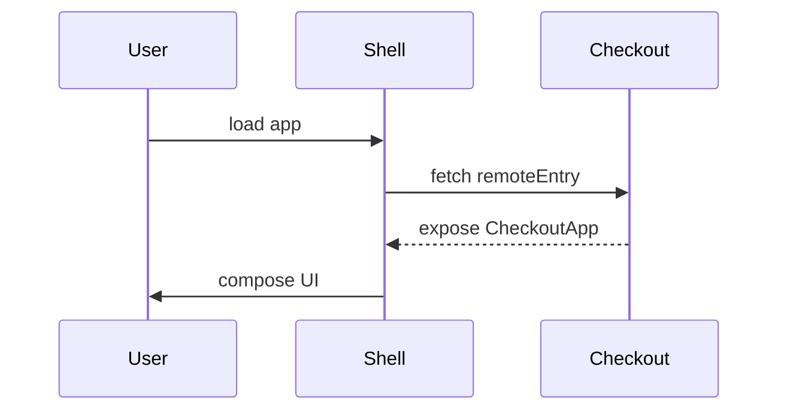

# Micro Frontends

<TopicMeta />

<Prerequisites />

::: tip Published
This page meets the handbook **published** bar: deep explanation, ≥10 common mistakes, and official references. Further engine-level errata welcome via PR.
:::

## Introduction

**Micro-frontends (MFE)** apply microservice ideas to UI: multiple deployable frontends compose one product. Composition may be build-time (packages), server-side (SSI/edge includes), or runtime (Module Federation, iframes, import maps).

## Why does it exist?

A single SPA monolith can block autonomous teams. MFEs aim for independent release cadence and tech-stack freedom—at the cost of shared UX consistency, performance, and operational complexity.

## Historical Background

ThoughtWorks popularized the term; platforms like Zalando, Spotify, and later Webpack Module Federation made runtime composition common. Many orgs later scaled back after underestimating cross-cutting concerns.

## Mental Model

An MFE is a **deployable UI slice with a contract** (routing, auth, shared design system, event bus). Independence is never absolute—users still see one product.

## Internal Workflow

1. Define vertical ownership (by route or widget).
2. Choose composition (build-time package vs runtime federation).
3. Standardize cross-cutting: auth token, design system, observability, routing.
4. Isolate failure (error boundaries, degraded shells).
5. Measure bundle duplication and UX consistency.

## Lifecycle



## Browser Perspective

Runtime MFEs mean extra network hops and possibly multiple framework runtimes—budget carefully.

## JavaScript Engine Perspective

Not applicable.

## React Perspective

Multiple React copies break hooks. Share React as a singleton in federation shared config.

## Next.js Perspective

Next has constraints with Module Federation; many teams use multi-zones or package MFEs instead.

## Server Perspective

Edge/server composition can assemble HTML fragments with clearer SEO control.

## Network Perspective

Versioned remoteEntry URLs, caching, and rollback of remotes matter as much as app deploys.

## Memory Perspective

Duplicate frameworks inflate memory; prefer shared singletons.

## Performance

Worst case: each remote ships its own React + UI kit. Mandate shared deps, budget total JS, and lazy-load remotes below the fold.

## Production Example

A shell owns chrome and auth. `checkout` and `catalog` deploy independently via Module Federation. A shared `@acme/ui` is a required singleton; CI fails if a remote bundles its own React.

## Code Examples

```js
// webpack Module Federation sketch (host)
new ModuleFederationPlugin({
  name: 'shell',
  remotes: {
    checkout: 'checkout@https://cdn.example.com/checkout/remoteEntry.js',
  },
  shared: {
    react: { singleton: true, requiredVersion: '^18.3.0' },
    'react-dom': { singleton: true, requiredVersion: '^18.3.0' },
  },
})
```

## Diagrams



## Common Mistakes

1. Choosing MFEs for a 5-person team
2. No shared design system → Frankenstein UX
3. Multiple React copies
4. No plan for auth/session across remotes
5. Ignoring performance budgets for remotes
6. Missing a production edge case for 15-architecture.micro-frontends (#1)
7. Missing a production edge case for 15-architecture.micro-frontends (#2)
8. Missing a production edge case for 15-architecture.micro-frontends (#3)
9. Missing a production edge case for 15-architecture.micro-frontends (#4)
10. Missing a production edge case for 15-architecture.micro-frontends (#5)


## Best Practices

- Start with build-time packages; escalate to runtime only when deploy independence is required
- Centralize design system + observability
- Contract-test remote integration

## Anti-patterns

- Iframes for every feature without strong isolation need
- Shared mutable global stores across remotes with no ownership

## Comparison

| Composition | Independence | Complexity |
| --- | --- | --- |
| Packages in monorepo | Build-time | Lower |
| Module Federation | Runtime deploy | Higher |
| Multi-zone / iframes | Strong isolation | UX/perf trade-offs |

## Interview Questions

### Easy

**Q:** What is a micro-frontend?

**A:** A UI architecture where independently deliverable frontend pieces compose one application.

### Medium

**Q:** Why is sharing React as a singleton important?

**A:** Hooks and context require a single React dispatcher; duplicates cause runtime errors and bloat.

### Hard

**Q:** When are micro-frontends the wrong choice?

**A:** Small teams, strong need for consistent UX/perf, or when a modular monolith/monorepo already enables team autonomy without runtime composition costs.

## Summary

- MFEs buy team deploy autonomy at real UX/perf cost
- Contracts for auth, UI, and shared runtime are mandatory
- Prefer simpler modularization until proven insufficient

## References

- [martinfowler.com — Micro Frontends](https://martinfowler.com/articles/micro-frontends.html)
- [Webpack Module Federation](https://webpack.js.org/concepts/module-federation/)

<RelatedTopics />


Prev: [`15-architecture.monorepo`](/15-architecture/monorepo/) · Next: [`15-architecture.module-federation`](/15-architecture/module-federation/)
