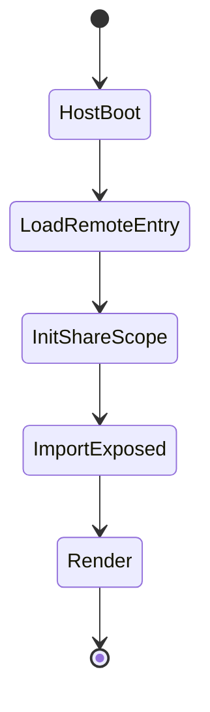
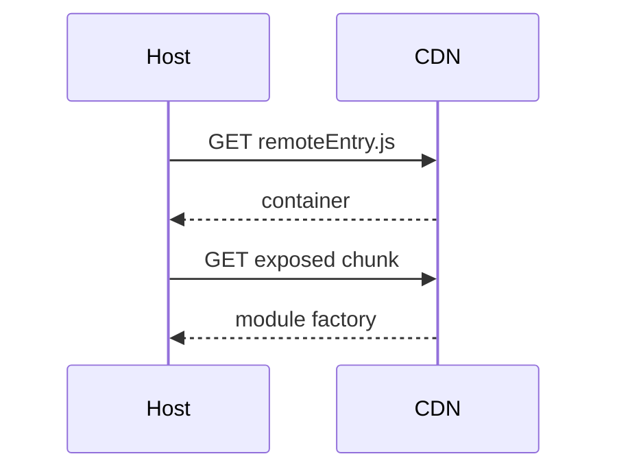

# Module Federation

<TopicMeta />

<Prerequisites />

::: tip Published
This page meets the handbook **published** bar: deep explanation, ≥10 common mistakes, and official references. Further engine-level errata welcome via PR.
:::

## Introduction

**Module Federation** lets a **host** load code from **remotes** at runtime. Each remote exposes modules through a `remoteEntry` file. `shared` config deduplicates libraries like React. It is the dominant runtime MFE mechanism in webpack ecosystems.

## Why does it exist?

Teams want to ship a feature bundle without rebuilding the shell. Federation provides a standardized runtime import contract instead of ad-hoc `<script>` loaders.

## Historical Background

Introduced in Webpack 5 by Zack Jackson et al. Adopted widely for MFEs; variants exist for Rspack and community Next.js plugins with caveats.

## Mental Model

Remotes publish a manifest of exposed modules. The host’s async import goes to the federation runtime, which fetches `remoteEntry`, initializes sharing scope, then loads the exposed module. Versions of shared libs negotiate singletons.

## Internal Workflow

1. Configure host remotes + remote exposes.
2. Declare shared singletons (React, router).
3. Deploy remotes to versioned URLs.
4. Host resolves remote at runtime (or prefetch).
5. Wrap remote UI in error boundaries + Suspense.

## Lifecycle



## Browser Perspective

Extra requests for remoteEntry + chunks; use long-cache hashed assets and careful CDN invalidation.

## JavaScript Engine Perspective

Not applicable.

## React Perspective

Must share React/ReactDOM as singleton. Lazy + Suspense around remote components.

## Next.js Perspective

Official support is limited; evaluate maintained plugins or alternative composition (multi-zones).

## Server Perspective

SSR with federation is non-trivial—many teams federate only client widgets.

## Network Perspective

Pin remote URLs per environment; plan rollback if a remote deploy breaks the host.

## Memory Perspective

Not applicable.

## Performance

Prefetch remotes for likely routes. Audit duplicate shared deps. Prefer exposing fine-grained modules over one giant remote bundle when possible.

## Production Example

Shell points `checkout@https://cdn/.../remoteEntry.js`. Checkout CI deploys new remoteEntry; shell unchanged. Canary by serving a fraction of users a different remote URL.

## Code Examples

```js
// remote
new ModuleFederationPlugin({
  name: 'checkout',
  filename: 'remoteEntry.js',
  exposes: { './Checkout': './src/Checkout.tsx' },
  shared: { react: { singleton: true }, 'react-dom': { singleton: true } },
})

// host
const Checkout = React.lazy(() => import('checkout/Checkout'))
```

## Diagrams



## Common Mistakes

1. Forgetting React singleton → cryptic hook errors
2. Unversioned remoteEntry that breaks all hosts on bad deploy
3. No error boundary around remote UI
4. Federating before the org needs independent deploy
5. Assuming SSR “just works” with federation
6. Missing a production edge case for 15-architecture.module-federation (#1)
7. Missing a production edge case for 15-architecture.module-federation (#2)
8. Missing a production edge case for 15-architecture.module-federation (#3)
9. Missing a production edge case for 15-architecture.module-federation (#4)
10. Missing a production edge case for 15-architecture.module-federation (#5)


## Best Practices

- Versioned remote URLs + rollback
- Shared dependency strategy documented
- Contract tests host↔remote

## Anti-patterns

- Exposing internal implementation paths as public remote API
- Silent failure when remote is down

## Comparison

| | Module Federation | npm package |
| --- | --- | --- |
| Deploy | Independent runtime | Needs host rebuild/publish |
| Coupling | Runtime contract | Build-time types |
| SSR | Harder | Straightforward |

## Interview Questions

### Easy

**Q:** What does remoteEntry.js do?

**A:** It is the federation manifest/container that tells the host how to load exposed modules and participate in shared scopes.

### Medium

**Q:** How does `shared.singleton` help?

**A:** It ensures one instance of a library (e.g. React) is used across host and remotes so runtime invariants hold.

### Hard

**Q:** How would you design rollback for a bad remote?

**A:** Immutable versioned URLs, host config that pins versions, instant config rollback, health checks, and error boundaries with fallback UI.

## Summary

- Federation is runtime module composition with shared scopes
- React singletons and versioned remotes are critical
- Treat remote deploys like production dependencies

## References

- [Webpack — Module Federation](https://webpack.js.org/concepts/module-federation/)
- [Module Federation examples](https://github.com/module-federation/module-federation-examples)

<RelatedTopics />


Prev: [`15-architecture.micro-frontends`](/15-architecture/micro-frontends/) · Next: [`15-architecture.state-management`](/15-architecture/state-management/)
