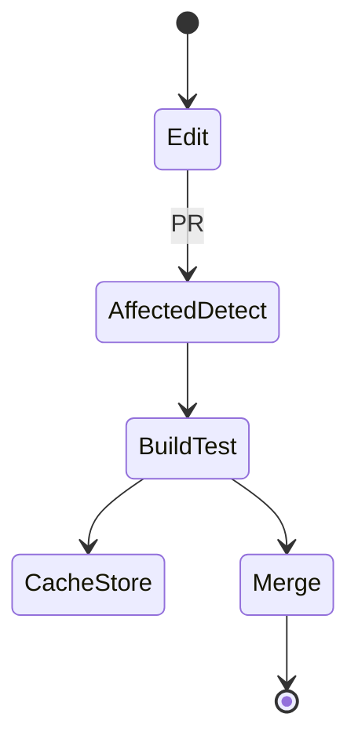
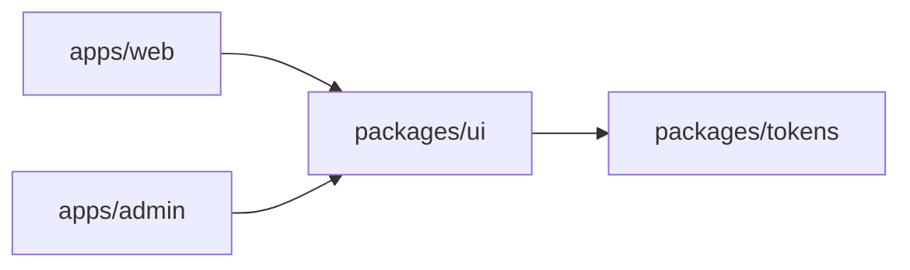

# Monorepo

<TopicMeta />

<Prerequisites />

::: tip Published
This page meets the handbook **published** bar: deep explanation, ≥10 common mistakes, and official references. Further engine-level errata welcome via PR.
:::

## Introduction

A **monorepo** stores multiple projects—apps, design system, eslint-config, backend BFF—in one VCS repo. Tools like pnpm workspaces, Nx, Turborepo, or Bazel orchestrate install, build, test, and affected-only CI.

## Why does it exist?

Multi-repo sharing forces publish-consume lag and version hell for internal packages. Monorepos make atomic cross-package changes, shared standards, and one CI graph possible—at the cost of tooling complexity.

## Historical Background

Google’s monorepo culture influenced industry tooling. In JS, Lerna → yarn/pnpm workspaces → Nx/Turborepo remote caching made JS monorepos mainstream for product orgs.

## Mental Model

Packages are nodes; dependency edges must be acyclic. CI should run **affected** tasks based on the git diff graph, not rebuild the world every commit.

## Internal Workflow

1. Define workspace packages (`apps/*`, `packages/*`).
2. Declare dependencies via workspace protocol.
3. Cache build/test outputs (local + remote).
4. Use project tags/boundaries for lint rules.
5. Release internals via changesets or fixed versions.

## Lifecycle



## Browser Perspective

Not applicable.

## JavaScript Engine Perspective

Not applicable.

## React Perspective

One React version across the workspace prevents hook invalidation bugs.

## Next.js Perspective

Multiple Next apps can share `packages/ui` and `packages/config`. Watch duplicate React copies—align `peerDependencies`.

## Server Perspective

Shared types between BFF and web packages reduce contract drift.

## Network Perspective

Not applicable.

## Memory Perspective

Not applicable.

## Performance

Remote cache and affected commands dominate developer experience. Keep package graphs shallow; avoid importing a heavy app from a leaf library.

## Production Example

A company keeps `apps/web`, `apps/admin`, `packages/ui`, `packages/eslint-config`. A button API change updates UI + both apps in one PR; Turborepo restores cached builds for untouched packages.

## Code Examples

```json
// pnpm-workspace.yaml
{
  "packages": ["apps/*", "packages/*"]
}
```

```bash
pnpm exec turbo run build --filter=web...
```

## Diagrams



## Common Mistakes

1. No affected CI — 40-minute pipelines for one-line changes
2. Circular package dependencies
3. Multiple React versions via nested node_modules
4. Treating the monorepo as permission to skip package boundaries
5. Checking in enormous build artifacts
6. Missing a production edge case for 15-architecture.monorepo (#1)
7. Missing a production edge case for 15-architecture.monorepo (#2)
8. Missing a production edge case for 15-architecture.monorepo (#3)
9. Missing a production edge case for 15-architecture.monorepo (#4)
10. Missing a production edge case for 15-architecture.monorepo (#5)


## Best Practices

- Workspace protocol + strict peer deps
- Remote cache for build/test
- Explicit package public APIs

## Anti-patterns

- Importing from another app’s `src/` via relative `../../`
- One package that everything depends on for unrelated utilities

## Comparison

| | Monorepo | Polyrepo |
| --- | --- | --- |
| Cross-cutting change | One PR | Coordinated releases |
| CI | Needs affected/cache | Simpler per repo |
| Ownership | Needs clear package owners | Natural per repo |

## Interview Questions

### Easy

**Q:** What problem does a monorepo solve?

**A:** Atomic multi-package changes and shared tooling without publishing lag for internal libraries.

### Medium

**Q:** What is an affected build?

**A:** CI computes which packages changed (and dependents) and runs tasks only for that subgraph.

### Hard

**Q:** How do you keep a JS monorepo fast at 200 packages?

**A:** Remote caching, fine-grained task inputs/outputs, project graph constraints, test splitting, and avoiding root-level dependency soup.

## Summary

- Monorepos trade tooling complexity for atomic shared change
- Acyclic package graph + affected CI are non-negotiable
- Align peer dependency versions (especially React)

## References

- [pnpm workspaces](https://pnpm.io/workspaces)
- [Turborepo docs](https://turbo.build/repo/docs)
- [Nx docs](https://nx.dev/getting-started/intro)

<RelatedTopics />


Prev: [`15-architecture.design-systems`](/15-architecture/design-systems/) · Next: [`15-architecture.micro-frontends`](/15-architecture/micro-frontends/)
