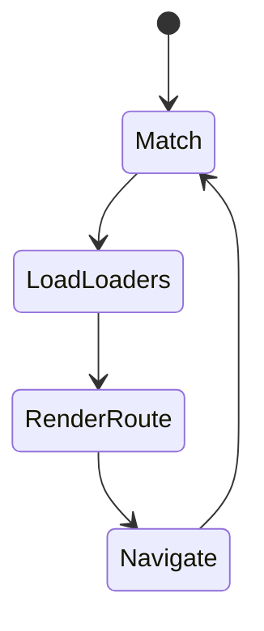
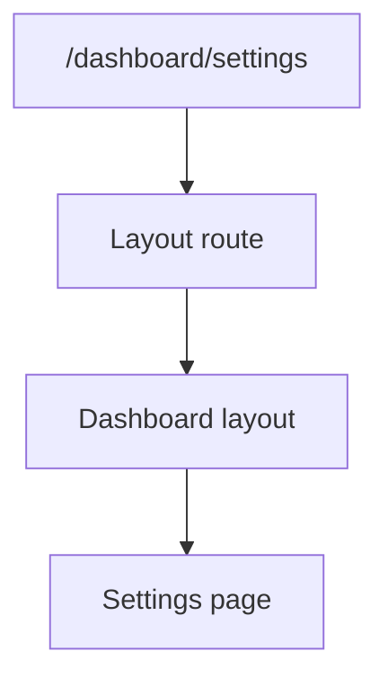

# React Router

<TopicMeta />

<Prerequisites />

::: tip Published
This page meets the handbook **published** bar: deep explanation, ≥10 common mistakes, and official references. Further engine-level errata welcome via PR.
:::

## Introduction

**React Router** maps URLs to React element trees. Modern versions (v6.4+) add **data APIs**—`loader`, `action`, `defer`—so navigation can fetch data through the router, with nested routes and outlets for layouts.

## Why does it exist?

SPAs need bookmarkable URLs, back/forward, nested layouts, and code-splitting by route. A router centralizes that instead of hand-rolled `window.location` logic.

## Historical Background

React Router has been the de facto React routing library since early React. v6 simplified nested routes; v6.4+ merged Remix-inspired data routers. Next.js App Router is a separate framework router.

## Mental Model

Routes form a tree. Parent routes render `<Outlet />` for children. The URL decides which branches match. Data routers run loaders before render to avoid empty-flash waterfalls.

## Internal Workflow

1. Define route tree (`createBrowserRouter`).
2. Nest layout routes.
3. Lazy-load route modules.
4. Use loaders/actions or your own data layer.
5. Link via `<Link>` / `useNavigate` (not raw reloads).

## Lifecycle



## Browser Perspective

Uses History API. `BrowserRouter` needs server fallback to `index.html` on deep links.

## JavaScript Engine Perspective

Not applicable.

## React Perspective

Router hooks (`useParams`, `useLoaderData`) are React integrations over history + matching.

## Next.js Perspective

Not applicable inside App Router—use Next navigation. React Router is common for Vite SPAs and some non-Next React apps.

## Server Perspective

Not applicable.

## Network Perspective

Loaders fetch on navigation; combine with caching libraries carefully to avoid double fetching.

## Memory Perspective

Not applicable.

## Performance

Route-based code splitting is the biggest win. Prefetch on link hover when appropriate.

## Production Example

A Vite SPA uses createBrowserRouter with layout route, lazy dashboard routes, and loaders that hit a BFF. Nginx falls back to index.html for HTML5 history.

## Code Examples

```tsx
import { createBrowserRouter, RouterProvider, Outlet, Link } from 'react-router-dom'

const router = createBrowserRouter([
  {
    path: '/',
    element: (
      <div>
        <nav><Link to="/about">About</Link></nav>
        <Outlet />
      </div>
    ),
    children: [
      { index: true, element: <Home /> },
      {
        path: 'about',
        lazy: async () => ({ Component: (await import('./About')).About }),
      },
    ],
  },
])

export function App() {
  return <RouterProvider router={router} />
}
```

## Diagrams



## Common Mistakes

1. Using `<a href>` for internal nav (full reload)
2. Forgetting server fallback for BrowserRouter
3. Giant single route module (no lazy)
4. Fighting the URL by mirroring all route state into Redux
5. Nested routes without Outlet
6. Missing a production edge case for 15-architecture.react-router (#1)
7. Missing a production edge case for 15-architecture.react-router (#2)
8. Missing a production edge case for 15-architecture.react-router (#3)
9. Missing a production edge case for 15-architecture.react-router (#4)
10. Missing a production edge case for 15-architecture.react-router (#5)


## Best Practices

- Nested layouts via route tree
- Lazy route modules
- URL as source of truth for location state

## Anti-patterns

- Manual history hacks beside the router
- Blocking back button without UX reason

## Comparison

| Router | Context |
| --- | --- |
| React Router | SPA / Vite / non-Next |
| Next App Router | Next.js framework |
| TanStack Router | Type-safe URL state focus |

## Interview Questions

### Easy

**Q:** What does `<Outlet />` do?

**A:** It renders the matched child route element inside a parent layout route.

### Medium

**Q:** Why do SPAs need server fallback to index.html?

**A:** Deep links request paths the server does not have as files; fallback serves the SPA shell so the client router can match.

### Hard

**Q:** Compare React Router loaders vs TanStack Query.

**A:** Loaders couple fetch to navigation timing; Query is a long-lived cache across navigations. Many apps use both carefully or pick one primary approach per surface.

## Summary

- React Router maps URL trees to nested UI
- Data APIs optional but powerful
- Code-split routes and support History API hosting

## References

- [React Router docs](https://reactrouter.com/)
- [React Router — Main concepts](https://reactrouter.com/start/concepts)

<RelatedTopics />


Prev: [`15-architecture.tanstack-query`](/15-architecture/tanstack-query/) · Next: [`15-architecture.url-as-state`](/15-architecture/url-as-state/)
