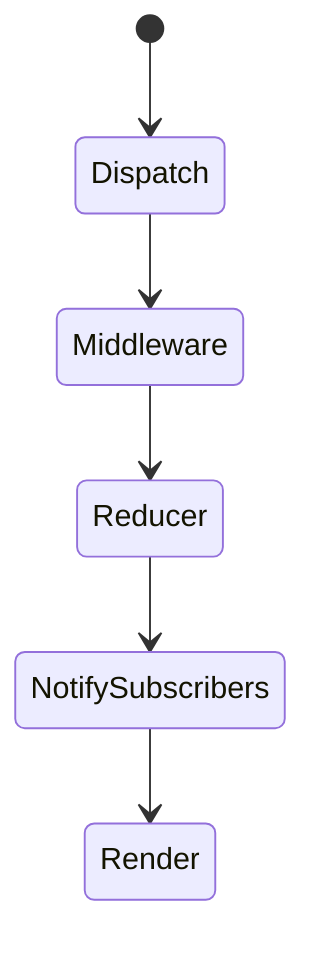
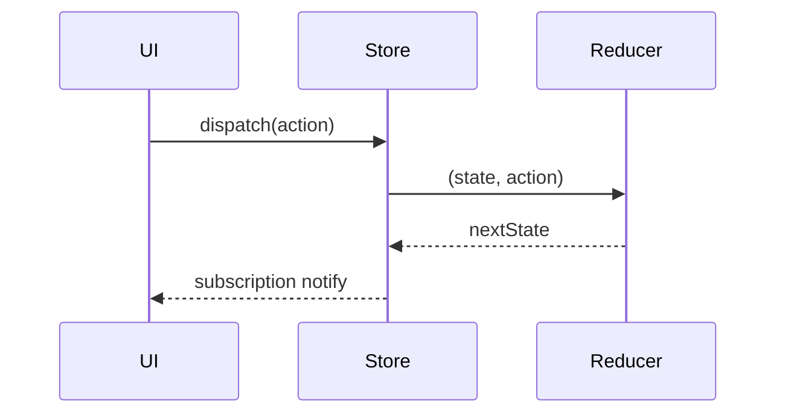

# Redux

<TopicMeta />

<Prerequisites />

::: tip Published
This page meets the handbook **published** bar: deep explanation, ≥10 common mistakes, and official references. Further engine-level errata welcome via PR.
:::

## Introduction

**Redux** centralizes client state in one store updated by **pure reducers** in response to **actions**. Today you should use **Redux Toolkit (RTK)** + `react-redux` hooks, not hand-rolled switch statements. Prefer RTK Query for server cache instead of custom thunks for every GET.

## Why does it exist?

Large apps needed a strict update story: who changed what, time-travel debugging, and middleware for side effects. Redux made updates explicit and testable. Overuse on server state created boilerplate fatigue—RTK and better server libraries fixed much of that.

## Historical Background

Flux (2014) → Redux (2015, Abramov/Redux team) → Redux Toolkit standardized store setup, slices, and Immer-based reducers. RTK Query added opinionated data fetching.

## Mental Model

`state = reducer(state, action)`. UI dispatches intents; selectors read derived data; middleware handles async. The store is the single source of truth for **client domain state** you choose to put there.

## Internal Workflow

1. `configureStore` with slices.
2. Components `useSelector` / `useDispatch`.
3. Async via `createAsyncThunk` or RTK Query.
4. Selectors (`reselect`) for derived data.
5. Keep server entities in RTK Query cache when possible.

## Lifecycle



## Browser Perspective

Not applicable.

## JavaScript Engine Perspective

Large immutable updates still allocate; Immer helps ergonomics but not magic O(1).

## React Perspective

`Provider` + hooks. Prefer selecting minimal state to limit rerenders. Avoid storing entire form trees.

## Next.js Perspective

Do not put RSC-fetched data into Redux unless hydrating intentional client state; usually keep server data on the server/query cache.

## Server Perspective

Not applicable.

## Network Perspective

RTK Query owns caching/dedupe for HTTP.

## Memory Perspective

Normalized entity adapters help; forgetting to clear on logout retains PII.

## Performance

Memoized selectors, normalized state, and granular subscriptions. Do not put high-frequency transient UI in Redux.

## Production Example

Complex booking wizard with multi-step client rules, undo, and audited actions uses RTK slices; product lists use RTK Query endpoints with tag invalidation.

## Code Examples

```ts
import { configureStore, createSlice, PayloadAction } from '@reduxjs/toolkit'

const cart = createSlice({
  name: 'cart',
  initialState: { ids: [] as string[] },
  reducers: {
    add(state, action: PayloadAction<string>) {
      state.ids.push(action.payload)
    },
  },
})

export const store = configureStore({ reducer: { cart: cart.reducer } })
export const { add } = cart.actions
```

## Diagrams



## Common Mistakes

1. Hand-writing classic Redux boilerplate in new apps
2. Fetching all server data into Redux instead of RTK Query/TanStack Query
3. Selecting the entire root state in every component
4. Putting derived state into the store
5. Side effects inside reducers
6. Missing a production edge case for 15-architecture.redux (#1)
7. Missing a production edge case for 15-architecture.redux (#2)
8. Missing a production edge case for 15-architecture.redux (#3)
9. Missing a production edge case for 15-architecture.redux (#4)
10. Missing a production edge case for 15-architecture.redux (#5)


## Best Practices

- Use Redux Toolkit
- Normalize complex entities
- RTK Query for server cache

## Anti-patterns

- Redux for every checkbox
- Mega action types shared without ownership

## Comparison

| Library | Best when |
| --- | --- |
| Redux/RTK | Complex client domain + middleware needs |
| Zustand | Small global client state |
| TanStack Query | Server state |

## Interview Questions

### Easy

**Q:** Are Redux reducers allowed to mutate arguments?

**A:** In classic Redux, no—they must be pure. With RTK/Immer, you write “mutating” syntax that produces immutable updates under the hood.

### Medium

**Q:** What does `configureStore` add over `createStore`?

**A:** Good defaults: Redux Thunk, Immersed reducers via RTK slices, DevTools, and simpler middleware setup.

### Hard

**Q:** How do you prevent unnecessary rerenders with react-redux?

**A:** Select minimal state, memoized selectors, stable references, and avoid inline object selectors that return new references each time.

## Summary

- Redux: explicit actions + pure reducers + single store
- Prefer RTK / RTK Query in modern apps
- Do not use Redux as a generic server cache by default

## References

- [Redux Toolkit docs](https://redux-toolkit.js.org/)
- [Redux Essentials](https://redux.js.org/tutorials/essentials/part-1-overview-concepts)

<RelatedTopics />


Prev: [`15-architecture.state-management`](/15-architecture/state-management/) · Next: [`15-architecture.zustand`](/15-architecture/zustand/)
