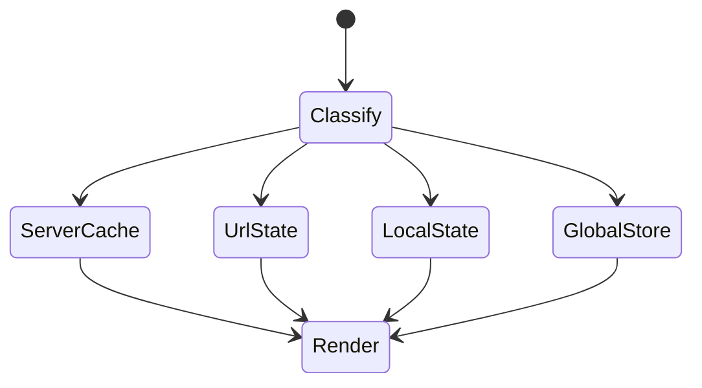
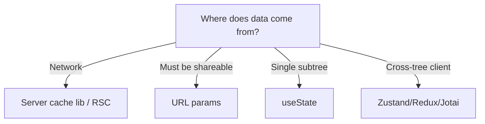

# State Management

<TopicMeta />

<Prerequisites />

::: tip Published
This page meets the handbook **published** bar: deep explanation, ≥10 common mistakes, and official references. Further engine-level errata welcome via PR.
:::

## Introduction

**State management** is the discipline of storing, updating, and deriving UI data. Modern guidance: most “global state” is **server state** (cache it), many filters belong in the **URL**, ephemeral UI state stays local, and only true cross-tree client state needs a library.

## Why does it exist?

Ad-hoc props and duplicated fetches create bugs and waterfalls. A clear state taxonomy prevents Redux-for-everything and `useEffect` sync hell.

## Historical Background

Flux → Redux → Context proliferation → hooks → server-state libraries (React Query/TanStack Query, SWR) reframed the problem. React 19 / RSC further push data toward the server.

## Mental Model

Classify each piece of state:

1. **Server** — comes from the network; needs cache/invalidation
2. **URL** — shareable/bookmarkable UI state
3. **Local** — one component subtree
4. **Global client** — auth shell, feature flags, rare cross-cutting UI

Pick the leftmost tool that works.

## Internal Workflow

1. Inventory state and classify.
2. Server state → TanStack Query/SWR/RSC fetch.
3. Filters/tabs/pagination → URL.
4. Local UI → `useState`/`useReducer`.
5. True global → small store (Zustand/Jotai/Redux).

## Lifecycle



## Browser Perspective

URL and `history` are first-class state containers.

## JavaScript Engine Perspective

Not applicable.

## React Perspective

Prefer deriving state during render. Avoid mirroring props into state. Context is for dependency injection, not high-frequency stores.

## Next.js Perspective

Server Components fetch on the server; client stores must not be the source of truth for server data.

## Server Perspective

Not applicable.

## Network Perspective

Server state libraries coordinate dedupe, retries, and backoff.

## Memory Perspective

Global stores that retain large normalized graphs can leak if not garbage-collected on logout.

## Performance

High-frequency state (mouse drag) should not flow through wide Context. Selectors/subscriptions that isolate rerenders matter.

## Production Example

Product page: price/inventory via TanStack Query; selected SKU in URL; modal open local; cart badge from a small Zustand store synced with mutations.

## Code Examples

```ts
// Taxonomy sketch
type StateKind = 'server' | 'url' | 'local' | 'global'

const decisions: Record<string, StateKind> = {
  product: 'server',
  selectedColor: 'url',
  isHoveringImage: 'local',
  sessionUser: 'global',
}
```

## Diagrams



## Common Mistakes

1. Putting all server responses into Redux
2. Syncing URL ↔ store with fragile effects
3. Overusing Context causing app-wide rerenders
4. Duplicating derived state
5. No ownership of cache invalidation
6. Missing a production edge case for 15-architecture.state-management (#1)
7. Missing a production edge case for 15-architecture.state-management (#2)
8. Missing a production edge case for 15-architecture.state-management (#3)
9. Missing a production edge case for 15-architecture.state-management (#4)
10. Missing a production edge case for 15-architecture.state-management (#5)


## Best Practices

- Classify before picking a library
- Server state libraries for remote data
- URL for shareable UI state

## Anti-patterns

- One mega-store for every form field
- `useEffect` to keep two stores “in sync” as architecture

## Comparison

| Kind | Tooling |
| --- | --- |
| Server | TanStack Query, SWR, RSC |
| URL | Router search params |
| Local | useState/useReducer |
| Global client | Zustand, Jotai, Redux |

## Interview Questions

### Easy

**Q:** What is server state vs client state?

**A:** Server state is persisted remotely and needs fetching/caching/invalidation; client state lives only in the UI session.

### Medium

**Q:** Why not put API data in Redux by default?

**A:** You reimplement caching, dedupe, retries, and staleness that dedicated libraries already solve; Redux shines for complex client-side domain logic.

### Hard

**Q:** Design state for a filters + infinite list + auth shell app.

**A:** Filters in URL, list pages via TanStack Query infinite queries, auth session in a small global store or httpOnly cookie session, row UI state local.

## Summary

- Classify state before choosing tools
- Most global state is server state or URL state
- Keep client stores small and purposeful

## References

- [TanStack Query docs](https://tanstack.com/query/latest)
- [React — Managing State](https://react.dev/learn/managing-state)

<RelatedTopics />


Prev: [`15-architecture.module-federation`](/15-architecture/module-federation/) · Next: [`15-architecture.redux`](/15-architecture/redux/)
