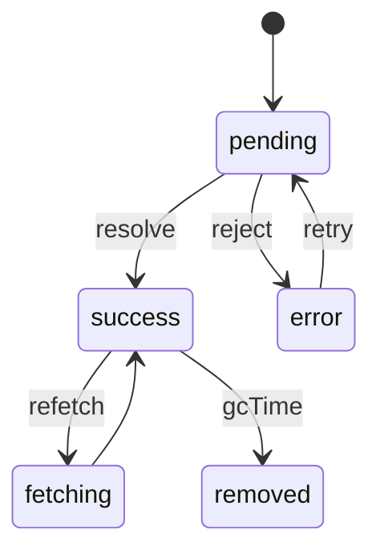
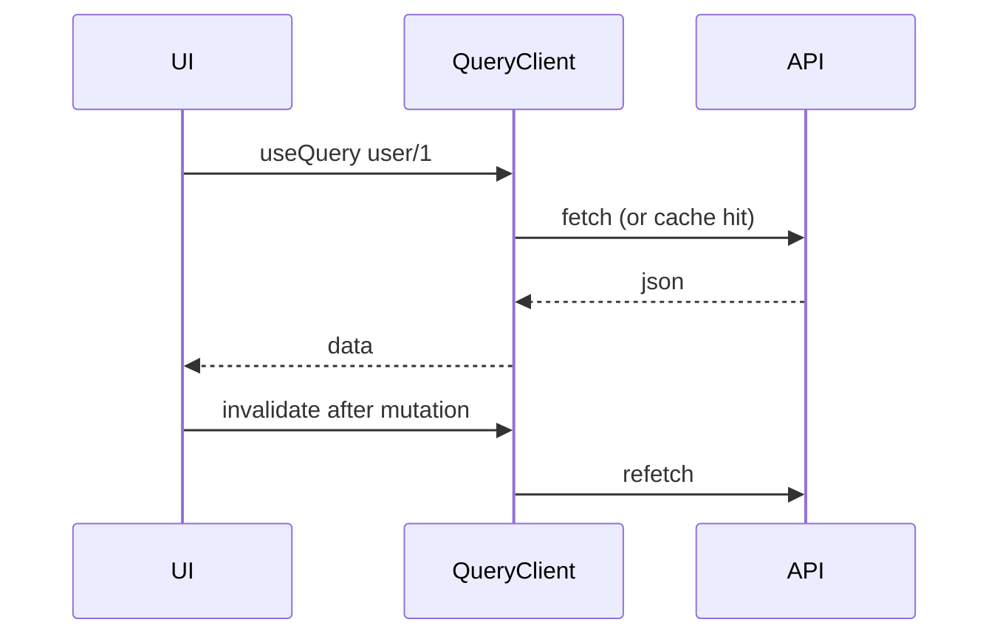

# TanStack Query

<TopicMeta />

<Prerequisites />

::: tip Published
This page meets the handbook **published** bar: deep explanation, ≥10 common mistakes, and official references. Further engine-level errata welcome via PR.
:::

## Introduction

**TanStack Query** (React Query) treats server data as a cache keyed by **query keys**. It manages fetching, background refetch, stale-while-revalidate, retries, pagination, and mutation invalidation so you do not reinvent that machinery in `useEffect`.

## Why does it exist?

Manual `useEffect` fetch leads to race conditions, duplicate requests, empty loading flashes, and inconsistent invalidation. Server state is not global client state—it needs cache semantics.

## Historical Background

React Query by Tanner Linsley evolved into TanStack Query (framework-agnostic core). It shifted community practice away from putting all API data in Redux.

## Mental Model

`queryKey` → cached record with status (`pending`, `error`, `success`), `data`, and freshness (`staleTime`, `gcTime`). Mutations update the server then **invalidate** or **optimistically** patch the cache.

## Internal Workflow

1. Wrap app in `QueryClientProvider`.
2. `useQuery({ queryKey, queryFn })` for reads.
3. Set `staleTime` intentionally (default is 0 = immediately stale).
4. `useMutation` + `invalidateQueries` for writes.
5. Use keys that encode all variables (ids, filters).

## Lifecycle



## Browser Perspective

Refetch on window focus/reconnect is configurable—disable when harmful.

## JavaScript Engine Perspective

Not applicable.

## React Perspective

Hooks bind components to cache entries. Prefer colocating keys in factories (`queryKeys.product(id)`).

## Next.js Perspective

Use the framework hydration helpers when dehydrating server-fetched queries to the client; or prefer RSC fetch for initial data and Query for client interactivity.

## Server Perspective

Not applicable.

## Network Perspective

Dedupes identical in-flight requests; retries with backoff; works with AbortSignal.

## Memory Perspective

`gcTime` controls how long unused cache entries remain.

## Performance

Tune `staleTime` to reduce refetches. Selectors (`select`) shrink rerender surfaces. Paginate/infinite query for large lists.

## Production Example

Admin table uses `['users', filters]` keys, 30s `staleTime`, mutations invalidate `['users']`. Detail pages prefetch on hover via `queryClient.prefetchQuery`.

## Code Examples

```ts
import { useQuery, useMutation, useQueryClient } from '@tanstack/react-query'

export function useUser(id: string) {
  return useQuery({
    queryKey: ['user', id],
    queryFn: ({ signal }) => fetch(`/api/users/${id}`, { signal }).then((r) => {
      if (!r.ok) throw new Error('Failed')
      return r.json()
    }),
    staleTime: 60_000,
  })
}

export function useUpdateUser() {
  const qc = useQueryClient()
  return useMutation({
    mutationFn: (body: { id: string; name: string }) =>
      fetch(`/api/users/${body.id}`, { method: 'PUT', body: JSON.stringify(body) }),
    onSuccess: (_d, body) => qc.invalidateQueries({ queryKey: ['user', body.id] }),
  })
}
```

## Diagrams



## Common Mistakes

1. Unstable query keys (new object identity every render)
2. Leaving default staleTime=0 then complaining about refetches
3. Catching errors inside queryFn and returning null (hides error state)
4. Forgetting AbortSignal / ignoring cancellation
5. Duplicating the same entity under many keys without invalidation strategy
6. Missing a production edge case for 15-architecture.tanstack-query (#1)
7. Missing a production edge case for 15-architecture.tanstack-query (#2)
8. Missing a production edge case for 15-architecture.tanstack-query (#3)
9. Missing a production edge case for 15-architecture.tanstack-query (#4)
10. Missing a production edge case for 15-architecture.tanstack-query (#5)


## Best Practices

- Query key factories
- Explicit staleTime per domain
- Invalidate by predicates/tags thoughtfully

## Anti-patterns

- Mirror Query cache into Redux “for consistency”
- Global onError toasts that swallow per-view UX

## Comparison

| | TanStack Query | useEffect fetch |
| --- | --- | --- |
| Cache | Yes | DIY |
| Deduping | Yes | Rarely |
| Retries/focus | Built-in | DIY |

## Interview Questions

### Easy

**Q:** What is a query key?

**A:** A serializable array/value that identity-caches a server resource; it must include all variables that affect the result.

### Medium

**Q:** Difference between staleTime and gcTime?

**A:** staleTime: how long data is considered fresh before background refetch; gcTime: how long inactive cache data remains in memory.

### Hard

**Q:** How do you do optimistic updates safely?

**A:** Snapshot previous cache, apply optimistic patch, rollback on error, then invalidate or set from server response; handle races with mutation lifetimes.

## Summary

- TanStack Query is a server-state cache, not a general client store
- Keys + staleTime + invalidation are the core levers
- Replace ad-hoc useEffect fetching

## References

- [TanStack Query — Important Defaults](https://tanstack.com/query/latest/docs/framework/react/guides/important-defaults)
- [TanStack Query — Query Keys](https://tanstack.com/query/latest/docs/framework/react/guides/query-keys)

<RelatedTopics />


Prev: [`15-architecture.jotai`](/15-architecture/jotai/) · Next: [`15-architecture.react-router`](/15-architecture/react-router/)
