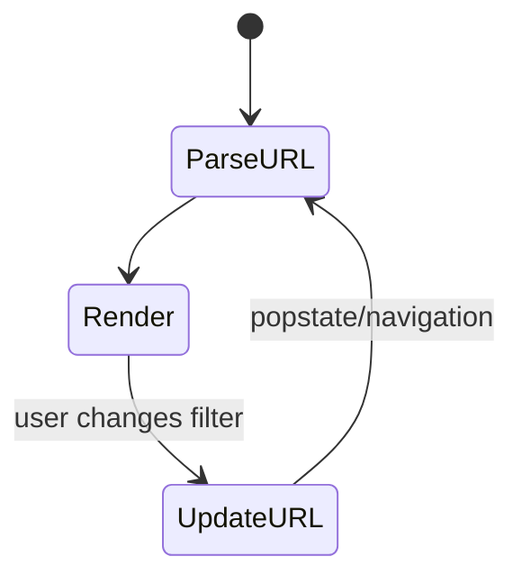
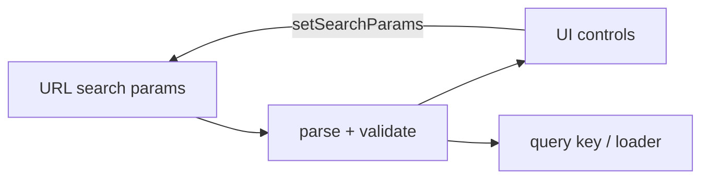

# URL as State

<TopicMeta />

<Prerequisites />

::: tip Published
This page meets the handbook **published** bar: deep explanation, ≥10 common mistakes, and official references. Further engine-level errata welcome via PR.
:::

## Introduction

**URL as state** means the address bar holds UI state that should be shareable or restorable: query params, path segments, and hashes. The URL becomes a first-class store—not a side channel synced from React state.

## Why does it exist?

Users expect copy-paste links, back button, and refreshed pages to restore context. Hidden React state fails all three. Support and analytics also benefit from deterministic URLs.

## Historical Background

Server-rendered apps always used query strings. SPAs relearned this after years of opaque client state. Modern routers treat search params as reactive state.

## Mental Model

If two users need the same view, put the discriminating state in the URL. Keep private ephemeral UI (tooltips, hover) out. Serialize carefully (types, defaults, validation).

## Internal Workflow

1. List shareable states (filters, page, sort, selected id).
2. Choose path vs search params.
3. Parse/validate with a schema; apply defaults.
4. Update via router APIs (`setSearchParams`) without losing unrelated params.
5. Drive data fetching from parsed URL state.

## Lifecycle



## Browser Perspective

History stack entries are created on navigation—decide replace vs push for filter typing.

## JavaScript Engine Perspective

Not applicable.

## React Perspective

URL is external state; components subscribe via router hooks. Avoid mirroring into `useState` unless editing drafts.

## Next.js Perspective

`searchParams` in pages/layouts; `useRouter`/`nuqs`-style helpers on the client.

## Server Perspective

Not applicable.

## Network Perspective

Shareable URLs often map to GET APIs—keep them cache-friendly.

## Memory Perspective

Not applicable.

## Performance

Debounce high-churn updates (search-as-you-type) and use `replace` to avoid history spam.

## Production Example

E-commerce PLP encodes `?q=&brand=&page=&sort=`. Support pastes a URL into tickets; SSR renders the same filters for SEO.

## Code Examples

```tsx
import { useSearchParams } from 'react-router-dom'

export function Filters() {
  const [params, setParams] = useSearchParams()
  const page = Number(params.get('page') ?? '1')

  return (
    <button
      onClick={() => {
        const next = new URLSearchParams(params)
        next.set('page', String(page + 1))
        setParams(next, { replace: false })
      }}
    >
      Next page ({page})
    </button>
  )
}
```

## Diagrams



## Common Mistakes

1. Keeping filters only in React state
2. Pushing a history entry per keystroke
3. Not validating/coercing param types
4. Dropping unrelated params on update
5. Putting secrets in the query string
6. Missing a production edge case for 15-architecture.url-as-state (#1)
7. Missing a production edge case for 15-architecture.url-as-state (#2)
8. Missing a production edge case for 15-architecture.url-as-state (#3)
9. Missing a production edge case for 15-architecture.url-as-state (#4)
10. Missing a production edge case for 15-architecture.url-as-state (#5)


## Best Practices

- Validate with defaults
- replace vs push intentionally
- URL state drives the query key

## Anti-patterns

- Dual source of truth: Redux filters + URL both “owners”
- Opaque base64 blobs in URLs when plain params suffice

## Comparison

| State | In URL? |
| --- | --- |
| Table filters | Yes |
| Modal open for ephemeral tip | Usually no |
| Selected entity id | Often yes |
| Auth token | Never |

## Interview Questions

### Easy

**Q:** Why put filters in the URL?

**A:** So views are bookmarkable, shareable, and restore on refresh/back.

### Medium

**Q:** When use replace vs push for params?

**A:** replace while the user is still editing (typing); push when they commit a navigable step you want in history.

### Hard

**Q:** How do URL state and TanStack Query interact?

**A:** Parsed URL values become part of the queryKey; navigation updates keys and triggers cache reads/fetches without mirroring filters elsewhere.

## Summary

- Shareable UI state belongs in the URL
- Parse/validate; do not mirror unnecessarily
- Coordinate with data fetching via keys/loaders

## References

- [MDN — History API](https://developer.mozilla.org/en-US/docs/Web/API/History_API)
- [React Router — Search params](https://reactrouter.com/en/main/hooks/use-search-params)

<RelatedTopics />


Prev: [`15-architecture.react-router`](/15-architecture/react-router/) · Next: [`15-architecture.component-libraries`](/15-architecture/component-libraries/)
