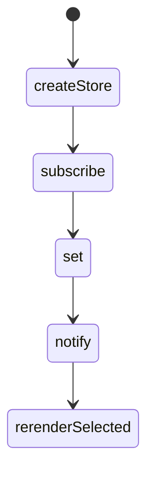
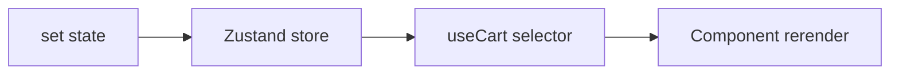

# Zustand

<TopicMeta />

<Prerequisites />

::: tip Published
This page meets the handbook **published** bar: deep explanation, ≥10 common mistakes, and official references. Further engine-level errata welcome via PR.
:::

## Introduction

**Zustand** is a small state library: create a store with `create`, export hooks, select slices to control rerenders. No Provider is required by default. Ideal for modest global client state when Redux ceremony is unnecessary.

## Why does it exist?

Context + `useState` at the root rerenders too broadly; Redux can feel heavy for a theme flag, cart badge, or wizard slice. Zustand offers external store semantics with simple APIs.

## Historical Background

Created by Poimandres (pmndrs). Grew with React 18 `useSyncExternalStore` integration for correct concurrent rendering.

## Mental Model

A mutable store lives outside React. Components subscribe via selectors. `set` merges updates. Middleware adds persist, devtools, immer.

## Internal Workflow

1. `create` store with actions colocated.
2. Export typed hooks/selectors.
3. Use shallow compare for object selections when needed.
4. Persist only non-sensitive slices.
5. Reset on logout.

## Lifecycle



## Browser Perspective

Not applicable.

## JavaScript Engine Perspective

Not applicable.

## React Perspective

Works with `useSyncExternalStore`. Select narrowly: `useStore(s => s.count)`.

## Next.js Perspective

Create stores per request on the server if SSR; do not share a module singleton with user data across requests.

## Server Perspective

Not applicable.

## Network Perspective

Not applicable.

## Memory Perspective

Module-level stores persist for the SPA lifetime—clear user data explicitly.

## Performance

Selector granularity is everything. Avoid `useStore()` returning the whole state object.

## Production Example

UI shell stores sidebar collapsed state + feature-flag overrides in Zustand; product data stays in TanStack Query.

## Code Examples

```ts
import { create } from 'zustand'

type CartState = {
  ids: string[]
  add: (id: string) => void
  reset: () => void
}

export const useCart = create<CartState>((set) => ({
  ids: [],
  add: (id) => set((s) => ({ ids: [...s.ids, id] })),
  reset: () => set({ ids: [] }),
}))
```

## Diagrams



## Common Mistakes

1. Selecting entire state objects without shallow compare
2. SSR singleton leaking data between users
3. Persisting tokens in localStorage via zustand/persist
4. Replacing TanStack Query with Zustand for server data
5. Giant store with unrelated domains
6. Missing a production edge case for 15-architecture.zustand (#1)
7. Missing a production edge case for 15-architecture.zustand (#2)
8. Missing a production edge case for 15-architecture.zustand (#3)
9. Missing a production edge case for 15-architecture.zustand (#4)
10. Missing a production edge case for 15-architecture.zustand (#5)


## Best Practices

- Colocate actions with state
- Narrow selectors
- Reset sensitive state on logout

## Anti-patterns

- Multiple competing stores for the same domain
- Business logic only in components while store is anemic bags of data with no invariants

## Comparison

| | Zustand | Redux |
| --- | --- | --- |
| Boilerplate | Low | Higher (even with RTK) |
| DevTools/middleware ecosystem | Good | Mature |
| Complex enterprise flows | Possible | Often preferred |

## Interview Questions

### Easy

**Q:** Does Zustand require a Provider?

**A:** Not by default—the store is an external module. Context variants exist if you need per-tree stores.

### Medium

**Q:** How do you avoid rerenders?

**A:** Select primitive slices or use shallow comparison for objects/arrays returned from selectors.

### Hard

**Q:** How do you use Zustand safely with Next.js App Router?

**A:** Keep stores in Client Components; for any per-user data on server, create the store per request or only on the client; never reuse a module singleton across SSR users.

## Summary

- Zustand: tiny external store + hook selectors
- Great for modest global client state
- Mind SSR singletons and persistence security

## References

- [Zustand documentation](https://docs.pmnd.rs/zustand/getting-started/introduction)
- [React useSyncExternalStore](https://react.dev/reference/react/useSyncExternalStore)

<RelatedTopics />


Prev: [`15-architecture.redux`](/15-architecture/redux/) · Next: [`15-architecture.jotai`](/15-architecture/jotai/)
